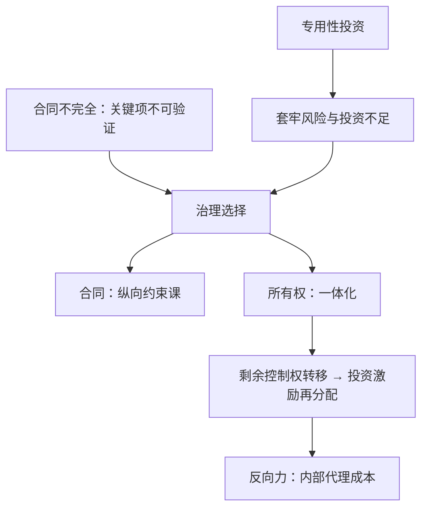
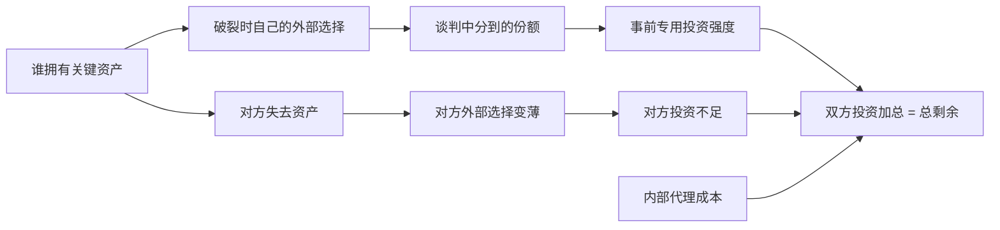

# 纵向一体化的动机

市场与企业不是两种成本函数，而是同一成本的两种边界：合同写得到的地方用合同，写不到的地方用所有权。

<footer>—— 据 Coase, The Nature of the Firm, 1937；Grossman and Hart, JPE 1986 整理</footer>

[上一课](/econ/quality-reputation-choosing)把质量写成跨期承诺问题，押金是溢价流。本课把承诺问题搬进供应链：上下游各自的专用投资与加价，靠什么治理。分工先钉死：[纵向约束](/econ/vertical-restraints)课讲**合同替代**——双重加价可用两部收费复制一体化，服务外部性可用转售价格维持；本课讲**产权边界**：合同写不到时，一体化才亲自上场。双重加价在本课只剩一句：合同能修的边界，不必动所有权。工具已备好：[套牢](/econ/hold-up-gh)给出专用投资的准租暴露，[不完全合同](/econ/incomplete-contracts)给出补偿条款为何写不了——本课拼成 make-or-buy 的完整答案。

## 问题

自建还是外购，动机有三层，份量递增。其一，**交易成本**：Coase 1937 的原始问题——使用价格机制本身有成本（搜寻、议价、履约），交易越频繁、越不确定、资产越专用，市场采购越贵；Williamson 1985 收成治理形式与交易属性的匹配表。其二是**双重加价消除**：约束课已给出合同何时足以修复。其三是**投资协调**：两家都做关系专用投资，事前都怕被事后套牢，双双投资不足；关键投资与状态对法庭不可验证，合同修不了这一层。Grossman–Hart 1986 与 Hart–Moore 1990 重新定义所有权：**一体化不是合并成本曲线，是把剩余控制权——合同未规定之事的决定权——转移给一方**。

GHM 的分配规则：**谁的投资更关键，谁拥有资产**。上游投资的社会边际产品高，则上游一体化下游；反之反是。两家投资都关键时，非一体化反而最优——分拆控制权本身就是激励设计。

术语翻译：剩余控制权就是合同没写到的那些事的决定权。合同写得再厚也写不完——机器闲置的晚上给谁用、需求突然翻倍先供谁——这些「没想到」的处置权，跟着资产所有权走，不跟价格走。

## 方法

模型骨架：两家、两资产，所有权决定关系破裂时各自拿什么走出谈判——拥有资产的一方外部选择更厚，分租更多，激励更强。一体化不免费：它抬高被合并方的激励、压低另一方的，还叠上内部代理成本——被收购部门的经理不再承受市场竞争的纪律，创新与成本控制变软。所以 make-or-buy 的正确问法不是「哪种便宜」，而是「剩余控制权放在哪一端，两边的投资加起来最大」。经验上可检验：Lafontaine–Slade 2007 综述的特许对直营数据——测量越难、品牌押金越重（接上一课）、地方努力越关键的业态越偏特许这类**中间治理**；资产专用而测量容易的环节，直营占比高。治理是连续谱，不是开关。

错在哪：把一体化当规模经济的合并，读不出激励转移；或把 make-or-buy 写成纯交易成本比较——芝加哥对威廉姆森的批评正在此：长期合同、声誉与竞争能缓解套牢，专用性不必然推向一体化。

直觉类比：谈判分蛋糕的比例，取决于你空手离开桌子时还能吃什么。拥有资产的一方离桌后仍可拿资产另找买家，所以敢要价；被合并走的人空手离桌，分成自然变薄——所有权正是通过「破裂时你手里剩什么」这条通道改变投资激励的。

## 机制

三个动机常叠加，拆法是问反事实改了哪一变量：交易成本主导，改的是**频率与不确定性**；双重加价主导，改的是**合同工具**，先于所有权试一遍；投资协调主导，改的是**外部选择**——谁的退出更薄，谁被套牢。Stigler 1951 的生命周期是动态版：新兴产业上游规模小，养不起专业供应商，市场扩大后一体化逐级**解体**外包——一体化率是均衡变量，不是企业的性格。这解释同行内并存的混合形态：核心模具自建、通用件外购、渠道特许。

一体化深的企业售后常失压：不是垄断加成，是内部部门失去外部标尺，成本与质量同时松动——内部组织成本是真金白银，进权衡，不当注脚。

常见误区：初学者容易把「这家公司就喜欢什么都自己做」当成一体化的原因。实际上一体化率随市场规模移动——Stigler 的生命周期说产业幼年养不起专业供应商只好自建，市场长大后逐级外包解体。是企业边界在适应，不是企业性格。

## 边界

本课不做纵向合并的审查要件：纵向合并的主要嫌疑是提高对手成本与圈除市场，是[掠夺与排他](/econ/predation-exclusion)里排他一支的延伸；[合并模拟](/econ/merger-simulation)的横向反事实不能照搬。平台生态是双边结构，本课只给单链。数据老坑：治理内生，OLS 混淆效率与激励，要用工艺或法律变动做准实验；测量命题随数据环境移动，剩余控制权的逻辑不动。加深层到此收束：产品会换代（竞赛）、需求可塑造（广告）、质量靠押金（声誉）、边界由控制权定（本课）；后课默认这套语言；树序接下去换到公共财政。

## 小结

- 一体化是剩余控制权的边界移动，不是成本函数的合并。
- 三动机分层：交易成本、双重加价（合同可解就不动所有权）、投资协调（GHM 的所有权分配）。
- 谁的投资更关键谁拥有资产；一体化的反向力是内部代理成本与激励变软。
- 治理是连续谱：特许与直营的分布随测量难度与品牌押金系统变化。
- 出处：Coase 1937；Williamson 1985；Grossman–Hart 1986；Hart–Moore 1990；Lafontaine–Slade 2007。
