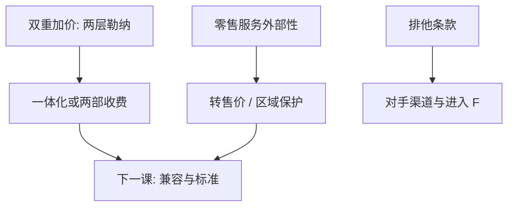

# 纵向约束

制造商与零售商各加一次价，双重加价把产量压得过低；转售价格维持、排他、数量强制，可能是把外部性内部化，也可能是把零售端的竞争关掉。

<footer>—— Spengler 双重加价；Tirole, The Theory of Industrial Organization 纵向控制章；Rey and Tirole 对纵向约束的综述传统</footer>

[上一课](/econ/entry-exit-sunk)让水平方向的 $J$ 变成付沉没之后的均衡。本课缺口是垂直链：上游定价与下游定价分开时，合同条款改变的是零售竞争与进入，而不只是同一层的 Bertrand。微观主干的纵向差异是质量阶梯，不是同一产品沿供应链的控制。本课用机制对照，不写法条清单。后课网络与标准会把兼容写成另一种「接口合同」。

## 问题

上游垄断、下游也有势力时，每层按自己的勒纳加价，最终 $p$ 高于一体化垄断，产量更低——双重加价。两部收费（批发价等于边际成本加固定费）在简单环境下复制一体化。零售若有服务外部性（展厅、库存、广告），降价抢流会让别人搭便车，制造商可能用最低转售价或排他区域来保护服务。缺口不是「纵向合同等于反竞争」，而是：**同一条款在双重加价世界里提高效率，在关闭零售竞争或阻碍进入时损害效率。** 要看合同改的是哪一层外部性。

芝加哥式阅读强调效率与避免搭便车；后芝加哥加上：排他可以迫使对手用更贵的渠道、提高进入的沉没。两套机制可以在同一份合同里共存，不能用口号选边。

### 纵向约束不是当然的反竞争

把转售价格维持一律读成卡特尔，会漏掉服务外部性；把排他一律读成效率，会漏掉对下游进入的封锁。法律阈值不是本课对象。经济测试问反事实：没有这条约束，零售服务、最终价格、上游进入会怎样——需要上一课的需求矩阵，加上这一层的合同策略。

Tirole 把纵向控制写成：上游选择合同菜单，下游选价格与服务，再看能否复制一体化利润。本课用这套语言，不把各国指南的安全港抄进来。

## 方法

基准：双重加价 → 一体化或两部收费降低最终价。服务搭便车 → RPM 或区域保护可能提高服务与需求。排他经销 / 排他购买：用「要么全拿要么走人」改变对手的规模，从而改变[进入](/econ/entry-exit-sunk)的 $F$ 或进入后利润。转售价上限可以限制下游加价，与最低价方向相反。经验上，同一条款在不同弹性矩阵下符号可以反转——这是 NEIO 合同版本，不是案例故事集。

不要把批发价减零售价的会计毛利当成势力测度；分工改变时毛利移动，效率也可以同时改善。特许经营把品牌与地方努力捆在一起，是纵向约束的常见合同包：最低服务、排他区域、抽取成，三件可以一纸写完，福利符号仍要拆开看。

## 机制

垂直外部性：上游看不见下游降价抢来的服务损失，也看不见下游加价造成的销量损失。合同是把这些导数内部化的装置。水平外部性：零售商之间的竞争约束最终价；关掉它可以抬价，也可以保护非价格竞争。进入封锁：排他把下游容量绑给在位，潜在上游必须自建渠道，沉没上升。哪一种占主导，取决于需求替代、零售是否有势力、以及[上一课](/econ/entry-exit-sunk)的 $F$。

与价格歧视对照：纵向约束常常是对零售端的非线性定价，不是对最终消费者的三级歧视。对象不同，福利公式不同。最惠国与转售价最惠，会把一个零售商的降价自动传给全网，削弱价格竞争——看起来「公平」，机制上接近横向协调。本课点到，不把平台 MFN 写完，那是双边续课的邻居。

Rey–Tirole 强调信息不对称时，合同还要防下游隐瞒需求。本课先在完全信息下分清效率与封锁，信息不完全是加厚，不是把本课改成机制设计全书。

## 边界

本课不写反垄断成文法的构成要件，不给「如何规避审查」任何步骤。不重写微观[价格歧视](/econ/price-discrimination)的三级分类。平台分成与最惠国条款放到双边定价课，这里只处理制造商–零售商链。后课默认：看见 RPM 或排他，先问双重加价、服务外部性还是进入封锁，再用弹性与沉没判断符号。合同不完备时，纵向约束还承担激励努力的功能，符号更不能从条款名称读出。

## 小结

- 双重加价使分散链比一体化更少产量；两部收费可复制一体化。
- 同一纵向条款可内部化服务外部性，也可关闭零售竞争。
- 排他通过渠道与沉没影响进入，不只通过当期零售价。
- 福利符号依赖需求矩阵，不能从条款名称读出。
- 出处：Spengler；Tirole；Rey and Tirole。
