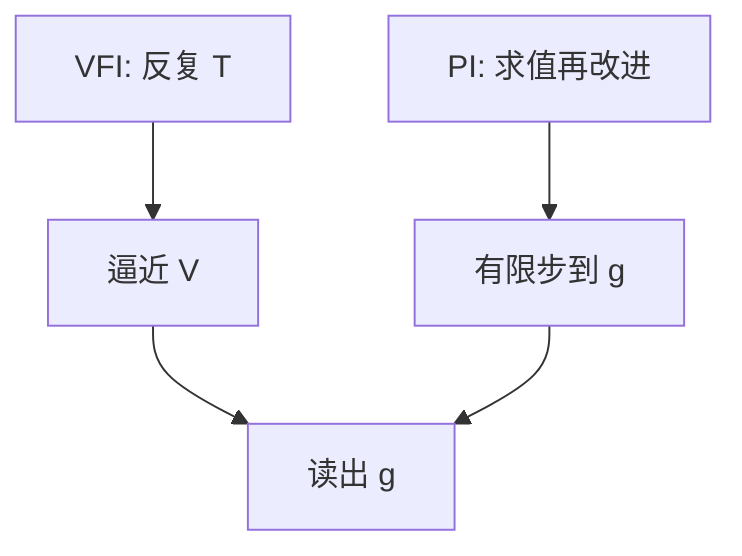

# 值函数迭代与策略迭代

压缩给出唯一不动点，不等于手上已经有 $V$；迭代是把算子变成可算的序列。

<footer>—— Howard, Dynamic Programming and Markov Processes, 1960；对照 Puterman 的策略改进；Judd, Numerical Methods in Economics, 1998</footer>

[上一课](/econ/bellman-dp)立住 $V=T(V)$，并声明算法另写。本课缺口是：**怎么算**。值函数迭代（VFI）反复施加 $T$；策略迭代（PI）在给定政策上解线性方程再改进政策。不重写压缩定理，不把网格误差写成理论。

## 问题

贝尔曼保证不动点存在时，仍要一张表或一组基函数才能在机器上碰到 $V$。离散状态、有限行动时，$T$ 是有限维 max-plus 运算：从任意有界 $V_0$ 令 $V_{n+1}=T(V_n)$，压缩比 $\beta$ 给出线性收敛。Howard：先猜政策 $g$，解 $V=r_g+\beta P_g V$（策略求值），再对每个 $s$ 做贪心改进 $g'(s)\in\arg\max_a\{r+\beta\mathrm{E}V\}$，直到政策不再变。缺口是把「有方程」变成「有算法」，而不是再选一次状态。

连续状态要插值或投影。本课只钉 VFI 与 PI 的逻辑；全局逼近的投影法在本课序后部。Rust 的条件选择概率是另一条估计线，不在这里。

## 方法

VFI：选网格 $\{s_i\}$，每个点上对 $a$ 做最大化，用插值读 $V(s')$，更新直到 $\lVert V_{n+1}-V_n\rVert$ 小于容忍。加速可用 McQueen–Porteus 界或修改政策迭代（每 $k$ 次改进做一次求值）。PI：政策空间有限时有限步精确收敛，每步要解线性系统，状态多时比一次 $T$ 贵。随机冲击用积分或求积节点。借贷约束把 $\arg\max$ 变成带不等式的一维搜索，政策在约束处出现 kinks——后课异质主体会反复碰到。

与欧拉方程方法对照：有时直接在欧拉上做时间迭代，不显式存 $V$。那要求内部解与可微；约束绑定时值函数迭代更老实。本课不把两种对立成教派。

## 机制

机制是算子单调加折扣。$V_n$ 从下方（或上方）逼近时，政策也会进入最优政策的邻域——但有限次迭代的 $g_n$ 不必已经最优，只是对当前 $V_n$ 贪心。PI 的求值步把「这条政策的真值」算准，改进步利用贝尔曼的贪心充分性。误差来源是网格、插值、积分与提前停止，不是贝尔曼本身写错。

代表性个体的光滑凹问题上，VFI 往往够用。一旦分布成为状态，每次 $T$ 都要在测度上操作，直接网格爆炸——那是 Krusell–Smith 用有界感知代替全分布的理由，不是本课提前解掉的。

Judd 强调：算法收敛不等于经济收敛到正确均衡。错误的状态或错误的期望算子会让漂亮的 $V$ 对应错误的模型。

## 边界

本课不校准、不估计。连续时间的策略改进有微分方程版本，不在此写。也不把深度学习当新原理：函数逼近可以换基，算子还是 $T$。局部扰动法下一课之后才出现，那是另一条「不求全局 $V$」的路。

后课默认：说到「解贝尔曼」，指 VFI/PI 或等价的欧拉迭代，已经知道网格与 kinks。下一课补上：即使不求 $V$，欧拉加横截也能刻画内部路径。

## 小结

- VFI 迭代 $T$；PI 在政策上求值再贪心改进。
- 约束与 kinks 时显式值函数更稳；光滑内部解可用欧拉迭代。
- 算法误差与模型误差要分开。
- 出处：Howard 1960；Judd, *Numerical Methods in Economics*, 1998。
