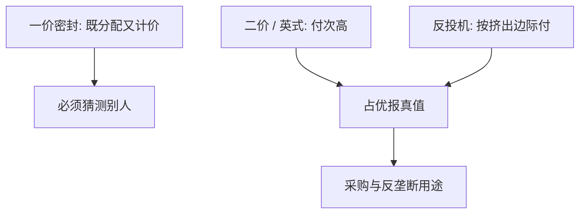

# Vickrey 反拍卖

    
第二价格密封投标让报出真实估值成为占优：报价只决定是否成交，应付价格由次高报价钉住；同一思想也用于对抗市场势力的反投机。

    <footer>—— Vickrey, Counterspeculation, Auctions, and Competitive Sealed Tenders, Journal of Finance 1961</footer>

附录对照，不插入主干。[上一课](/econ/nash-1950-paper)对照的是均衡点的存在。本篇对照 **Vickrey 1961 原文的问题设定**：公共采购与有势力的卖方如何引出真实需求，而不必先解贝叶斯纳什的遮挡函数。主干[二价与维克里](/econ/second-price-vickrey)已取 IPV 下占优真话；这里对照原文标题里的三件事——反投机、拍卖、密封投标——为何写在同一篇 *Journal of Finance* 里。

## 问题

原文不是从「四种拍卖收入是否相等」起笔。Vickrey 面对的是公共机构买劳力或工程、以及垄断卖方把产量缩到边际成本以下。若按第一价格密封，投标人要猜测别人的报，均衡依赖分布；若按边际成本强制定价，又没有激励去报真实意愿。缺口是一套规则，使**说真话成为占优**，从而把配置拉回竞争结果附近。

第二价格（最高报得物、付第二高）是拍卖侧的答案。反投机（counterspeculation）是同一会计在买方或计划者一侧：按边际上被挤出的那个人的报来支付，把市场势力的信息租金从策略里拆走。政府密封招标是应用，不是另一套理论。

原文用的是密封投标与口头英式的对照，并讨论需求曲线上的多单位。收入等价作为定理是后课；1961 年已经看到对称下期望可以对齐，但文章的锋芒在占优真话与反投机。

## 方法

单物品：每人报一个数，最高者得物，付第二高。占优论证逐点打在别人的最高报 $p_{(2)}$ 上——与主干相同，附录不重推。原文还写了多单位与公开增价：英式口头在私人价值下与二价策略等价；荷兰式降价与一价等价。公共工程的「反拍卖」只是买方与卖方角色对调，支付规则仍是次优价格。

反投机的操作直觉：若卖方有势力，计划者（或公共买方）按其报出的供给与次际需求成交，并把支付钉在被挤出的边际上，使谎报数量不再能抬价。这与二价「付别人的报」是同一解耦，只是应用在市场势力而不是密封拍卖教具。原文同时担心：没有这套规则时，边际成本定价在激励上站不住。

没有显示原理的名字。没有虚拟价值。机制被写成可操作的投标程序，而不是一般的直接机制集合。

## 机制

机制是把「我要不要赢」与「赢了付多少」解耦。自己的报只当门槛，价格由别人钉住，于是没有遮挡的理由。反投机把同一解耦用到有势力的一侧：计划者或公共买方按次际意愿成交，垄断者不能靠谎报数量把价格抬到边际价值以上——至少在占优实施的理想里。主干课把这句话收成 IPV 教具；原文把它写成对抗市场失灵的政策工具。

多单位时，真话仍要求支付按你挤掉的边际单位计价；若付的是自己的报，遮挡回来。1961 年已经看到这条，但没有写成后文的 VCG 一般外部性。公共工程密封招标只是买方人数少、卖方投标——会计不变。

### 对照主干二价课，不插入拍卖课序

主干[二价与维克里](/econ/second-price-vickrey)已钉占优与「不必知道 $F$」。本附录对照 *Journal of Finance* 16(1), 1961, 8–37：反投机、公共密封投标、多单位线索。没有赢家诅咒的完整模型，没有 VCG 的一般外部性写法——克拉克与格罗夫斯是后几年。把 1961 插进[一价](/econ/ipv-first-price)之前当作先修，会让读者以为必须先读财政采购史才能写遮挡。

Vickrey, *Journal of Finance* 16(1), 1961。不要给这篇发明 arXiv。荷兰式 ≡ 一价、英式 ≡ 二价，是原文已标明的策略等价，不是后来才有的口诀。

## 边界

原文没有解决合谋、假名、预算约束。占优挡单人偏离，挡不住两人压低第二价。共同价值下真话不必占优：别人的报带着物品信息，$p_{(2)}$ 不再与你无关——赢家诅咒是后课，不要读进 1961 的 IPV 论证。

也不要把反投机写成已经实施的反垄断法条。它是机制建议，针对的是边际成本定价的激励不相容，不是法院判例。

收入最大化不是原文的目标函数；那是下一篇附录的 Myerson。有效配置与引出需求才是 1961 的靶心。

合谋与假名操纵第二价，占优挡不住。原文知道市场势力，没有写成联盟稳定。

读完回主干二价课。不要把附录拍卖三篇当成主干拍卖课序的插页。

弱占优：在 $p_{(2)}=v_i$ 的零测集上无差。原文要的是「不必知道分布」，不是严格占优的字面。关联价值下英式与二价密封不再策略等价，那是后课信息结构。

## 小结

- 附录对照 Vickrey 1961：二价使真话占优；反投机用同一会计对付市场势力。
- 公共密封投标是应用；一价/荷兰式仍要遮挡。
- 没有虚拟价值、没有合谋定理；收入最大是后一篇。
- 出处：Vickrey, *Journal of Finance* 1961。
