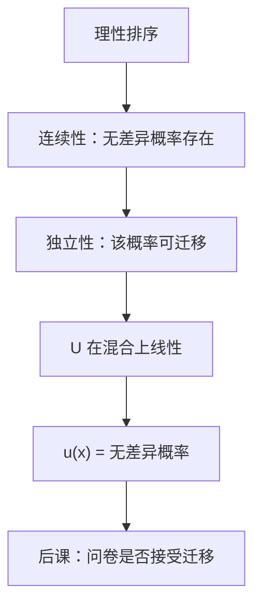

# vNM 公理怎么用

    
把最好与最差当锚，无差异概率就是效用——独立性保证这个概率在任何共同混合里都不改口。

    <footer>—— 据 von Neumann and Morgenstern, Theory of Games and Economic Behavior, 1944 整理</footer>

[上一课](/econ/expected-utility)已经给出工作表示 $U(F)=\mathbb{E}_F u$，并声明 $u$ 在正仿射变换下唯一。本课不重写这条定义，也不把彩票集合再介绍一遍。缺口是：独立性与连续性究竟怎样把「排序」逼成「概率加权」，后课才能知道阿莱打的是证明里的哪一步，而不是打在「人不会算平均数」上。

## 问题

表示定理的结论上一课用过了。证明却有一截没钉死：若只有理性，连续效用在 $\Delta(X)$ 上仍只是序数的，单调变换合法。要把 $U$ 收成对概率线性，必须让「与最好结果无差异的概率」成为刻度。缺口是把公理当成操作：连续性给出这个概率存在，独立性给出它不随共同混合项改变，于是 $U$ 在复合彩票上仿射。

设结果有最好 $b$ 与最差 $w$，对任意 $x$ 存在 $\pi(x)$ 使 $x\sim \pi(x)\,b+(1-\pi(x))\,w$。定义 $u(x)=\pi(x)$。对任意彩票 $F$，独立性允许把 $F$ 里每个结果换成它的无差异两极混合，再把共同的 $b,w$ 提出来，得到 $F\sim \bigl(\mathbb{E}_F u\bigr)b+\bigl(1-\mathbb{E}_F u\bigr)w$。比较两张彩票于是化成比较两个概率。这就是「怎么用」，不是另一套 $U$ 的定义。

### 仿射唯一不是序数唯一

若 $\tilde u=au+b$、$a>0$，期望排序不变。若换成非线性单调变换，概率加权不再保持排序——因为刻度是用概率本身量的。上一课的基数性在本课变成一句可检验的话：测两次无差异概率，只允许差一个正仿射。后课 Arrow–Pratt 要用 $u''/u'$，缺了这一步没有不变性。

阿基米德（连续性）排除「无穷好」的结果：再小的概率碰到无穷，无差异概率不存在。独立性排除「共同尾事件仍改排序」。两刀缺一，构造停在半路。

## 方法

工作顺序固定。先用理性把 $\Delta(X)$ 排好；再用连续性，对夹在中间的 $F$，解出与两极混合无差异的 $\alpha\in(0,1)$；最后用独立性：对一切 $H$，

$$
F\sim G \implies \alpha F+(1-\alpha)H\sim \alpha G+(1-\alpha)H,
$$

把复合彩票拆成一阶段分布时，权重可加减。于是 $U(\alpha F+(1-\alpha)G)=\alpha U(F)+(1-\alpha)U(G)$。线性是推出来的，不是对 $\mathbb{E}u$ 再写一遍。

有限支撑时以上足够。无限支撑要补可测与有界，否则积分可以不是连续效用。主干停留在有限结果，与上一课一致。

本课仍用客观概率。状态名字、主观信念不是这里的缺口。也不引入对概率的非线性加权：那是表示已经失败之后的另一条文献。

## 机制

独立性的操作含义是：共同的 $H$ 可以从两边同时删掉，就像线性方程里消去同类项。vNM 证明反复做这件事，直到只剩两极的权重。若决策者把「确定」或「共同的零」当成不能消的质，无差异概率随背景变，$u$ 不再是结果上的函数，仿射表示崩溃——下一课阿莱就是把这步拿去实验。

连续性的操作含义是：概率轴是连通的，偏好没有跳跃的洞。没有它，只能得到字典式一类的非期望表示，后课的微积分风险厌恶写不下去。两公理分工：连续给实数刻度，独立给加法。

构造里 $u(b)=1$、$u(w)=0$ 只是归一化，不是「效用有上界」的经济学。换一对锚，等于做一次正仿射变换。

## 边界

本课假定有最好、最差。结果无界时要用更弱的连续性（如混合连续）加增长条件，教科书常绕开。也不处理模糊：概率未知则无差异概率本身没有客观轴可沿。

实验偏离不是本课的对象。本课只标明：若接受两公理，表示必仿射；若拒绝独立性，不要再用同一 $u$ 去解释两对问卷。主干后课仍用 $\mathbb{E}u$，但会知道自己站在哪一条推演上。

不要把无差异概率写成限价簿上的成交概率。这里是实验室彩票的权重，不是报价强度。Savage 的主观概率公理更长，本课不走。

后课默认：vNM 表示的基数性来自「无差异概率可迁移」；检验独立性即检验这一迁移。

## 小结

- 不重写 $\mathbb{E}u$；本课只用独立性与连续性把无差异概率变成刻度。
- 连续性保证锚与中间结果之间有概率；独立性保证该概率不随共同混合改变。
- 线性与仿射唯一是推出来的，故非线性单调变换不合法。
- 下一课阿莱检验的正是「共同项可消去」这一迁移。
- 出处：von Neumann and Morgenstern, *Theory of Games and Economic Behavior*, 1944。
