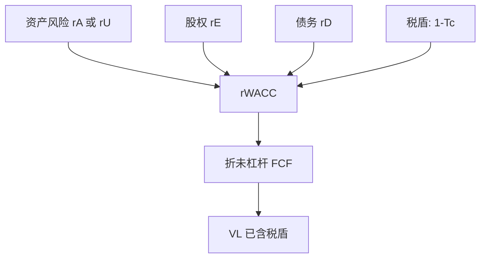

# 资本成本与 WACC

    
加权平均资本成本不是「债务便宜所以应当多借」的许可证；它是在既定资本结构下，把税后经营现金流折成资产价值的一个利率。

    <footer>—— 据 Modigliani and Miller, AER 1958/1963；Miles and Ezzell, Journal of Financial and Quantitative Analysis 1980；Brealey, Myers and Allen 整理</footer>

[上一课](/econ/npv-irr-pitfalls)把接受规则钉成 NPV，贴现率 $r$ 仍是占位符。本课缺口是把 $r$ 写成加权平均资本成本（WACC）：在税盾已经进入[1963](/econ/mm-corporate-tax)、权衡给出目标切片之后，如何把 $r_E$ 与 $r_D$ 合成一个对自由现金流的折现率。不重做家庭自制杠杆，不把项目 beta 提前。

## 问题

[MM 1958](/econ/modigliani-miller) 已经警告：看到 $r_E>r_D$ 就加杠杆，是把切片成本当成资产成本。有公司税之后，税后债务成本是 $r_D(1-\tau_c)$，教科书 WACC 写成

$$
r_{\mathrm{WACC}}=\frac{E}{V}r_E+\frac{D}{V}r_D(1-\tau_c).
$$

若每期按市值权重保持 $D/V$ 不变，用这个利率去折未杠杆自由现金流，得到的是杠杆企业价值 $V_L$——税盾被折进贴现率，而不是加在现金流上。缺口是许可证：权重用目标结构还是现行结构？现金流必须是对全部资本提供者的税后经营现金流，不能再扣利息。上一课的 IRR 门槛若换成 WACC，陷阱一个不少。

Miles–Ezzell（1980）：若杠杆按价值比例调整，税盾的折现率不是 $r_D$，第一期之后更接近 $r_U$。MM 的 $\tau_c D$ 对应债务水平固定的永久债。公式要与再平衡政策匹配，不能混用。

## 方法

三块输入：$r_E$ 来自股权要求回报（下一课用项目或可比的 CAPM 来填），$r_D$ 来自债务承诺收益或到期收益率（违约风险高时要用期望收益，不是承诺收益），权重 $E/V$、$D/V$ 用**目标**市值结构，不是账面、也不是「为了让项目过关而假设的全债」。$V=E+D$ 是企业价值，不是资产账面。

现金流口径：WACC 折的是对债与股都自由的现金流（FCFF）——税按**假如无杠杆**来算经营税，利息税盾留给 $(1-\tau_c)$ 因子。若把税后利息再扣一次，税盾被算两遍。股权自由现金流必须用 $r_E$ 折，不能用 WACC。

Miles–Ezzell 与 Harris–Pringle 给出不同再平衡假设下税盾的折现。教学上：目标 $D/V$ 稳定，用教科书 WACC；债务金额锁定（LBO、项目融资有还本表），不要用常数 WACC，下一课 [APV](/econ/apv) 把税盾单独加。Brealey–Myers 的操作句是：先想清楚债务怎么走，再选公式。

## 机制

机制是把税后要求回报写成对同一资产的加权。无税时 WACC 退回 $r_A$，与切片无关。有税且按价值再平衡时，多借债降低 WACC，下降来自 $\tau_c$，不是来自「银行贷款利率看起来低」。$r_E$ 仍随杠杆上升（命题 II）；权重里债务变大、股权变贵，两边一起动。把现行低 $r_D$ 塞进一个高杠杆权重、却用今天尚未加杠杆的 $r_E$，会系统低估 WACC、高估 NPV。

与权衡的衔接：目标 $D/V$ 来自税盾对困境成本，不是来自「把 WACC 压到最低」。若把 WACC 当目标函数去加杠杆，会忽略困境对现金流本身的破坏——那些破坏应进 FCF 或进 APV 的副作用，不能靠再压贴现率来假装没有。

### 承诺收益不是期望收益

高收益债的到期收益率含违约补偿。折现期望现金流若用承诺 $r_D$，分母偏大。WACC 里的 $r_D$ 应是债权人的期望回报，接近评级相近的债务期望收益，而不是把垃圾债 YTM 直接当成本。Brealey–Myers 把这写成常见高估债务成本、从而高估 WACC 的反向错误；更常见的实务错误仍是低估。

循环：WACC 需要 $E/V$，而 $V$ 正是折现结果。迭代到权重与价值一致，或用 APV 躲开循环。目标结构已知时，用目标权重，循环较轻。

## 边界

不要把 WACC 当成与资本结构无关的「公司折现率」去折所有项目：项目风险不同于公司资产风险时，下一课改 beta，不改成「公司 WACC 一刀切」。也不要把部门要求回报写成谈判政治——那是配额，上一课已经禁止用错误比率替代 NPV。

本课不推导 CAPM，不估计市场溢价。$r_E$ 在这里仍是输入。[优序](/econ/pecking-order)说发股有柠檬，那是发行成本，不是把 WACC 里的 $r_E$ 人为加几个点当「股权贵」。柠檬应进发行折价或 APV 副作用。

后课默认：WACC 折未杠杆 FCF、权重用目标市值、税盾与再平衡政策匹配。债务水平锁定则离开常数 WACC，交给 APV。不要用 $r_E>r_D$ 证明应当加杠杆。

宏观课序与家庭欧拉给出的是随机折现；WACC 是确定等价或 beta 调整后的一个利率，不是另一套偏好。

## 小结

- WACC 是既定（目标）结构下对 FCFF 的折现率；税后债务成本不证明「应当多借」。
- 权重用市值目标；现金流不要再扣利息；再平衡政策决定能否用常数 WACC。
- 下一课用 CAPM 填项目的 $r_E$ 或 $r_U$，而不是公司现成的一个数。
- 出处：MM 1958/1963；Miles and Ezzell, *JFQA* 1980；Brealey, Myers and Allen。
