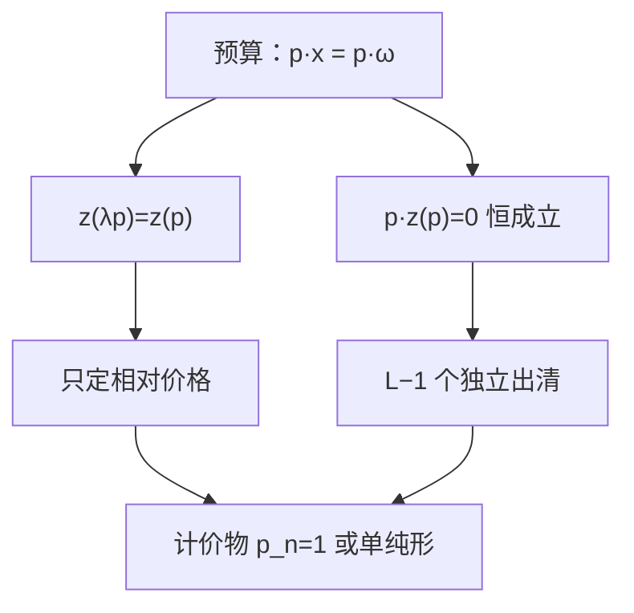

# 瓦尔拉斯定律与计价物

超额需求对价格一次齐次，且价格加权和恒为零；独立方程比商品数少一个，必须选出计价物。

<footer>—— 据 Walras, Éléments d'économie politique pure, 1874；Mas-Colell, Whinston and Green 第 17 章整理</footer>

定位：[上一课](/econ/walrasian-equilibrium)。瓦尔拉斯均衡已经定义为 $(p^*,x^*)$ 使 $z(p^*)\le 0$，并在局部非饱和下点到 $p\cdot z(p)=0$ 与相对价格。本课不重写需求规划，也不证明存在。缺口是把齐次性、瓦尔拉斯定律、少一个方程、计价物正规化四件事写成同一套会计，避免后课把 $L$ 个市场当成 $L$ 个独立方程去「解价格水平」。

## 问题

预算 $p\cdot x^i\le p\cdot\omega^i$ 对 $\lambda>0$ 不变，故需求 $x^i(\lambda p)=x^i(p)$，超额需求 $z(\lambda p)=z(p)$：**零次齐次**。均衡只决定相对价格。若把 $p$ 与 $\lambda p$ 当成两个解，配置相同。缺口不是再画一次出清，而是：**有 $L$ 个市场时，真正独立的出清条件是几个？**

局部非饱和使预算等式成立，$p\cdot x^i(p)=p\cdot\omega^i$，加总得瓦尔拉斯定律：对**一切** $p$（不只均衡），

$$
p\cdot z(p)=0.
$$

于是 $\{z_\ell(p)=0\}_{\ell=1}^L$ 线性相关：任意 $L-1$ 个市场出清，第 $L$ 个自动出清（定律成立时）。找均衡少写一个方程，不是漏了一种商品。

### 计价物是正规化，不是货币

选商品 $n$ 为计价物，令 $p_n=1$，其余 $p_\ell$ 读成「一单位 $\ell$ 值多少单位 $n$」。也可以把价格投到单纯形 $\sum p_\ell=1$ 上，存在性课用这个紧集。两种正规化给出同一配置。计价物必须在均衡里价格严格为正；若误把自由财（$p_\ell^*=0$）钉成 $1$，正规化失败。货币价格水平是宏观另加的锚，本课 $p$ 没有绝对水平。

定律是恒等式，来自预算，不是均衡条件。有人把「均衡时 $p\cdot z=0$」当成定律，会低估它：它对非均衡报价也成立，所以拍卖人不能靠「总值」发现还有哪个市场没出清。

## 方法

从个人预算加总直接证定律，不必可微。免费处置、不等式出清时，定律仍给出 $p\cdot z(p)=0$；均衡处对 $z_\ell<0$ 有 $p_\ell=0$，严格正价格的市场必须 $z_\ell=0$。齐次性与定律合在一起，把定义域从 $\mathbb{R}^L_+$ 收到 $\Delta$。

数方程：未知数为 $L-1$ 个相对价格（加配置，但配置由需求决定）。方程为 $L-1$ 个独立的出清。个数匹配不保证存在或唯一——那是后课不动点与总替代。Walras 自己数方程的算术是本课的起点，不是存在性证明。

有生产时，利润 $p\cdot y$ 流回股东，预算变成 $p\cdot x\le p\cdot\omega+\theta\pi$，加总后生产的价值被利润项对消，定律仍成立。本课以纯交换写清；[带生产的一般均衡](/econ/production-economy-ge)再用一次。

## 机制

齐次性的机制是：所有价格乘 $\lambda$，财富乘 $\lambda$，买得起的集合不变。定律的机制是：每人花光市值，买与卖的市值在个人账上抵消，加总后超额需求的市值为零。因此不可能出现「所有市场都超额需求」——至少一种商品必须超额供给（或全为零）。这是会计，不是稳定性。

选错计价物的机制：若 $n$ 在均衡是自由财，$p_n^*=0$，令 $p_n=1$ 与齐次性冲突，相对价格无定义。实践上选一种人人都要、供给有限的商品。也不要把计价物理解成现金先行里的货币：那是宏观课，本课没有现金约束。

数方程的陷阱：有人写成 $L$ 个出清加 $L$ 个价格，再抱怨「方程比未知数多」。齐次性先砍掉一个自由度，定律再砍掉一个方程，两边匹配。匹配只是会计，存在靠后课的不动点，唯一靠总替代一类总体条件。Walras 的算术是本课要保住的那一层，不要把它夸成存在性。

不要把计价物价格写成限价簿某一档的报价单位。簿上的货币单位是制度；这里 $p_n=1$ 只是把齐次射线截断。

## 边界

现金先行、货币、价格水平，一律不在本课引入。配额、配给使预算不等式的解释变掉，定律要重写。非饱和失败时定律可以破，第一福利定理也破——福利课已经用局部非饱和。试错动态把 $\dot p_\ell=z_\ell(p)$ 写在 $L-1$ 维上，收敛是[唯一性与试错](/econ/uniqueness-tatonnement)的缺口。

后课默认：谈到竞争均衡的价格，指相对价格；瓦尔拉斯定律使独立市场少一个；存在性在单纯形上找不动点。

## 小结

- 超额需求零次齐次；均衡只决定相对价格。
- 瓦尔拉斯定律对一切 $p$ 成立，故只有 $L-1$ 个独立出清方程。
- 计价物是正规化，须选均衡中价格为正的商品，不是货币。
- 下一课把均衡配置接到帕累托集：两定理。
- 出处：Walras, *Éléments*；Mas-Colell, Whinston and Green 第 17 章。
