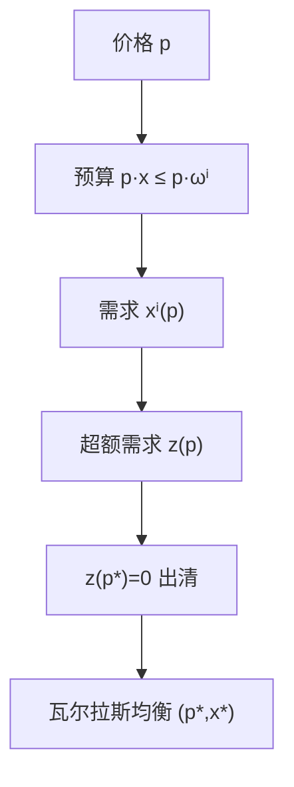

# 瓦尔拉斯均衡

价格是使每一种商品的有效需求与有效供给相等的那些比率；拍卖人只报价格，不亲自交易。

<footer>—— 据 Walras, Éléments d'économie politique pure, 1874；Debreu, Theory of Value, 1959 整理</footer>

[上一课](/econ/mrs-contract-curve)（契约曲线与 MRS）。给出了帕累托集：合同曲线上有许多有效点，透镜里还有互利但未完成的交易。缺口是协调。没有计划者点名「停在哪一点」时，用什么公共信号让每个人只看自己的预算、合起来却把市场出清？本课引入价格与瓦尔拉斯均衡，仍不证明它存在，也不谈它是否有效——那是后两课。

## 问题

盒里的讨价还价没有唯一解。两人可以停在透镜与合同曲线交集的任何一点，也可以达不成交易、停在禀赋。若引入第三、第四个人，双边议价的组合爆炸。需要一个更瘦的制度：报出一个价格向量 $p\in\mathbb{R}^L_+$，每个人把 $p$ 当成给定，在预算集里选需求，要求所有市场同时出清。

这不是再写马歇尔的局部需求。马歇尔需求面对的是一种商品的价格，收入外生；这里收入是禀赋的市值 $p\cdot\omega^i$，所有价格一起动，一种商品的「需求」取决于全部相对价格。超额需求必须对所有商品同时为零。局部均衡把其他市场冻住；瓦尔拉斯均衡解的是整张联立。

### 拍卖人不是交易所

瓦尔拉斯拍卖人报 $p$，看超额需求，调整报价，直到没有人想改计划。成交发生在均衡价格上，中间报价不执行。这是教学装置，不是限价簿：没有队列、没有价差、没有时间优先。量化栏的[限价簿](/quant/lob-structure)从本栏停笔之后才开始；本课禁止把 $p$ 读成某档挂单价。

消费者 $i$ 的预算是 $\{x:p\cdot x\le p\cdot\omega^i\}$。财富 $m^i=p\cdot\omega^i$ 随 $p$ 变，这是一般均衡与局部均衡的会计差别。齐次性： $p$ 与 $\lambda p$ 给出同一预算，故均衡只决定相对价格。

## 方法

交换经济 $\mathcal{E}=(\succsim^i,\omega^i)_{i=1}^I$。给定 $p$，消费者解

$$
x^i(p)\in\arg\max_{\succsim^i}\{x:p\cdot x\le p\cdot\omega^i\}.
$$

超额需求 $z(p)=\sum_i\bigl(x^i(p)-\omega^i\bigr)$。瓦尔拉斯均衡是一对 $(p^*,x^*)$，使得 $x^{*i}\in x^i(p^*)$ 且 $z(p^*)\le 0$，对 $z_\ell(p^*)<0$ 的商品有 $p^*_\ell=0$（免费处置）。内部均衡常写成 $z(p^*)=0$。

瓦尔拉斯定律：若偏好局部非饱和，预算等式成立，于是 $p\cdot z(p)=0$ 对一切 $p$ 成立。 $L$ 个市场只有 $L-1$ 个独立方程，与相对价格的自由度一致。把一种商品当计价物（numeraire），价格落在单纯形上，后课用不动点就在这个单纯形上找。

有生产时，厂商在 $p$ 下利润最大化，利润作为股东的预算流入消费者。均衡还要求要素与产品市场出清。本课以纯交换为主；生产只改变 $z(p)$ 的来源，不改变「价格 → 计划 → 出清」这条环。

## 机制

价格同时做两件事：估值禀赋，从而决定谁有购买力；标相对稀缺，从而把各人的 MRS 往同一个 $p$ 上对齐。若 $(p^*,x^*)$ 是内点均衡且偏好可微，则每人 $\mathrm{MRS}^i=p^*_1/p^*_2$，于是配置落在合同曲线上——这已经是第一福利定理的局部版本，下一课再写成一般语句。

出清是总量约束，不是单个人的约束。一个人可以卖出全部禀赋再买回别的束；市场只要求买卖配对。计价物的选择不改变配置：只改变价格的单位。零价格商品是自由财，超额供给被免费处置吃掉；严格正价格的市场必须精确出清。

均衡可以不唯一。两种商品的供给需求都对相对价格有弹性时，可能有多个交点。唯一性需要额外结构（显示偏好的总替代、总收入效应弱），本课不假定。也不假定均衡存在：连续、凸、紧，是[存在性](/econ/ge-existence)的缺口。

### 相对价格与绝对水平

齐次性意味着只有 $L-1$ 个相对价格被决定。要谈「价格水平」，必须另加货币或计价物的名义锚，那是宏观课，不是本课把 $p$ 乘一个常数。瓦尔拉斯定律还意味着：若 $L-1$ 个市场出清，第 $L$ 个自动出清（在定律成立时）。找均衡时少写一个方程，不是漏了一种商品。

试错（tâtonnement）把 $\dot p$ 写成超额需求的函数，是教学动态，不是存在性。它可能不收敛，即使均衡存在。本课的定义是静态的一对 $(p^*,x^*)$，不承诺拍卖人的调整路径。更不要把试错写成限价簿上的连续报价修订：中间报价在瓦尔拉斯装置里不成交。

自由财：$z_\ell(p^*)<0$ 且 $p^*_\ell=0$。有免费处置时这是均衡的一部分。没有免费处置，就要 $z(p^*)=0$，价格必须严格把所有过剩需求赶到零，存在性更脆。

## 边界

瓦尔拉斯均衡是完全竞争的一般均衡：人人把 $p$ 当参数。古诺、伯川德、霍特林里的厂商对价格或数量有影响，不是这个解概念。也不要把「拍卖人」理解成真实的中央电脑；它只是把「没有人内部化自己对价格的影响」这句话说清楚。

货币在本课里不是一种商品。价格是相对价格，没有绝对价格水平，没有现金先行。宏观的货币中性是后课另起的结构。同样，均衡配置是净交易向量，不是订单流；不要用本课去解释价差或队列位置。

后课默认：谈到「竞争均衡」时，指的是这组 $(p^*,x^*)$。福利定理问它与帕累托集的关系；核问它能否被联盟推翻。

## 小结

- 帕累托集太大；瓦尔拉斯用价格做公共信号，要求超额需求为零。
- 财富是禀赋市值；瓦尔拉斯定律使独立市场比商品数少一个。
- 均衡是相对价格与配置，不是限价簿上的成交机制。
- 存在、有效、唯一都还没有证明。
- 出处：Walras, *Éléments*；Debreu, *Theory of Value*。
