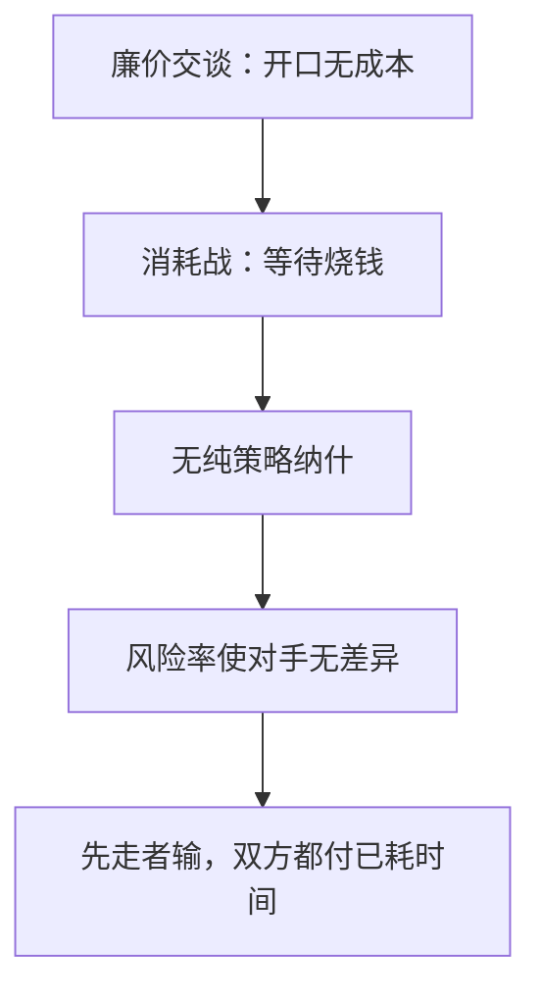

# 消耗战

冲突的代价落在时间上：先撤者失去奖赏，双方都为已耗掉的等待付钱；均衡是混合的放弃时间，而不是某一方纯策略硬撑。

<footer>—— Maynard Smith, The Theory of Games and the Evolution of Animal Conflicts, Journal of Theoretical Biology, 1974；Bishop and Cannings, Advances in Applied Probability, 1978</footer>

[上一课](/econ/cheap-talk)的消息不进支付。缺口是许多僵局里「不说话、不让步」本身在烧资源：两家抢市场、两只动物争领地、公共品等谁先贡献。等待有成本，奖赏只给撑到最后的那一个。本课钉消耗战的混合均衡，不把廉价分区再推一遍，也不把不完全信息估值写成下一课的贝叶斯纳什。

## 问题

两人，奖赏价值 $v$，单位时间成本 $c$。每人选放弃时刻 $t_i\ge 0$。较小的 $t$ 先走，先走者得 $0$ 并已付 $c t$；胜者得 $v$ 并付同样的等待成本。平局可均分或再随机，教具里零测。

纯策略纳什对不上：若对方一定撑到 $T$，自己的最优是要么立刻走（若 $cT\gt v$），要么刚好比 $T$ 晚一点。双方都「刚好比对方晚」不可行。故均衡必须混合：放弃时间有连续分布，使对手在每一瞬间无差异于「再等 $dt$」与「现在走」。

### 不是轮流出价的贴现饼

Rubinstein 里拖延伤害双方，但提议一被接受就交割，SPE 是纯策略分割。消耗战没有「接受即结束」的要约，只有「谁先眨眼」。延迟的成本是沉没的时间，不是把饼贴现后仍按协议切。廉价交谈则连这点沉没成本都没有。

演化稳定策略（ESS）是 Maynard Smith 的原语言：种群里「硬撑」与「早退」的混合比例，使两种行为期望支付相等。经济翻译成纳什混合；Bishop–Cannings 给出一般支付下的分布。

## 方法

对象：完全信息、对称、连续时间、线性等待成本。先写无差异：若对手的放弃有风险率 $\lambda$，再等 $dt$ 的期望收益为 $-c\,dt+\lambda dt\cdot v$。令其等于立刻放弃的 $0$，得 $\lambda=c/v$。指数分布 $F(t)=1-e^{-(c/v)t}$ 是对称混合均衡。非对称 $v_i$ 时，弱者（估值低或成本高）的风险率更高，更可能先走。

风险率 $\lambda=c/v$ 把「再等一秒」钉成公平赌博：成本 $c$ 对上「对方刚好放弃」的概率。$v$ 越大或 $c$ 越小，撑得越久，结束越晚。

支付结构像全支付：输家也付了等待，赢家额外得到 $v$。后课拍卖里会把这句话写成叫价；本课先停在时间。

## 机制

无差异条件把「再撑一秒」的边际成本钉在「对方刚好在这一秒放弃」的概率上。均衡里没有人严格想硬撑到无穷——那会使对手早走、自己白烧。也没有人严格想立刻走——因为对方也在混合，立刻走丢掉了免费赢的机会。期望支付常被压到「一开始就放弃」的水平：租金在等待里耗尽。这是完全信息下的消耗，不是私型。

与无名氏的对照：重复博弈用未来路径惩罚；消耗战是一次性时序，惩罚已经写进瞬时成本，不需要下一阶段改玩法。与进入遏制也不同：那里威胁要在子博弈里可信；这里「继续等」在每一时刻都是混合里的最优反应之一。

期望支付被压到立刻放弃的水平，是完全耗散：奖赏的社会价值在等待里烧光（若等待本身无产出）。这与全支付对称混合同一会计，只是把 $x$ 叫成时间。人数增加时，每人的风险率上升，结束更快，但总等待成本仍可把 $v$ 耗尽——「更多竞争」不必留下租金。

### 生物学与市场退出是同一方程

两只动物按体型比拼展示，展示消耗能量；两家产能过剩，谁先关厂谁认亏。风险率语言可直接搬。非对称时，表面上「强者应立刻赢」，混合均衡里强者仍以正概率早走——否则弱者不会愿意跟，无差异会坏。

不完全信息消耗战（Hendricks–Weiss–Wilson 一类）把 $v$ 换成私型，放弃时间变成类型的增函数，效率损失是「拖得太久」。那是 BNE；本课完全信息已经需要混合，不要把两层叠成一句「都是消耗」。

## 边界

多人、奖赏可分、等待成本凸，风险率公式要改。拍卖时钟、专利竞赛有时同构于全支付，后课再写支付规则。也不要把消耗战写成限价簿里挂单等待成交——本栏没有队列。

公共品「等别人先贡献」是同一风险率：每人希望对方先眨眼（先提供），均衡延迟，供给不足。与自愿贡献的纳什数量不足是表亲，这里不足写在时间上。私型一进来，放弃时间变成类型的揭示，接到贝叶斯纳什。

后课默认：完全信息消耗战的对称均衡是指数放弃，租金耗在时间上。下一课进入类型未知：贝叶斯纳什把私型写进策略，不再默认支付公开。

## 小结

- 廉价交谈不烧资源；消耗战的等待本身就是支付。
- 纯策略撑不住，对称均衡是使对手无差异的风险率 $c/v$。
- 双方都付已耗时间，结构上接近全支付。
- 完全信息已要混合；私型消耗是后课 BNE。
- 出处：Maynard Smith, *JTB*, 1974；Bishop and Cannings, 1978。
