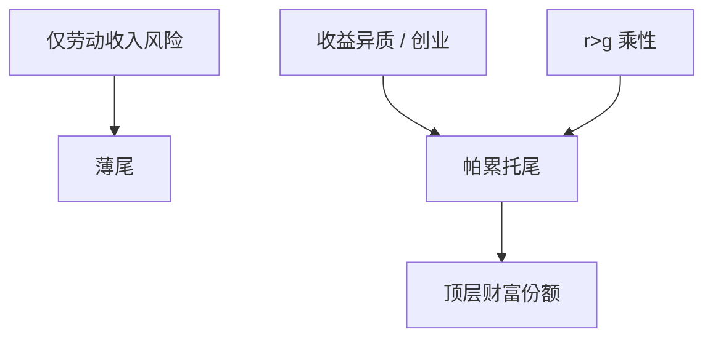

# 财富分布与帕累托尾

Aiyagari 的右尾太薄；更厚的尾要靠收益异质、创业或 $r$ 与增长率的差在随机乘性过程里放大。

<footer>—— Pareto；Gabaix 对幂律；Benhabib, Bisin and Zhu；Piketty and Zucman 的国民账户财富</footer>

[上一课](/econ/krusell-smith)说明均值或可预报价格。数据里的财富极右尾很厚，政策与 $r$ 的变动主要打在那里。本课缺口是**尾从哪来**，不是再跑一遍 KS 的 $R^2$。

## 问题

劳动收入即使很持久，加上线性储蓄政策，财富分布往往仍是薄尾。幂律（Pareto）出现在乘性随机增长：$\log$ 财富有正漂移时被反射或死亡抵消，得到 $P(w\gt x)\propto x^{-\alpha}$。Benhabib–Bisin–Zhu：异质收益率、资本收入风险、遗产，比劳动收入更能造尾。Piketty：$r\gt g$ 放大已有财富，但是否幂律还看冲击与再分配。缺口是把「基尼」从稳态 Aiyagari 的失败，升级成对尾机制的选择。

Gabaix, *Annual Review of Economics* 2009，幂律综述。Saez–Zucman 与 Piketty–Zucman 给跨国尾指数。本课不把税收最优一次写完。

## 方法

诊断：在双对数图上看财富的 complementary CDF 是否直线。模型：在 Aiyagari 上加（i）异质 $r$（投资技能、私募），（ii）创业占优，(iii) 随机死亡与利他遗产，(iv) 偏好异质。校准靶从劳动收入矩换成财富份额（前 1%、0.1%）。KS 的低维预报在极尾变重要时可能不够：极富者的资本供给弹性决定 $r$。

与周期：尾厚使总量资本更集中，MPC 加总更接近富人的低 MPC——除非住房与流动性把穷人绑在约束上（后课 HANK 的两资产）。

## 机制

机制是乘性放大加某种重置。没有重置（死亡、破产、税收），方差爆炸，没有平稳尾。没有乘性（纯加性劳动储蓄），尾指数太大（太薄）。$r-g$ 是漂移：更大则更厚尾、更慢的社会流动。但 $r$ 在一般均衡里是内生的，把数据里的 $r\gt g$ 直接当外生常数会重复计算——再后课专门钉。

测量：资本化法与调查对顶层敏感不同。模型对错要声明数据口径。

Pareto 1896 对收入；现代财富尾见 Klass 等、Vermeulen 对顶层修正。

## 边界

本课不写最优资本税（Atkinson–Stiglitz、Piketty 税）。不把企业家金融写成公司金融课。也不用量化栏的因子模型解释个人财富。代际流动下一课才从人力资本接。

后课默认：厚尾需要乘性收益或创业，不只是 Aiyagari 劳动风险。下一课：把不完全市场接到有名义刚性的总需求——HANK。

## 小结

- 标准不完全市场稳态尾偏薄。
- 帕累托尾来自乘性财富过程加重置。
- 尾决定谁供给资本、加总 MPC 的权重。
- 出处：Gabaix 幂律综述；Benhabib, Bisin and Zhu；Piketty–Zucman。
