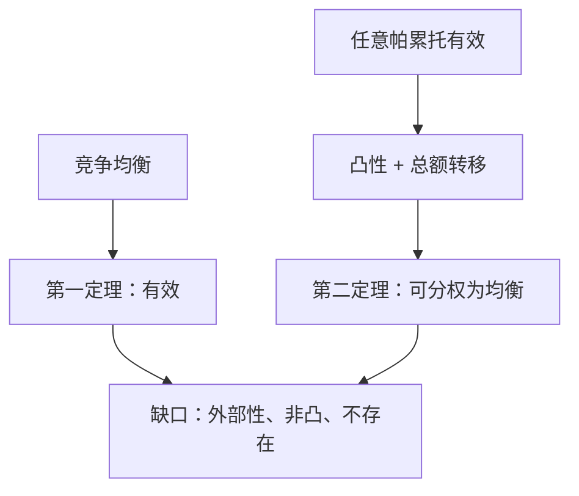

# 福利经济学两定理

竞争均衡配置是帕累托有效的；反过来，在凸性下，任一帕累托有效配置都可以在适当的财富再分配之后，成为某个竞争均衡。

<footer>—— Arrow, An Extension of the Basic Theorems of Classical Welfare Economics, 1951；Debreu, Theory of Value, 1959</footer>

[上一课](/econ/walras-law-numeraire)（瓦尔拉斯定律与计价物）。定义了瓦尔拉斯均衡，但没有把它和[帕累托集](/econ/edgeworth-pareto)接起来。缺口是规范：均衡配置算不算「没有浪费」？若社会想要合同曲线上的另一个点，能否只改禀赋、仍用竞争去实现？两定理回答这两问。它们不是增长理论，也不给人际效用加法。

## 问题

第一问：市场会不会停在盒内相交而不相切的点上？若会，竞争就接受了帕累托改进的余地。第一福利定理说：在局部非饱和下，不会。均衡配置一定有效。证明几乎是会计：若有帕累托改进，改进后的配置更贵，加总会戳破总财富，与出清矛盾。

第二问：有效点很多，竞争只挑其中与初始禀赋对应的那些。若禀赋极端，均衡可以有效但很不平等。第二定理说：只要偏好（与生产集）凸，任意有效配置都可以找到一组价格和一组转移支付，使它成为转移后经济的均衡。计划者不必指定每人消费什么，只需改购买力，再让市场跑。

### 看不见的手是第一定理，不是第二定理

把两定理揉成一句「市场总是最好」会读错。第一定理是：在完整市场、无外部性、局部非饱和下，均衡有效。它不说均衡唯一，不说均衡公平，不说均衡存在。第二定理是：有效点可用竞争去分权实现，前提是凸性和可做总额转移。转移需要识别谁该得到购买力，这已经是计划信息，不是放任。

局部非饱和：任意消费束的任意邻域里都有严格更好的点。它保证预算等式成立，从而「更好的配置一定更贵」。无它，均衡可能浪费免费财，第一定理失败。

## 方法

第一定理。设 $(p^*,x^*)$ 是均衡，偏好局部非饱和。若 $x$ 帕累托优于 $x^*$，则对每人 $p^*\cdot x^i\ge p^*\cdot x^{*i}$，且至少一人严格。加总得 $p^*\cdot\sum x^i>p^*\cdot\sum x^{*i}$。可行性要求 $\sum x^i\le\sum\omega^i=\sum x^{*i}$，与 $p^*\ge 0$ 矛盾。故不存在这样的 $x$。

第二定理。设 $x^*$ 有效，偏好连续、凸、局部非饱和。用超平面分离：把「帕累托优于 $x^*$ 的总束」与可行总束分开，分离价格 $p^*$ 支撑每人的偏好与预算。再令转移 $T^i=p^*\cdot x^{*i}-p^*\cdot\omega^i$，则 $(p^*,x^*)$ 是转移后的均衡。盒里的几何是：先把禀赋挪到目标点，再画预算线与双方无差异曲线相切。

生产并行：第一定理对厂商利润最大化同样用「更好的计划更贵」；第二定理要求生产集凸，否则规模报酬递增会让分离失败。

## 机制

第一定理的引擎是共同价格。人人面对同一 $p^*$，边际替代率被对齐到同一组比率，这正是内点有效的切条件。定理比切条件更宽：它不要求可微，角点、自由财都覆盖，只要局部非饱和。

第二定理的引擎是凸性加再分配。凸性让「更好的集合」与可行集能被超平面分开；价格是这个超平面的法向量。转移改变的是超平面相对禀赋的位置，不改变法向量与偏好的相切。总额转移（lump-sum）不扭曲相对价格；若只能用商品税，相对价格被扭，第二定理的制度前提就没了——那是[次优](/econ/theory-of-second-best)的缺口。

两定理都不做人际比较。第一定理说的是帕累托，不是「总福利最大」。要把有效点再排序，需要社会福利函数或公平公理，那些不在本课。

### 总额转移与商品税不是同一工具

第二定理的 $T^i$ 不随消费选择变，因此不改 MRS 与价格的对齐。商品税改的是消费者面对的相对价格，对齐被扭，实现的配置一般离开原目标有效点。实践里识别谁该得 $T^i$ 等于要知道偏好或禀赋，谎报动机会把第二定理从「分权实现」变成机制设计——那是[显示原理](/econ/revelation-principle)的缺口，本课只把逻辑分界钉住：能做总额转移时，竞争仍够用；只能做扭曲税时，进入次优。

生产集非凸时，即使偏好凸，分离超平面可能切不到有效点：规模报酬递增的厂商在竞争价格下要么亏、要么想无限扩张。第一定理仍可在「若均衡存在」下成立，但均衡可能空，第二定理失败。存在性课会回收凸性。

地方非饱和不能改成全局非饱和来凑合。饱和点附近，更好的配置不必更贵，第一定理的会计会漏。教材里用单调偏好保证局部非饱和，是为了少写例外。

## 边界

缺市场则第一定理失效：外部性没有价格，公共物品没有自愿出清，不对称信息让「商品」的质量不可签约。这些是本课程后半的市场失灵，不是把第一定理改成假命题了事。非凸（不可分商品、规模报酬递增）让第二定理的分离失败，均衡可能不存在或无法支撑某些有效点。

转移在实践中不是免费信息。识别 $\succsim^i$ 才能算 $T^i$，而显示这些信息本身有激励问题，要等到[显示原理](/econ/revelation-principle)。本课只在完全信息、完整市场的基准里把两句话钉死。

也不要用两定理去给限价簿背书。簿上的价差、队列、存货是制度细节；福利定理谈的是抽象的 $p$ 与净交易。量化栏不在这里重写。

地方非饱和不能改成全局饱和来凑合。饱和点附近，更好的配置不必更贵，第一定理的会计会漏。教材里用单调偏好保证局部非饱和，是为了少写例外。生产集非凸时第一定理在「若均衡存在」下仍可成立，但均衡可能空，第二定理的分离失败。

## 小结

- 第一定理：局部非饱和下，竞争均衡帕累托有效。
- 第二定理：凸性下，任意有效配置可经总额转移成为均衡。
- 有效不是公平；分权实现仍要转移所需的信息。
- 外部性、公共品、非凸、扭曲税，是后课故意打开的缺口。
- 出处：Arrow, 1951；Debreu, *Theory of Value*。
