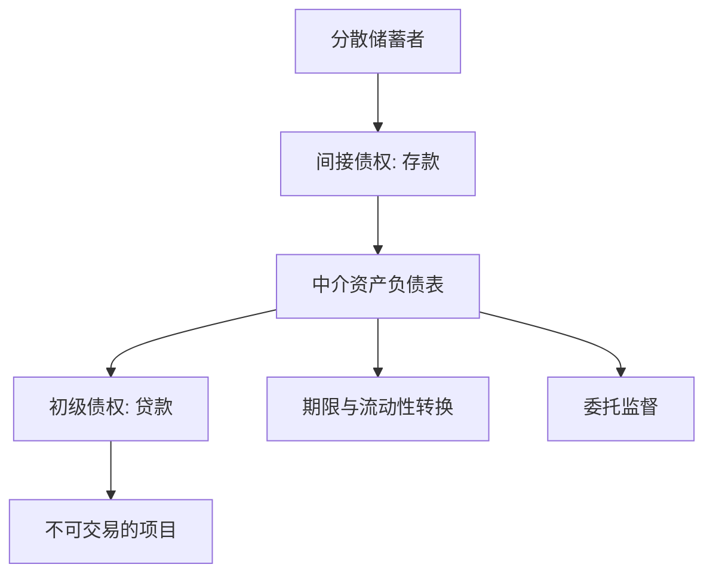

# 金融中介的功能

金融中介不是把同一张债券转手加价，而是把难以交易的初级债权，改写成公众愿意持有的间接债权。

<footer>—— 据 Gurley and Shaw, Money in a Theory of Finance, 1960 整理</footer>

[上一课](/econ/backus-smith)（Backus–Smith）。[不可能三角](/econ/impossible-trinity)。三选二已经把开放宏观的政策空间钉死；本课缺口不是再写一种汇率制度，而是：资本账户开或关之后，储蓄者和投资者为什么仍要通过**银行**配对，而不是直接持有对方的债权。货币层次在[支付](/econ/money-as-medium)里已经出场；本课问的是中介本身。后课默认已经读完：中介的功能是期限、流动性和监督的转换，不是「多一个市场」。

## 问题

完整市场里，[或有要求权](/econ/state-contingent)按状态定价，家庭直接持有企业的状态依存债权，银行没有位置。Arrow–Debreu 均衡不需要存款合同。经验上却到处是银行：吸收活期存款、发放不可交易的贷款、把短负债配到长资产。若只把银行写成「多一层交易成本」，无法解释它为什么能在竞争中活下来，也无法接到后课的挤兑。

Gurley 与 Shaw 把缺口说成**初级证券与间接证券**的差别。企业发行的贷款、债券是初级债权，流动性差、监督成本高、面额不齐。中介买下这些初级债权，对自己的客户发行存款、保单、基金份额——间接债权。公众持有的是中介的负债，不是项目本身。没有这层改写，分散的储蓄者无法对不可分、不可观察的项目定价。

直接金融是储蓄者直接持有初级证券（股票、公募债）。间接金融是持有中介负债。两者可以并存；本课问的是间接金融为何不是冗余。

## 方法

把中介的资产负债表写成转换器，而不是过滤器。资产侧是非流动、信息密集的初级债权；负债侧是流动、标准化、可被当作[支付工具](/econ/money-as-medium)的存款。转换至少有三件独立的事，后课会拆开，本课只并列钉住。

第一，期限与流动性转换：资产期限长、难即时变现；负债可按面值提取。这正是下一课 [Diamond–Dybvig](/econ/diamond-dybvig) 的原料。第二，规模与风险分摊：把许多小额存款合成大额贷款，把个别违约摊到 diversified 资产池上。第三，委托监督：贷款质量不可公开验证，每个储蓄者亲自审计一次是浪费。Diamond（1984）把银行写成**委托监督者**：它监督借款人，存款人只监督银行；资产足够分散时，银行自己违约的概率低，第二层监督变得便宜。

Gurley–Shaw 的 inside money 就是这张负债：它在私人部门内部同时是某人的资产和另一人的负债。央行发行的 outside money 不在本课展开；[准备金](/econ/reserve-endogenous-money)才处理它如何约束这张表。

## 机制

若项目可被公开定价、债权可被无摩擦转卖，中介的负债相对初级证券没有优势，家庭会绕过银行。中介得以存在，是因为有至少一项市场没有：流动性保险、不可合约化的监督、或不可分割的项目规模。转换一旦发生，中介的净值就变成公共信息的压缩：存款人不必知道每笔贷款，只需要相信银行有偿付能力。这也是为什么后课要把**挤兑**写成对这张压缩的挤兑，而不是对某个项目的挤兑。

委托监督要求中介自己有皮在赌局里。若中介可以无成本地转手所有风险，监督激励消失，又回到直接金融。因此中介的资本不是装饰——但资本的「成本」要等到[莫迪利亚尼–米勒](/econ/modigliani-miller)才有严格说法。本课只记下：功能成立依赖中介不能把表完全倒空。

### 与支付、与完整市场的分界

[货币层次](/econ/money-as-medium)已经说明存款是支付工具。本课加的是：支付工具可以是央行负债，也可以是中介负债；后一种之所以被接受，是因为转换已经把不可交易项目压成可转账的要求权。完整市场里这项压缩无必要，每个状态都有价格。Gurley–Shaw 面对的是 1960 年的金融结构事实：大量初级债权从未进入交易所。Diamond 1984 把「为何不每人监督一次」收成成本比较，与流动性转换并列，而不是互相替代。后课会证明：只做监督、不做活期，可以没有挤兑；只做活期、资产全是可交易国债，也可以没有委托监督。现实银行两件都做，脆弱性来自两者的叠加。

Freixas and Rochet 的银行微观经济学把转换、监督与流动性保险分成可拆的模块。主干按这个拆法走：本课并列，下一课只取流动性保险。

## 边界

不要把证券公司、公募基金、支付公司一律叫成「银行」。Gurley–Shaw 的转换强调**以自己的负债为他人提供流动性**；仅做撮合、不承担转换的经纪人，不是本课的对象。也不要把中介写成对[瓦尔拉斯均衡](/econ/walrasian-equilibrium)的否定：它是在证券不全、信息不称时对均衡配置的一种补充合同，不是另起一套价值理论。

本课不推导挤兑博弈，不写货币乘数。下一课把流动性转换收成 Diamond–Dybvig 的活期存款；再下一课才问准备金与内生货币。开放宏观的三选二在这里只提供场景：无论汇率锚在哪，只要有不可交易的初级债权，中介问题就还在。

也不要把「中介存在」读成对[显示原理](/econ/revelation-principle)的否定：在可验证信息下，机制设计可以不经过银行。银行是在信息难以写进公共状态、债权难以转卖时的一种特殊机制。影子银行做同一转换、少受存款保险约束，后课的资本与最后贷款人会对它失效——本课只先承认转换可以发生在牌照之外。

后课默认已经读完：谈到银行，先问它转换了什么，再问合同是否可挤兑。不要在下一课把「中介」重新定义成买卖价差或监管牌照。Gurley–Shaw 的 inside money 与 Diamond 的委托监督，足够支撑挤兑、准备金与资本三课，不必再从「货币是什么」起笔。

开放宏观在上一课程停在三选二。本课程进入货币银行：同一套开放约束下，国内仍有不可交易的贷款。中介问题与蒙代尔–弗莱明不是替代品。影子银行做转换而不持牌，后课的保险与窗口对它覆盖不全——本课先承认转换可以发生在表外。

只做监督、不做活期，可以没有挤兑。只做活期、资产全是可交易国债，也可以没有委托监督。现实银行两件都做。

经纪人撮合而不发行自己的负债，不是本课的中介。Gurley–Shaw 强调的是间接证券。

## 小结

- 完整市场不需要银行；银行存在是因为初级债权难以直接持有。
- Gurley–Shaw：中介把初级证券改写成间接证券。
- 功能是期限/流动性转换与委托监督（Diamond 1984），不是加一层买卖价差。
- 转换把挤兑风险做成后课缺口；资本成本留给公司金融。
- 出处：Gurley and Shaw, *Money in a Theory of Finance*；Diamond, *Review of Economic Studies* 1984。
