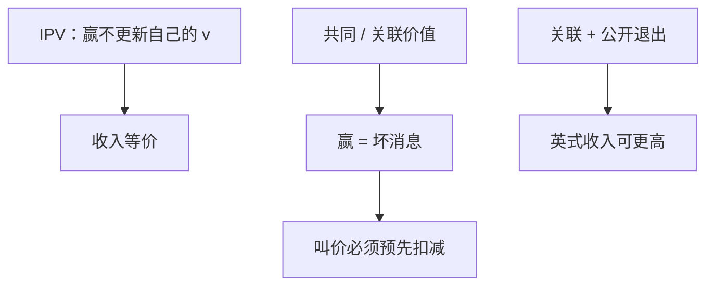

# 共同价值与赢家诅咒

赢得拍卖是坏消息：胜者的信号在所有人里最高，对共同价值的条件期望低于只凭自己信号时的估计；不遮挡就会买贵。

<footer>—— 据 Wilson 的矿物权投标；Milgrom and Weber, A Theory of Auctions and Competitive Bidding, Econometrica, 1982</footer>

[上一课](/econ/revenue-equivalence)在 IPV 正则下把标准拍卖的期望收入钉成同一条 $Q$。缺口是估值不再独立私有：物品有一块共同价值（油储、公司控制权），各人只持有有噪声的信号。此时「赢」本身更新信念，收入等价失败，英式与密封不再一样。本课钉赢家诅咒与关联，不把价格发现写成限价簿。

## 问题

矿物权模型：真实价值 $V$ 对所有人相同（或高度关联），信号 $X_i=V+\varepsilon_i$。若仍按 IPV 的一价均衡去叫，赢的时候 $\mathbb{E}[V\mid X_i=x,\,\text{赢}]$ 低于 $\mathbb{E}[V\mid X_i=x]$——因为赢意味着别人的信号都更低。这就是赢家诅咒：胜者系统性地高估。理性投标必须在叫价里预先扣掉这块坏消息，遮挡比 IPV 更狠。

关联（affiliation，Milgrom–Weber）：信号与价值同向变动的强形式。关联下，对手叫得高是好消息。英式拍卖把对手的退出价公开，胜者在加价过程中不断更新；密封一价没有这条公开路径。联动原理：公开与价值关联的信息，能提高期望收入。故关联下英式期望收入 $\ge$ 二价 $\ge$ 一价（在对称模型的标准排序里）。

### 诅咒不是「人变傻」

诅咒是条件期望的会计：选择「赢」这个事件，截断了信号分布的下侧。幼稚投标用无条件估计，均衡投标用「给定赢」的估计。实验里常见过度叫价，那是对这条会计的偏离，不是定义本身。

Wilson 的完全竞争投标极限：人数极多时，叫价趋近真实 $V$，但有限 $n$ 时诅咒必须进入策略。Milgrom–Weber 把英式、荷式、一价、二价放进同一关联结构里比较收入，IPV 是关联退化为独立的特例。

IPV 里赢不提供关于自己估值的新信息，因为 $v_i$ 已是私有且独立。
共同价值里 $v_i$ 还没被自己完全知道，赢是额外的似然比。
收入等价用的包络少了这项条件期望，所以推不出「同一 $Q$ 则同一收入」。

## 方法

对象：对称关联模型，风险中性。先写一价：叫价 $b(x)$ 对「给定 $X_i=x$ 且赢」的条件价值取期望再遮挡。再写英式：价格升到只剩两人时，公开退出史已经把下侧信号泄露，剩余策略接近「真实条件期望」。比较收入用联动：把密封里藏着的对手信息，部分搬到路径上。

## 机制

信息结构改的是「赢」这个事件的含义。IPV 下赢只是「我的私人数字最大」；共同价值下赢是「我的噪声最朝上」。理性人把这一似然比写进叫价，否则事后 $\mathbb{E}[V-\text{支付}\mid\text{赢}]<0$。英式把别人的信号逐步公开，胜者的条件期望在加价中被纠正，诅咒被部分保险；密封没有这条保险，叫价更保守或收入更低。

联动不是「公开越多越好」的空话：公开的必须与价值关联。公开无关噪声只增加混淆。这与道德风险里「合同只应依赖充足统计」同一逻辑，但本课的对象是拍卖信息结构，不是工资合同。

IPV 里赢不提供关于自己估值的新信息；共同价值里 $v_i$ 还没被自己完全知道，赢是额外的似然比。
收入等价用的包络少了这项条件期望，所以推不出「同一 $Q$ 则同一收入」。

## 边界

纯共同价值是极限；多数拍卖是混合：私人使用价值加共同残值。非对称信号、胜者知道得更多（winner's curse 的镜像是「败者的羡慕」），排序可以改。风险厌恶、合谋、预算约束再叠加，Milgrom–Weber 的收入排序不必成立。

不要把赢家诅咒写成限价簿里知情交易者吃价差：那是做市存货与方向性私人信息，属于微观结构，不在本课。本课的价格是一次性拍卖叫价，没有连续簿。

后课默认：离开 IPV 后，赢是信息；关联下公开加价可以拉开收入。配置若变成双边配对、没有单物品叫价，要用稳定匹配，不是再写一条叫价函数。

### 遮挡的两层不要混

IPV 一价的遮挡是怕自己付多、怕没赢的概率权重；共同价值还要再扣「给定赢，$V$ 更差」。两层可以同向，实证难分。油田租赁、公司并购是经典场景：胜者往往是信号最乐观的那一个。

联动原理要求对称与关联；一旦信号结构非对称，公开信息也可能伤害卖家。本课只钉对称教具。

## 小结

- 共同价值下，赢截断他人信号，条件期望低于事前估计。
- 理性叫价必须预先扣掉赢家诅咒；幼稚投标会买贵。
- 关联使英式的公开退出有价值，收入等价失败。
- 这不是限价簿价差；下一课把配置换成双边匹配。
- 出处：Wilson 矿物权投标；Milgrom and Weber, *Econometrica* 1982。
