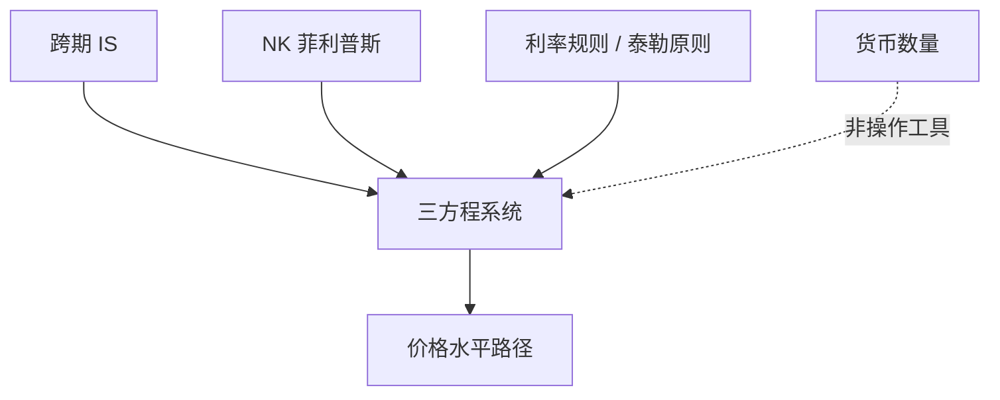

# Woodford 利息与价格

在现金几乎消失的极限里，货币政策仍能通过利率规则决定价格水平；数量方程不再是操作手册。

<footer>—— Woodford, Interest and Prices: Foundations of a Theory of Monetary Policy, Princeton University Press, 2003</footer>

附录对照。主干[新凯恩斯粘性价格](/econ/new-keynesian)与[泰勒规则](/econ/taylor-rule)已用三方程课本。本篇对照 **Woodford 2003 原书的问题设定**：Wicksell 式的利率主义如何在跨期一般均衡里被写严，以及为何可以几乎不提货币数量。不重做 [Kydland–Prescott](/econ/kydland-prescott) 的时间不一致例子——书把承诺与时间一致政策当成工具，而不是再证明一遍规则优于权变。

## 问题

货币主义操作把 $M$ 当工具；$MV=PY$ 是沟通装置。1990 年代主要央行已经盯短期名义利率，准备金迁就结算。缺口是理论：若交易对现金的需求可以任意小（cashless limit），价格水平由什么钉住？Woodford 的回答是新维克塞尔：利率相对自然利率的路径，加上价格粘性，决定通胀与产出缺口；利率规则必须满足泰勒原则一类的激进程度，均衡才局部唯一。

原书是研究生专著，不是一篇 AER。附录对照其问题与方法骨架：跨期 IS、新凯恩斯菲利普斯、利率规则，以及现金的有无不是定价的关键。主干三方程是这本书的课堂压缩。

自然利率：灵活价格均衡下的实际利率。政策利率高于它，需求收缩。这是 Wicksell 1898 的语言进了 Calvo 价格与欧拉消费。确定性问题：差的规则允许多条通胀路径都自洽；好的规则把预期钉在唯一局部路径上。

## 方法

代表性家庭欧拉给出实际利率与消费增长的关系，即跨期 IS。Calvo 交错定价给出通胀对产出缺口与预期通胀的 NKPC。政策用

$$
i_t = i^* + \phi_\pi(\pi_t-\pi^*)+\phi_x x_t
$$

一类规则替换 LM。货币数量若出现，只作为利率规则的残余（准备金供给迁就）。分析工具是对数线性、理性预期、局部确定性。最优政策章用二次损失逼近福利，讨论通胀目标与承诺下的利率路径，直接接上 1977 年的承诺价值，但对象换成粘性价格的微观福利。

与 Friedman 1956 的对照：两者都要长期锚定名义量；Friedman 用稳定的 $M$ 需求，Woodford 用利率规则对通胀的反应。经验上货币需求不稳，反而抬高了利率主义的相对地位——这是读原书时的语境，不是对 1956 的否证演算。

## 机制

机制是名义锚在预期里，不在印钞机的机械比例。粘性使今天的利率能移动真实需求；理性预期使规则的**未来**部分进入今天的 IS 与 PC。因此沟通与承诺属于同一套工具，数量宽松在零下限才作为替代工具进入——主干[零下限](/econ/zlb-unconventional)的位置在此预定，原书已专章处理。

Cashless 不是「没有货币」。计价单位仍在，央行仍是唯一能定隔夜利率的机构。消失的是作为数量工具的 $M$。

## 边界

不要把 2003 书当成已经包含后危机的足量非常规操作细节；它提供框架，不是 2008 之后的手册。也不要在附录里校准 $\phi_\pi$。不完全竞争加 Calvo 的福利近似依赖特定扰动；异质性、金融摩擦是后文。金融栏的[内生货币](/econ/reserve-endogenous-money)解释准备金如何迁就；Woodford 假定迁已经发生，从利率往下写。

下一篇（也是宏观附录最后一篇）对照银行挤兑原文：利率规则管的是价格水平，不管活期合同的双均衡。

## 小结

- 附录对照 Woodford 2003：利率规则在近现金极限里决定价格路径。
- 骨架是 IS + NKPC + 满足泰勒原则的规则；$M$ 不是操作工具。
- 承诺价值接到 KP 1977，对象换成粘性价格福利。
- 出处：Woodford, *Interest and Prices*, 2003。
