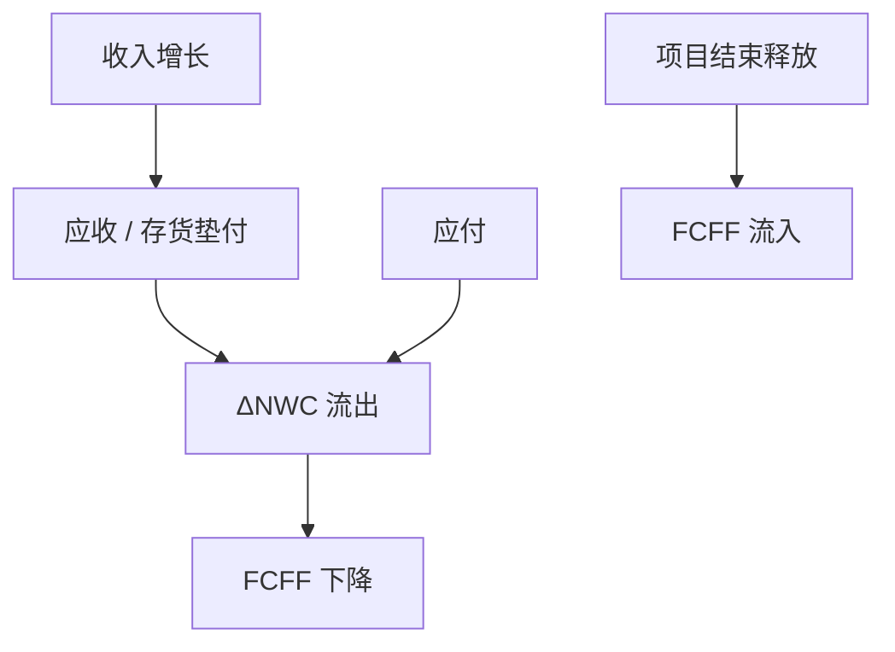

# 营运资本

    
应收、存货与应付是项目的一部分：增长要垫付现金，衰退才释放；把它们排除在资本支出之外，等于高估自由现金流。

    <footer>—— Brealey, Myers and Allen, Principles of Corporate Finance；对照 FCF 课的净经营资产恒等式</footer>

[上一课](/econ/lease-vs-buy)把长期资产的租与买写清。本课缺口是短期经营资产：营运资本（NWC）如何进入增量 FCFF、周期与通胀下为何特别容易算错。不重做租赁税盾公式，不把现金持有的治理理论提前。

## 问题

[自由现金流预测](/econ/fcf-forecasting)已经写过 $\Delta$ NWC 进入分子。资本预算仍常把「厂房投资」当唯一初始流出，好像客户会预付、存货自己出现。缺口是机制：NWC 是内生的生产函数——赊销条款、生产周期、供应商信用决定垫付天数。增长时垫付与收入近似成比例，像永续的再投资；项目结束必须把应收收回、存货出清，否则终值里藏着一笔永远不回来的现金。

与 Jensen 现金：预防性现金是治理与摩擦对象；经营性 NWC 是生产技术。本课只估值经营垫付，不把超额现金写成项目 NPV。

现金转换周期 ≈ 存货天数 + 应收天数 − 应付天数。天数下降释放现金，等价于正的一次性 FCFF，但可能以价格或短缺风险为代价——代价进经营现金流，不是只改周转、不改 EBIT。

## 方法

增量 NWC = 项目引起的应收 + 存货 + 经营现金 − 应付。初始垫付是 $t=0$ 流出；之后随收入增长再垫；期末释放是流入。通胀：名义应收膨胀，垫付更多，下一课会与名义折现一起写。季节性：年内高峰垫付不在年末报表里出现，但折现要按月度现金，不能只用年报余额。

配额与 IRR：营运资本高峰使早期现金更负，IRR 更差、NPV 仍可能很好——又一条比率陷阱。APV：NWC 风险靠近经营，用 $r_U$ 折，不要用税后 $r_D$。

信用政策是价格：放宽应收等于降价加承担客户 beta。把增长做成「只加收入不加 NWC」是最常见的过关表。

## 机制

机制是时间间隔与一价。货物先走、现金后到，企业提供了贸易信贷；供应商同样。贸易信贷是短期债务替代，但风险是客户违约与经营周期，不是公司债 beta。宏观课序里的信贷摩擦会让贸易信贷在银行紧缩时扩张（替代）或收缩（互补）——企业预测要用情景，不要把历史天数当常数。

与实物期权：存货是缓冲期权，减少缺货，持有成本是仓储与折现。最优存货不是零 NWC。资本预算若强迫「精益到零」却不计缺货，会高估 NPV。

### 应付不是免费资本

拉长应付像无息贷款，但供应商会加价或减服务。净效应进 EBIT 与 NWC 两边。只改应付天数、不改进货价格，是配额游戏。

经营现金（收银台、最低存款）属 NWC；超额现金与有价证券是融资存量，估值时从 EV 得到股权价值时再减，不进项目 FCFF——除非项目改变最低经营现金。

## 边界

不要把本课写成营运资本管理手册（EOQ 细节）。对象是增量现金进 NPV。现金持有的权衡（预防、税、代理）在治理单元。下一课通胀：名义 NWC 膨胀是隐藏的真实税。

后课默认：增长垫付、结束释放；NWC 用经营折现率；应付有代价。不要在终值里假设收入永续增长却把 NWC 固定在第 $T$ 年。

## 小结

- 营运资本是项目投资：增长垫付、结束释放，漏记则高估 FCFF。
- 信用与存货政策是价格和期权，不是免费的周转改善。
- 应付不是无代价的资本；高峰垫付会再次让 IRR 与 NPV 分家。
- 出处：Brealey, Myers and Allen；与 Penman 净经营资产恒等式一致。
