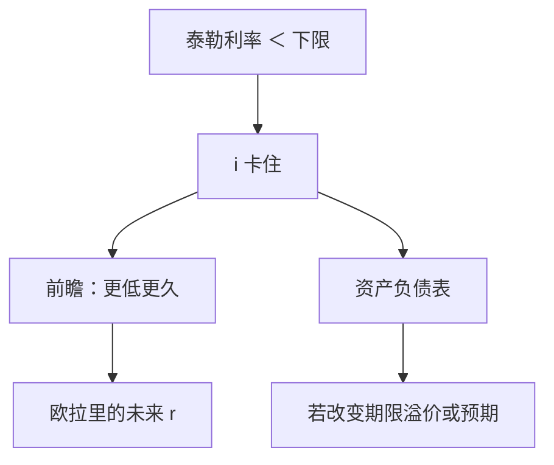

# 零下限与非常规政策

当名义利率不能再降，政策就从「今天的 $i$」换成「对未来路径与资产负债表的承诺」；工具变了，时间一致问题没有消失。

<footer>—— Woodford 对利率规则与零下限的分析；Eggertsson and Woodford, Brookings 2003</footer>

[上一课](/econ/ior-corridor-floor)（准备金利息与走廊）。在此之上，承诺写成：未来不能再偷意外通胀。泰勒规则在正利率区用 $i$ 反应 $\pi$。本课的缺口是：$i$ 有有效下限（现金的名义回报约为零），规则给出的泰勒利率一旦为负，工具就卡住。Friedman 的数量扩张在下限附近重新进入；Woodford 强调真正起作用的仍是对未来利率与价格水平的承诺。财政乘数在下一课，因为下限上货币换不来同样的实际利率路径。

## 问题

现金保证名义利率不能大幅为负（存储成本可有一点负利率）。欧拉要求的实际利率若低于下限允许的 $i-\mathbb{E}\pi$，当前需求过弱，$\tilde{y}$ 更负，$\pi$ 更低，实际利率反而更高——紧缩螺旋。Hicks 的流动性陷阱是祖先：LM 水平时 $M$ 扩不动 $i$。现代写法是 $i_t=\max\{i_t^{\mathrm{Taylor}},i_{\mathrm{ELB}}\}$。

缺口不是「要不要印钞」的口号，而是：在 $i$ 卡住时，哪一种操作能改变欧拉里的 $\mathbb{E}\sum$ 未来实际利率，或改变自然利率本身。Eggertsson 与 Woodford（2003）：最优是承诺在下限结束后保持更低更久的 $i$，让价格水平回到目标路径，而不是只扩张当前的 $H$ 却宣布一回到正利率就立刻收紧。

数量宽松改变央行资产负债表的期限与风险。若预期不变，只是把公众的债券换成准备金，在弹性价格下接近中性。非常规政策的核是预期，不是「资产规模」这个数字本身。

## 方法

把泰勒规则加上 $\max$。下限持续期由冲击与承诺共同决定。前瞻指引：把 $i$ 的路径写成状态依存（「直到通胀与缺口满足…」），以降低 $\mathbb{E}r$。价格水平目标或平均通胀目标把过去的偏低通胀记入未来超调，正是承诺技术在下限上的延伸。

基础货币在下限上可以由数量方程的 $V$ 下降来吸收：公众愿意持有任意 $H$。铸币税在 $\pi$ 很低甚至为负时不是问题；问题是通缩税反向——持币收益过高、支出过少。

### 非常规不是第四种中性

长期中性仍在：一旦离开下限、价格灵活调整，多出来的 $H$ 仍要进 $P$ 或被回笼。非常规改变的是下限持续期内的预期路径。卢卡斯批判：若公众认为 QE 会在复苏后被立刻对冲，则当前扩张几乎不进 $\mathbb{E}\pi$。

Krugman（1998）用流动性陷阱描述日本：货币增加若被看作暂时，只换成现金，不改 $P$。前瞻承诺改变的是「暂时」这一句。

## 机制

欧拉向前看。今天 $i$ 已经为零，能降的是未来一串 $i$ 的期望，或抬高 $\mathbb{E}\pi$。承诺「弥补过去的通胀欠账」等于抬高未来价格水平目标，当前 $\pi^e$ 上升，实际利率下降。若承诺不可信（时间不一致：复苏后央行又想立刻回到低通胀、拒绝超调），则下限更长。Kydland–Prescott 的逻辑在此翻转符号：事后想要紧缩，事先需要把宽松绑住。

数量宽松若只等比例扩大基础货币、且被预期会在复苏后收回，接近 Krugman 的暂时货币，效应弱。若改变长期债供给或被读成财政主导的未来 $\pi$，通道不同。本课不发明某一次 QE 的基点。有效下限可以略负，逻辑不变：工具区间仍被切断。

铸币税在 $i=0$ 时流量小。非常规政策的目的是抬 $\mathbb{E}\pi$ 与缺口，不是为财政抽税。若市场把它读成货币化，通道串到 Sargent–Wallace。

## 边界

本课不评估某一次 QE 的基点效果，不把加密资产当负利率技术。开放经济下，下限还通过汇率与资本流动外溢，蒙代尔课会碰到，这里封闭。量化栏没有央行操作台。也不要把 CIP 基差当这里的操作成本；需要时链到[利率平价](/quant/irp)。

后课默认：$i$ 有下限时，政策评估必须写路径承诺，不能只写当期 $M$。下一课：财政扩张在下限上的乘数，以及李嘉图是否把它抵消。

## 小结

- 泰勒利率低于有效下限时，当期 $i$ 失去常规边际。
- 真正的工具是未来利率路径与名义锚的承诺。
- QE 若不同时改变预期，接近资产互换。
- 复苏后拒绝超调，是下限上的时间不一致。
- 长期中性在离开下限后仍然成立。
- 出处：Krugman, Brookings 1998；Eggertsson and Woodford, Brookings 2003。
