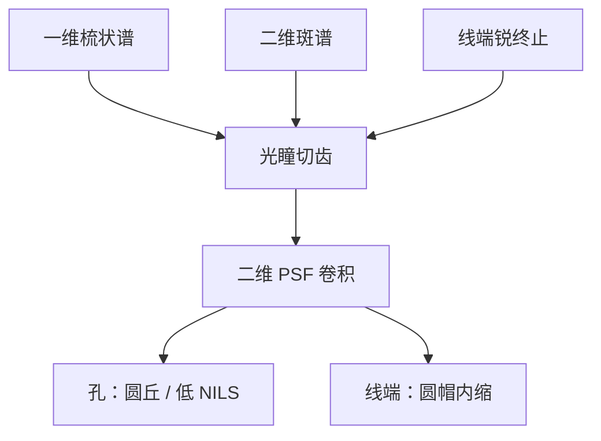

# 接触孔与线端成像

一维骨架把线栅收成几根齿；孔和线端把频谱铺成二维斑，光瞳切的是面积，核在两个方向上同时卷积。

<footer>—— Goodman 的二维傅里叶对；孔与线端的光刻读法见 Mack</footer>

[上一课](/litho/focus-tilt-compensation)结束了传递函数课序。缺口是：骨架一直可以在一维线上讲完，**接触孔与线端**却必须用二维卷积。主干已有[接触孔图形化](/litho/contact-hole-patterning)与[线端缩短](/litho/line-end-shortening)的产线侧；本课只把它们接到 PSF / TCC，不重写孔层流程与锤头 OPC。禁戒节距留给[下一课](/litho/forbidden-pitch)。

## 问题

线栅的 $T$ 是梳；圆孔或方孔的 $T$ 是 jinc 或 sinc 的二维斑，能量散在面积上。光瞳切掉斑的外圈，像面核把孔糊成圆丘，对比和 NILS 通常弱于同样 $k_1$ 叙事下的密线——因为两个方向都要过截止。线端是矩形的突然终止：纵向也出现锐边，二维核把端面收成圆帽，阈值轮廓内缩。

缺口不是再定义 Airy，而是：后课二维图形（角、EPE）默认已经会用「面积频谱 × 核」来读孔和端，而不是把孔当成「短一点的线」。

### 照明各向同性

强偶极抬一维节距，同时把孔拉成长圆、把线端的横纵糊不对称。孔阵列常用常规或弱四极，正是让二维斑在光瞳里比较圆。本课不选产品照明；只要求报孔 CD 与 LES 时声明 $S$ 的对称性。矢量浸没下两向不能同时 TE，孔再付一笔[上一课序](/litho/immersion-vector-imaging)的税。

方孔的角在掩模上是直角，空中像在光学直径内已经圆。计量若报「孔圆度」，先问是光学核还是刻蚀。主干孔课管工艺窗与随机缺失；本课管成像核。

## 方法

计算：在同一套 SOCS 核上放有限长线或孔阵列，切阈值等高线。相对无限长线的中段，端面内缩量即光学 LES；相对掩模方孔，像面等强度线变圆即光学圆化。邻孔进入光学直径后，交叉项按 Hopkins 双线性进来——孤立孔与密阵列不是同一只有效核。

采样：二维 Nyquist 两个方向都要满足，孔的旁瓣折叠会假造「邻孔桥连」。网格规则沿用[采样课](/litho/sampling-theorem-imaging)。

### 与主干课的分工

主干孔课回答层怎么选照明、相移、过刻；主干 LES 课回答怎么量缩短、怎么意识到中段 CD 看不见端。本课只提供前向：为什么二维一定更糊。修版（锤头、衬线、孔偏置）仍属 OPC，这里不出场。

## 机制

卷积把物体的每个凸起与 $h$ 做相关。孔的直径若接近核宽度，峰值掉、边缓，剂量一点就穿或封。线端相当于半平面终止，核的一半悬空，等强度线回缩约核半径量级，随焦点变本加厉——因为离焦让核更胖。部分相干交叉项让对面线端、邻孔参与这场回缩，所以 LES–间隙曲线不是常数。

## 边界

胶扩散与刻蚀再收一截，光学项必须先分开：改照明或改对面间隙，光学 LES 先动。EUV 缺孔是计数统计，不是 Airy 太胖的同义词。禁止把未公开的某层「孔 NILS 门槛」当普遍常数。也不要把 Sparrow 两点距直接当孔阵列节距规则。

## 小结

- 孔与线端是二维频谱被光瞳切面积，不是短线栅。
- 光学 LES 与孔圆化来自同一只二维核。
- 照明对称性决定孔椭圆和端头各向异性。
- 邻域交叉项用 TCC，不把孤立核当密阵列。
- 下一课：一维 through-pitch 上的禁戒节距。
- 出处：Goodman；Mack；Hopkins (1953)。
