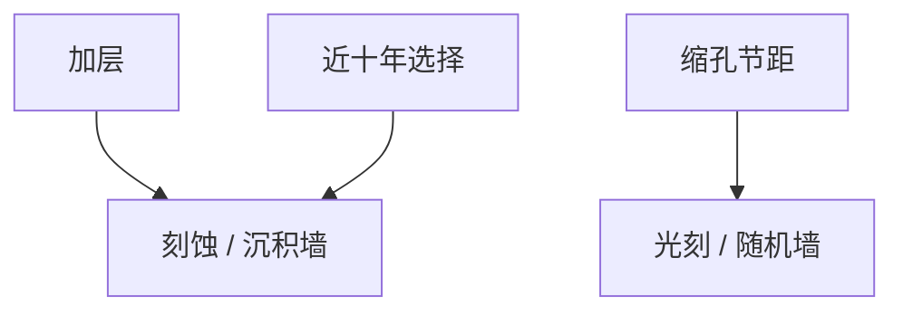

# 3D NAND 与光刻负担转移

加层比缩孔更划算的阶段，扫描机从分辨率机器变成对准与大深宽比集成的仆人。

<footer>—— 对照 3D NAND 堆叠使图形化瓶颈从光刻转向刻蚀/沉积的公开产业叙事</footer>

[上一课](/litho/memory-litho-dram-nand)区分 DRAM 与 NAND。缺口是转移机制。本课钉 3D NAND 与光刻负担转移。替代光刻形态从[下一课](/litho/multibeam-direct-write) 另起课序。

## 问题

沟道孔要穿过百层介质，ARDE、扭曲、选择比是主墙；光刻提供孔位置、CD 均值与倾斜预算。台阶（staircase）要多次曝光或特殊光刻定义每层接触。键合两片 NAND 时对准进封装光刻量级或更好。EUV 对孔的随机与成本交叉仍可能出现，但「每两年加层」阶段的 capex 偏向刻蚀机台。

缺口是**边际回报从 k1 转到层数**，不是 NAND 无光刻。把 3D NAND 当光学课的反例即可：同一门课程序列里，瓶颈可以离开投影光学。

### 与逻辑 3D（CFET）不同

逻辑 3D 仍要密金属与切线；NAND 的重复孔阵列对 SMO 二维自由度需求不同。不要把负担转移写成所有 3D 的普遍定律。

孔倾斜与套刻在电学上变成串扰与开路。光刻规格以电学为源，规则起源课的逻辑在此同样适用。

## 方法

预算：孔 CD、位置、倾斜、台阶套刻。机台组合：浸没或 KrF 对某些非最密层可能足够。检测：深孔需要特殊计量，e-beam/光学对表面，剖面靠 FA。

## 机制

比特密度 ≈ 层数 × 孔面密度。层数增加时，刻蚀时间与难度涨；孔节距缩时，光刻与随机涨。产业选择了先加层，于是光刻相对份额下降。层数墙出现后，节距与 EUV 可能再回来——IRDS 存储章的红格，不是本课预言。

## 边界

不预测何时缩孔再成主墙。不给堆叠层数表。节点经济课序在 NAND 转移处收束，下一课序谈投影光刻的替代形态。

后课默认：并非一切先进图形化都是 EUV 逻辑；下一课多束直写作为另一条「不经过掩模」的路。

## 小结

- 3D NAND 阶段边际密度常来自加层，瓶颈在深孔刻蚀。
- 光刻仍管孔位、台阶、键合对准。
- 与逻辑 3D 的负担结构不同。
- 出处：3D NAND 图形化负担转移的公开产业叙事。
