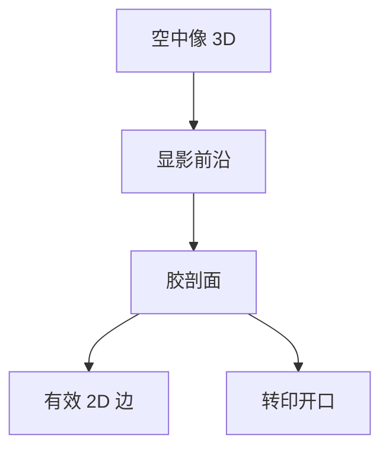

# 三维胶模型

2D 轮廓假定胶是无限薄的刀；真实胶有厚度、侧壁角和顶损失，转印看到的是这截三维物体。

<footer>—— 对照三维抗蚀剂剖面模拟与紧凑 2D 轮廓签核的公开讨论</footer>

[上一课](/litho/model-residual-analysis)在 2D EPE 上诊断残差。缺口是转印与电学有时对侧壁和剩余厚度敏感：塌缩、开口不足、硬掩模打穿。本课钉三维胶模型。刻蚀核如何标定，留给[下一课](/litho/etch-model-calibration）。

## 问题

[胶紧凑模型](/litho/resist-compact-model) 输出平面轮廓，全芯片 OPC 靠它。三维模型（反应–扩散 + 显影速率沿 z，或经验侧壁角）解释 FEM 截面、顶圆化、T-top、底脚。高 NA 薄胶与 EUV 吸收浅，z 方向自由度变少，但相对误差对转印更大——见薄胶转印课的衔接，本课不重写光子吸收。

缺口是**何时 2D 不够**，不是每层都上 3D 全芯片。把截面 SEM 当 OPC 目标，算力与计量都会炸。

### 3D 是签核补充，不是替代 CM

热区、新胶、新 NA 用 3D 解释 2D 残差中的焦点不对称与「CD 对了但刻不穿」。日常 TAPOUT 仍是 2D CM + 刻蚀核。3D 校准集是截面与 AFM，样本少，过拟合风险高。

显影后侧壁角进入刻蚀开口；2D EPE 为零仍可能 ARDE 或打穿失败。AEI 目标要声明是顶 CD 还是电学 CD。

## 方法

实验室：PROLITH 一类或内部 3D 求解器，用 Dill/Mack 参数加 PEB。紧凑 3D：对 2D 边附加角与高度的经验映射，由截面校准。与 [抗蚀剂剖面仿真](/litho/resist-profile-simulation) 的关系：那课写剖面物理；本课写它在模型栈里的位置——校准后的 2D 签核何时必须加 3D 抽检。

EUV 二次电子模糊在 z 与 xy 都有，3D 模糊核与 2D 有效模糊不是简单切片。

## 机制

曝光在 z 上随吸收指数衰减（DUV 更明显，EUV 也非均匀），显影前沿从表面推进，形成角。驻波（薄膜课已有）给出 z 调制，截面呈波纹。紧凑 2D 把这些积分成分成「有效边」；当转印阈值落在剖面某处而不是「平均边」时，积分失效。

## 边界

3D 胶模型不替代等离子体腔体。全芯片 3D 反应–扩散仍不可作 OPC 内循环。不编造某胶的侧壁角度数表。

后课默认：ADI 可以是 2D 边加抽检剖面；下一课把 AEI 当作第二个要校准的邻域算子。

## 小结

- 2D CM 是全芯片默认；3D 胶解释剖面敏感的转印与焦点不对称。
- 高 NA 薄胶让 z 误差更致命，但仍不是全芯片 3D OPC。
- 截面计量样本少，3D 经验项易过拟合。
- 出处：Mack 三维显影与剖面；紧凑 2D 对 3D 的工程分工。
