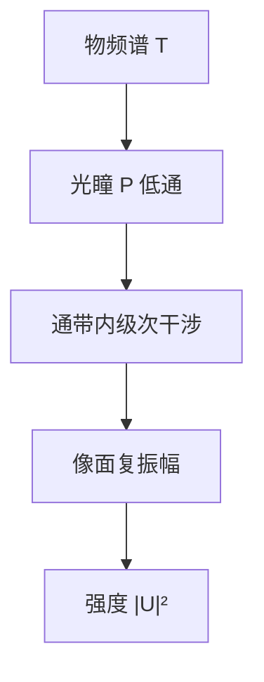

# 阿贝成像原理

显微镜里的物不是被透镜「拍照」；它先把照明衍射成一套频谱，镜头只让进得去的那些级在像面重新干涉。

<footer>—— Abbe 成像原理；傅里叶光学表述见 Goodman, Introduction to Fourier Optics</footer>

[上一课](/litho/diffraction-spatial-freq)已经把掩模写成空间频率，并指出可传播的横向频率不超过 $n/\lambda$。缺口是：投影物镜并不会把整根频率轴都送到晶圆——它只收集进入光瞳的那一段，像是被截断频谱的干涉图。本课把这件事收成阿贝成像：物频谱被光瞳当低通。数值孔径如何把截止写成 $n\sin\theta$，留给[透镜与数值孔径](/litho/lens-na)。仍不要写 $\mathrm{CD}=k_1\lambda/\mathrm{NA}$：那是产线判据，本课还在问「像的场从哪几个频率来」。

## 问题

只有衍射级、没有收集孔径，就无法回答空中像为什么变糊。阿贝的实验图像很短：照明 → 物体衍射 → 后焦面（光瞳）上出现级次 → 这些级作为相干光源在像面干涉。镜头的作用是当空间滤波器，不是当几何缩放尺。上一课留下的频率轴，本课要被一扇窗切掉。

缺口因此是「低通」这两个字的光学含义：哪些傅里叶分量还在，像就由它们干涉而成；被挡住的高频回不来，边会变缓。这与显微镜两针孔是否刚可分辨不是同一句话。

### 相干成像先写场，再写强度

完全相干时，像面复振幅是物频谱乘光瞳函数后再逆变换：

$$
U_\mathrm{img}=\mathcal{F}^{-1}\bigl\{P(\mathbf{f})\,T(\mathbf{f})\bigr\}.
$$

$T$ 是物（掩模）频谱，$P$ 在通带内为复透过率、带外为零。强度 $I=|U_\mathrm{img}|^2$ 才是空中像的相干特例。部分相干要把许多照明方向的 $I$ 相加，那是后课；阿贝先把「光瞳乘频谱」钉死。

阿贝自己讨论的是显微镜与相干照明下的衍射级。光刻把同一句话搬到投影物镜：光瞳平面就是物体傅里叶面（中间可能有缩比）。

## 方法

把光瞳坐标与空间频率对齐：径向越靠外，频率越高。周期掩模的级是光瞳上的点；孤立图形的谱是连续斑。理想圆孔 $P$ 是硬切；有像差时 $P$ 带相位，仍是同一套乘法，只是通带里不再平坦——相位展开留给后面的 Zernike 课。

Goodman 的 4f 系统把阿贝写成两次傅里叶变换：第一次在光瞳得到 $T$，乘 $P$，第二次得到像。扫描机的投影物镜不是教室里的 4f，但信息流相同：物面 ↔ 光瞳（频率）↔ 像面。缩比把频率轴按倍率缩放，讨论「哪一级在光瞳里」必须声明物方还是像方。

### 至少两级才有条纹

只收零级，像面强度均匀，没有空间结构——上一课已经说过。阿贝补上工程含义：分辨率再好的镜头，若照明与节距配合不当，一级仍可能落在窗外汇，调制为零。后课用 $\mathrm{NA}$ 给这扇窗标半径；本课只要求把成像理解成「通带内频率的干涉」，而不是「物体被缩小贴到晶圆上」。

相移掩模改的是 $T$ 的相位，不是光瞳半径。零级被压掉之后，通带里剩下的级重新干涉，对比可以上升。机制已在阿贝框架内，不必另起一套成像原理。

## 机制

锐边的频谱拖得很远。光瞳切掉高频，等效于像面与一个衍射核卷积，边变成斜坡。周期图形则更干脆：级在窗内或窗外是离散事件，节距一密，一级出瞳，对比崩掉。这就是「衍射极限成像」在频率语言里的机制，尚未引入工艺因子 $k_1$。

斜照明把 $T$ 在光瞳里整体平移，本会出窗的一级可以再进来——阿贝图像立刻解释离轴照明，而不需要先画偶极产品图。本课不选光瞳形状；只留下：低通滤波器的通带，可以相对频谱移动。

### 后课默认的接口

说到成像，默认是物频谱被光瞳相乘（相干）或进入后课的双线性核（部分相干）。不要再把透镜说成把物体「聚焦成缩小照片」。$\mathrm{NA}$ 还没有正式定义，但光瞳作为频率窗已经可用；下一课只是给窗的边缘一个 $n\sin\theta$。

## 边界

阿贝原理不包含胶的阈值、不包含矢量偏振、不包含掩模三维。标量相干模型在低 $\mathrm{NA}$、松节距上够用；高 $\mathrm{NA}$ 要换能量沉积，定义仍是「通带里的场如何叠加」。也不要把「低通」理解成电子学里的砖墙滤波器已经保证通带内 MTF=1：有限圆孔的相干传递对高频本来就有自己的权重，像差和离焦再往下压。

产线分辨率公式不在本课。后课写 $k_1$ 时，光学部分指的就是本课这扇窗还剩多少可用调制。

## 小结

- 阿贝成像：物体衍射 → 光瞳收集频谱 → 像面干涉。
- 光瞳是物频谱上的低通；$P(\mathbf{f})T(\mathbf{f})$ 决定相干像场。
- 至少两个通带内分量才有空中像调制。
- 斜照明平移频谱，为后课离轴照明预留接口。
- 本课不定义 $\mathrm{NA}$，不写瑞利 CD。
- 出处：Abbe 成像原理；Goodman, *Introduction to Fourier Optics*。
