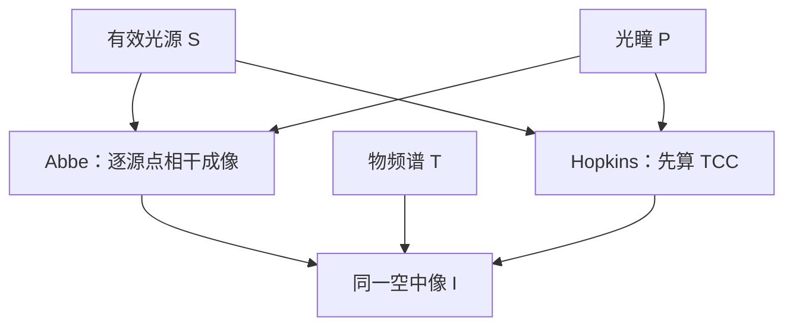

# Abbe 法对 Hopkins 法

部分相干成像只有一套物理：源点各做相干成像再加强度。先扫源还是先收成 TCC，是计算顺序，不是两种光学。

<footer>—— Abbe 的源点图像；Hopkins (1953) 把同一叠加收成与物体分离的核</footer>

[上一课](/litho/sparrow-criterion)对照了两点几何判据。缺口是：补层已经有傅里叶对、PSF、传递函数，还没有把主干里两套**求空中像的算法**放在同一张表上——[阿贝](/litho/abbe-imaging)的源点循环，对 [Hopkins TCC](/litho/hopkins-tcc) 的双线性核。本课只对照顺序与复杂度。本征分解留给[下一课](/litho/socs-decomposition)。不重推产线 $k_1$。

## 问题

完全相干：一次 $T\cdot P$ 再逆变换，Abbe 与「单源点 Hopkins」重合。部分相干：有效光源 $S(\mathbf{f})$ 上每一点是互不相干的相干通道。Abbe 法：对每个源点把物频谱平移进光瞳，做相干像，强度累加。Hopkins 法：先把 $S$ 与两个错位光瞳收成 $\mathrm{TCC}(\mathbf{f}_1,\mathbf{f}_2)$，再对物频谱双线性求 $I$。

缺口不是再写一遍 TCC 积分，而是回答：何时扫源更便宜，何时预计算核更便宜，以及二者在截断、像差、换掩模时差在哪。把它们写成「标量对矢量」或「老理论对新理论」会错：矢量成像只是把 $P$ 换成偏振通道，两种顺序都还在。

### 换什么，重算什么

掩模每改一次（OPC 碎片移动），Abbe 要重扫源；若源点多、掩模只动局部，可以缓存光瞳，但仍与源点数成正比。Hopkins 的 TCC 与掩模无关：照明与镜头几天不变时，核算一次，物体只进一对频率。这正是主干 Hopkins 课留下的工艺动机。换 $\sigma$ 或换 SMO 光瞳 = 换 TCC；Abbe 法则换源点集合。

Abbe 循环容易并行、容易加源点偏振与掩模 3D（每个源点一次严格衍射）。Hopkins 核一旦含掩模 3D 就不再严格与物体分离。工程上「Hopkins + 薄掩模」和「Abbe + 厚掩模」常混合，不是理论对立。

## 方法

记源点离散为 $N_s$，物频谱采样为 $N_f\times N_f$。粗算：Abbe 做 $N_s$ 次二维滤波；Hopkins 预计算四维核（或下一课的低秩），每次成像是对频率对的累加。全芯片稀疏求值时，低秩相干核往往胜；单次严格矢量、源点不多时，Abbe 更直接。

数值必须声明：源点积分的求积精度、光瞳采样、是否等晕。两种方法在连续极限下给出同一 $I(\mathbf{x})$——都来自[傅里叶对](/litho/fourier-pairs-convolution)那一套卷积切片。差的是截断误差：源点过疏会漏掉 TCC 里的细重叠；TCC 频率网格过疏会漏掉大位移交叉项。

### 与 CTF / OTF 的位置

单源点 = 一条平移 CTF。源点填满光瞳且互不相干 → 强度传递趋向 OTF。Hopkins 的两个极限已经写过；本课只强调：Abbe 是显式走完这条连续统，Hopkins 是把连续统积成核。

## 机制

物理图像始终是：照明方向决定物频谱在光瞳里的位置，通带内频率干涉成场，不相干源的强度相加。Abbe 让人看见「哪一个源点救了哪一级」——离轴照明、偶极为什么抬特定节距，用 Abbe 讲最直。Hopkins 让人看见「哪一对物频率有重叠面积」——禁戒节距、TCC 为零的几何，用重叠讲最直。后课二维图形会两边都用。

## 边界

1953 年标量 Hopkins 不含胶、不含矢量。Abbe 的「源点」在 EUV 上还要带掩模阴影随角度变，严格说每个源点的 $T$ 不同，薄物体 TCC 只是近似。禁止把某 OPC 引擎的「默认用 SOCS」写成物理定律；那是下一课的算法。也不要把 Abbe 法理解成只适用于显微镜、Hopkins 只适用于光刻。

## 小结

- 部分相干只有一套叠加；Abbe 扫源，Hopkins 预计算 TCC。
- 换掩模：Hopkins 核可留；换照明/镜头：两套都要重做。
- 连续极限下 $I$ 相同，差在离散截断与是否薄掩模。
- 矢量、厚掩模改变的是每个通道的 $P$ 或 $T$，不是对立理论。
- 下一课：把 TCC 收成少数相干核（SOCS）。
- 出处：Abbe；Hopkins, *Proc. R. Soc. Lond. A* (1953)；Goodman。
