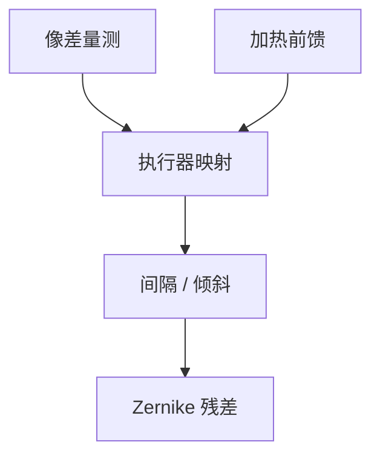

# Zernike 漂移与操纵器

热、气压、装调残差让 Zernike 系数慢慢走。操纵器是镜头里的可动自由度，把可观测量推回预算，不是把设计改成另一台镜头。

<footer>—— 对照投影物镜 manipulator；[Zernike 像差](/litho/zernike-aberrations)</footer>

[上一课](/litho/lens-heating-compensation)给出热前馈。缺口是执行器：哪些面可以微动、能动哪些项。本课钉操纵器，计量方法留给后课。

## 问题

系数空间维数高于执行器数。能补球差、像散，未必能补高阶或非旋转对称的加工残差。乱拧会把一套项拧进另一套。把「镜头可调」理解成任意波前整形，会高估 SMO 闭环。

## 方法

公开层面：若干透镜间隔/倾斜、可能的变形镜或主动支撑。控制把量测（相位测量、晶圆上像差探针）映射到执行器命令，用伪逆，正则化避免增益过大。与加热表叠加：热前馈 + 操纵器反馈。

扫描缝视场上像差还随缝内位置变。操纵器通常补的是缝平均或低阶场依赖，不是每个点独立。

## 机制

透镜微移改变局部光焦度与偏心，在光瞳上近似低阶 Zernike。高阶项对间隔不敏感，要靠加工和热管理，不能靠拧螺丝。

## 边界

下一课致密化：永久材料变化，操纵器行程会慢慢被吃掉。

## 小结

- 操纵器补可观测的低阶 Zernike，维数有限。
- 与加热前馈叠加；不能当任意波前整形。
- 出处：Zernike 课；物镜 manipulator 通识。
