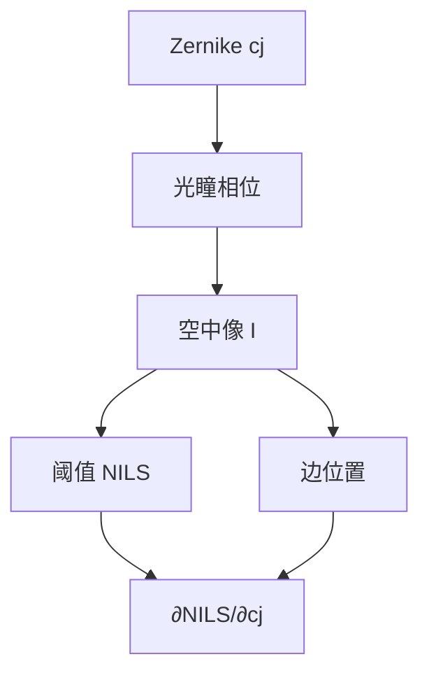

# 像差对 NILS 的敏感度

Zernike 系数改的是光瞳相位；工艺看见的是阈值处斜率掉了多少。敏感度是把 $c_j$ 接到 NILS 的导数，不是再报一次 RMS 波前。

<footer>—— Zernike 展开见 Malacara；NILS 定义见 Mack；相位进 TCC 见 Hopkins</footer>

[上一课](/litho/immersion-vector-imaging)把浸没默认成矢量能量沉积。缺口是：镜头残差、热漂移、离焦配平，最终要问**边还陡不陡**。主干已有 [NILS](/litho/nils-ils) 与 [Zernike](/litho/zernike-aberrations)；本课补的是二者之间的敏感度，不重定义 ILS，不重背全套多项式。焦面倾斜与场曲如何补偿，留给[下一课](/litho/focus-tilt-compensation)。不重推产线 CD 式。

## 问题

NILS $=\mathrm{CD}\cdot(d\ln I/dx)|_{\mathrm{th}}$。像差进 $P$ 的相位，因而进每条 SOCS 核，空中像边沿变缓或侧移。波前 RMS 或 Strehl 是积分指标，对「这条金属边」不必敏感：同样的 RMS，球差与彗差对密线 NILS 的伤害可以差一截。缺口因此是 $\partial\mathrm{NILS}/\partial c_j$（以及 $\partial x_\mathrm{edge}/\partial c_j$），而不是再展开一次 $W=\sum c_j Z_j$。

必须声明图形与阈值：孤立线、密栅、孔、线端各有一套敏感度。浸没矢量像上，TM 已经矮了一截的边，同样 $c_j$ 可以更快把 NILS 打穿。

### 偶项与奇项

离焦、球差、像散（偶次、随焦点可配平的一类）主要糊对比、关焦窗。彗差、三叶、倾斜（奇项）主要造成边位移和左右不对称，套刻与 CD 不对称一起动。把所有 $c_j$ 塞进一个「像差预算纳米」而不分偶奇，会同时去拧调焦和对准。

Fringe 与 Noll 编号不同，敏感度表必须写约定。场点不同系数不同：狭缝中心的球差表不能代表狭缝边缘的彗差。

## 方法

在校准过的前向（矢量 TCC + 薄膜）上，对每个 $c_j$ 做小扰动，量目标图形阈值处的 NILS 与边位置。线性区给出敏感度系数；大像差要看 Bossung 与 PV-band，线性不够。扫描平均把瞬时波前沿狭缝积分，有效敏感度是加权后的。

计算光刻：PW-OPC 的工艺点应包含代表像差的焦点与剂量，而不是假定 $c_j\equiv 0$ 的理想核。镜头加热导致 $c_j(t)$，敏感度高的项必须进补偿环（下一课的倾斜/场曲是其中可驱动的部分）。

### 与 MTF 敏感度的差别

OTF 随像差掉的是正弦调制；NILS 是局部对数斜率。通带里 MTF 看起来还能用，切在拐角或线端的缓坡上 NILS 可以已经死。敏感度分析必须在真实图形上做，不能用圆孔 MTF 零点代替。

## 机制

相位在光瞳径向的弯曲改变不同空间频率的相对相位，空域干涉从「同相相长」变成错位，边的傅里叶合成变钝。彗差让光瞳一侧的频率多走相位，边向一侧爬，看起来像局部套刻。这就是为什么 EPE（后课）会把像差项和 overlay 项缠在一起：奇像差本来就在挪边。

高阶项振荡快，对靠近截止的密图形更毒；低阶项对孤立边和焦窗更毒。敏感度随节距走，禁戒节距附近导数可以变号——照明一换，表要重做。

## 边界

本课不给某代投影物镜的系数预算。Strehl 与 Marechal 判据是镜头验收语言，不是 NILS 敏感度。胶扩散会再糊一层，光学敏感度是上限。禁止把未公开的「Zernike 每毫波对应几纳米 CD」当作通用常数。

## 小结

- 像差敏感度是 $\partial\mathrm{NILS}/\partial c_j$ 与边位移，不是单靠 RMS。
- 偶项糊窗，奇项挪边；图形类别必须声明。
- 矢量浸没像上同样 $c_j$ 可以更狠。
- MTF 掉不代替阈值斜率掉。
- 下一课：倾斜与场曲作为可补偿的场相关项。
- 出处：Mack（NILS）；Malacara（Zernike）；Hopkins（相位进核）。
