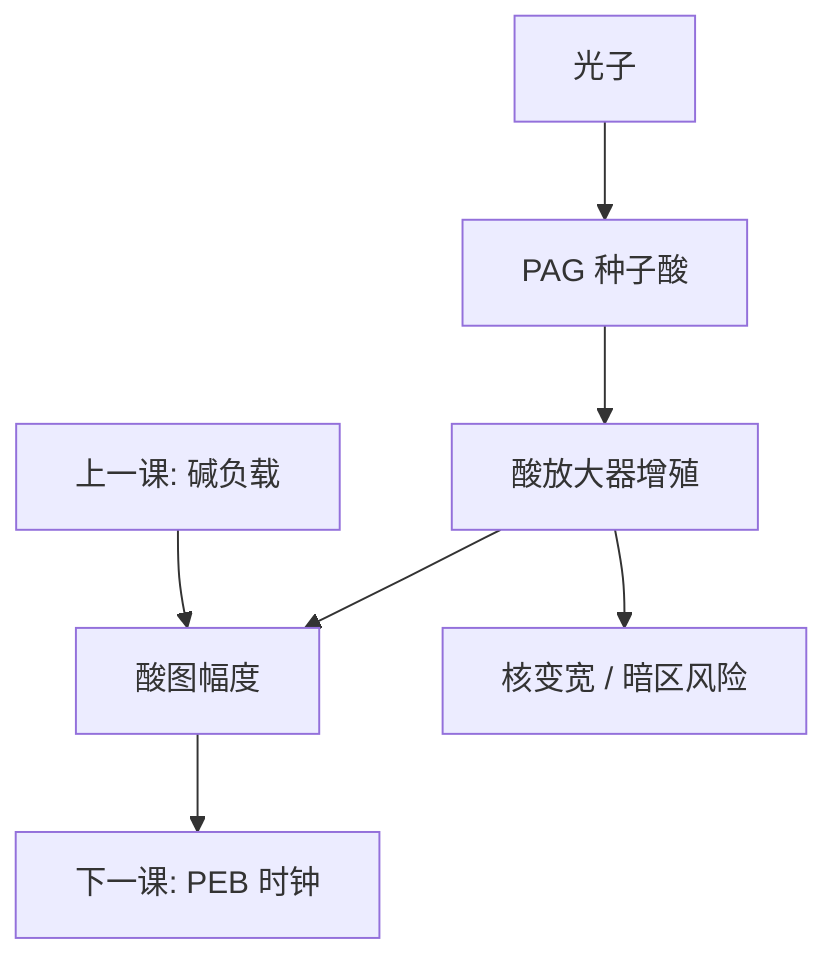

# 酸放大器

PAG 产的那点酸若还不够敏，可以再放一种酸催化自身产酸的前体：增益加一截，模糊与暗区泄漏也加一截。

<footer>—— 据公开 CAR 讨论中的酸放大器（acid amplifier）机制整理，不涉及具体配方</footer>

[上一课](/litho/quencher-loading)把碱负载写成阈值零点与暗区保险丝。缺口是灵敏度仍不够时，有人在配方里再加一截化学增益：酸放大器（acid amplifier, AA）——酸催化前体分解，放出更多酸。本课钉这层增殖。PEB 温度如何同时改增益与扩散，留给[下一课](/litho/peb-bake），不在这里拧烘箱。

## 问题

PAG 的量子产率与加载有顶：吸收截面、团聚、出气、193 nm 聚合物已经在抢光子。淬灭剂负载又把 $E_0$ 往上推。产线若既要薄膜又要 wph，就会问：能不能让已经出生的酸再制造酸。公开 CAR 讨论里的酸放大器正是这类前体：本征稳定，被强酸催化后分解并释放新的酸，形成增殖。

缺口不是再调一次 PAG/碱比，而是承认第三条化学通道。把它写成免费灵敏度，会漏掉：增殖发生在 PEB 时间里，酸多走一步，空间核变大；暗区若有漏酸，放大器会把漏放大成起雾。

### 放大器不是第二种 PAG

PAG 靠光子（或 EUV 二次电子）直接产酸。放大器靠已经存在的酸，热催化产酸，对光本身可以相当钝。没有种子酸，它不应启动。因此它放大的是潜像对比，也放大潜像里已经有的噪声与漏。光学对比为零的地方，不该被它点亮——若被点亮，就是暗区不稳定。

本课不写商品名、不写摩尔比、不编某代 ArF 是否量产使用。公开文献把 AA 当作 CAR 增益工具箱里的一项；是否进某条产线配方，不在课内断言。

## 方法

概念上的旋钮：放大器加载、催化阈值（要多强的酸才启动）、PEB 时间（增殖时钟）。表征仍用 $E_0$、衬度、暗侵蚀、延迟 PEB、CD 与 LWR：灵敏度若改善而暗区厚度掉、线边频谱涨，就是增益买在了不该买的地方。与上一课联合：碱负载提高启动门槛，可以压住放大器的暗区误触发，同时把亮区需要的种子酸量抬高——又是一对，不是两个「越好」。

OPC 紧凑模型若仍用「PAG + 单次酸扩散核」，会低估有 AA 时的有效增益与核宽。换配方族要重校准，不能只改剂量。

### 后课默认

说到 CAR 增益，默认主通道仍是 PAG 催化脱保护；放大器是可选的额外产酸通道。没有声明 AA 时，不要把异常高的化学增益解释成「PAG 特别灵」。热时钟在下一课。

## 机制

种子酸使前体过催化门槛，放出新酸，新酸再催下一批——化学上像支链，直到前体耗尽或被碱收掉。空间上，种子酸出生点周围会出现一朵「二次酸」云，等效扩散核大于只有 PAG 的情形。时间上，增殖抢 PEB 的 Arrhenius 窗口：太短增益不够，太长暗区与模糊一起涨。这与 Ito / Willson 的「一酸多脱保护」不同：那条增益改的是保护基，酸分子数不必增加；AA 改的是酸分子数本身。

因此 RLS 三角在这里更尖：灵敏度向 AA 借，分辨率向核还。公开讨论把这当成机制取舍，而不是一种取消三角的新胶。

EUV 光子更稀，有人会想用 AA 补灵敏度；二次电子模糊与酸增殖叠在同一纳米尺度上，随机尾往往先坏。本课不把 AA 写成 EUV 的默认答案。

## 边界

不发明分子结构，不发明文献编号，不把某篇会议海报的剂量当成工艺点。负胶交联体系里「酸催化交联」已经是增益，再叠 AA 的动机与风险不同，不并列开两套处方。

出气：前体及其分解产物可能增加挥发分，镜头卫生账要单独看，不能因为「更敏所以扫描更快」就当净收益。下一课 PEB 会把本课的增殖时钟与扩散时钟乘在同一个温度上，分开调的自由度很小。没有种子酸就不该启动：flare 把暗区抬离零时，放大器会把光学台基变成化学起雾，光学课的杂散光在这里变成配方风险。

## 小结

- 酸放大器用种子酸催化再产酸，是 PAG 之外的增益通道。
- 它放大潜像，也放大漏酸与空间核；不是第二种 PAG。
- 须与淬灭剂负载联合标定；暗区稳定性是第一约束。
- 紧凑抗蚀剂模型要重校准有效增益与核。
- PEB 是下一课的热时钟，本课不拧温度。
- flare 抬暗区时，放大器会把光学台基变成起雾。
- 出处：公开 CAR 文献对 acid amplifier 的机制讨论；Ito &amp; Willson 化学放大作为对照。
