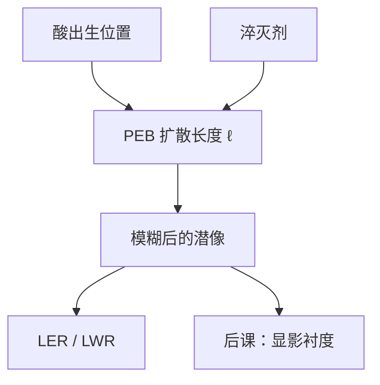

# 酸扩散与线宽粗糙度

PEB 里酸必须走动才能催化；走动的长度就是潜像的模糊核，线宽粗糙度有一部分是这颗核加上出生位置的随机。

<footer>—— 据 Mack 对抗蚀剂模糊与 LER 的讨论，以及 CAR 产线对扩散长度与淬灭剂的表述整理</footer>

[上一课](/litho/peb-bake)（PEB 温度）。钉死了 PAG 产酸与 PEB 催化循环。缺口是：酸不是钉在出生点上的——它在聚合物里扩散，催化半径变成几纳米的模糊；随机的出生与淬灭把边缘走成一条毛边。本课把扩散长度和线宽粗糙度（LWR / LER）写进潜像。显影速率如何再切一刀，留给[下一课](/litho/resist-contrast-curve)。

## 问题

化学增益要求酸在 PEB 期间遇到许多保护基，因此必须有位移。位移的均方根就是有效扩散长度 $\ell$。空中像再陡，卷积一个宽度 $\ell$ 的核之后，NILS 在潜像上下降。上一课把 PEB 当增益时钟；本课把它当模糊旋钮。两个身份是同一段热过程，不能只调灵敏度而不问 $\ell$。

线边粗糙度（LER）是边缘位置沿线方向的涨落；线宽粗糙度（LWR）是宽度的涨落，统计上与两侧 LER 相关。产线规格写的往往是 LWR 或 $3\sigma$ LER。缺口不是再解释什么是 CAR，而是：平均 CD 可以靠剂量拧回来，高频毛边拧不回来，刻蚀还会部分继承。

### 模糊核不是光学焦深

$\ell$ 沿胶平面与沿厚度都可以有分量，但它是化学的，不按 $\lambda/\mathrm{NA}^2$ 缩放。光学 NILS 已经低的密图形，同样的 $\ell$ 伤害更大。不要把 LWR 写成「镜头没对准」：调焦改变的是空中像，PEB 改变的是核。

淬灭剂缩短有效酸程：酸走不了多远就被中和，阈值变陡，$\ell$ 下降，灵敏度通常也下降。这是 RLS 三角在 CAR 上的具体旋钮，EUV 随机课会再遇到。

## 方法

紧凑模型把酸扩散写成高斯（或类似）卷积，再进入脱保护动力学。OPC 抗蚀剂模块用的就是这颗核，不是分子动力学。量测上，用 CD-SEM 沿边缘取样，按空间频率看功率谱：低频往往来自剂量与掩模，中高频才更多见化学与散粒。

控制手段：降 PEB 温度/时间、加淬灭剂、改聚合物自由体积、减胶厚。每一项都同时改增益。本课只要求后课改「CAR 模糊」时声明 $\ell$ 与 PEB，而不是只报一个 LWR 纳米数。

### 光子随机在 DUV 上还不是主角

ArF 光子多，LWR 的主导项常是聚合物/PAG 团聚与酸扩散。EUV 光子少，泊松与二次电子射程叠上来，那是[随机效应](/litho/euv-stochastics)与[EUV 胶](/litho/euv-resist)的缺口。本课停在 CAR 的化学核，不把 92 eV 的统计提前做完。

## 机制

酸做随机行走，脱保护事件沿路径累积。亮区中心酸多，边沿酸少；扩散把边沿的酸送进暗区，暗区的淬灭剂送进亮区，等效把阈值轮廓外推并变钝。边缘位置对局部 PAG 密度敏感：同一条设计线，沿 $y$ 取样会看到 $x$ 在跳，这就是 LER。

刻蚀转移不是低通那么简单：有的高频被修掉，有的被侧壁粗糙放大。本课的 LWR 默认指显影后胶上的量，除非显式写「刻蚀后」。计量课会再区分 SEM 收缩与真实几何。

### 频谱比一个 3σ 更有用

沿边缘取样得到的位置序列可以做功率谱：低频成分多半来自剂量、flare 与掩模，扩散核自己滤不掉；高频可被 $\ell$ 压掉，却会被 SEM 噪声抬起来。只报一个 $3\sigma$ 而不声明线长与滤波窗，无法判断该拧 PEB 还是该拧光学 NILS。后课的衬度 $\gamma$ 会再改谱的权重：切得越陡，缓坡上的同一噪声变成更方的毛刺。

不要把 LER 全部归咎于胶配方。空中像 NILS 低时，阈值切在缓坡上，同样的分子噪声会放大成更大的边缘抖。光学对比与化学核相乘。

## 边界

$\ell$ 不是材料表上的一个全球常数，随温度、自由体积和淬灭剂变。不要把某篇 SPIE 演示的 5 nm 扩散写成所有 ArF 层的预算。也不要把 LWR 规格当成光学对比度的替代：对比度差会加重 LWR，但对比度好不等于 $\ell=0$。显影本身也会加粗糙（溶解前沿的随机），下一课讲平均衬度，不在本课把溶解噪声展开成第二套谱。

空间频率上，酸扩散主要砍中高频；掩模 LER 和剂量低频是另一段谱。修 OPC 边缘不能当降 LWR 的主手段。计量课的 SEM 还会给 LER 加收缩与滤波，报数时必须声明。

LWR 与 LER 的关系近似 $\mathrm{LWR}\approx\sqrt{2}\,\mathrm{LER}$ 当两侧不相关。相关长度短时近似成立；长相关（剂量、焦点）会打破它。规格要写清量的是哪一个。

## 小结

- PEB 的增益与酸扩散长度是同一过程的两面。
- 潜像 = 空中像经化学核模糊；密图形的 NILS 先被 $\ell$ 吃掉。
- LER/LWR 是边缘随机，平均剂量拧不回高频毛边。
- 淬灭剂缩短 $\ell$、通常牺牲灵敏度。
- 显影如何按剂量切厚度，是下一课。
- 出处：Mack, *Fundamental Principles of Optical Lithography*；Levinson 对 LER 与抗蚀剂模糊的讨论。
