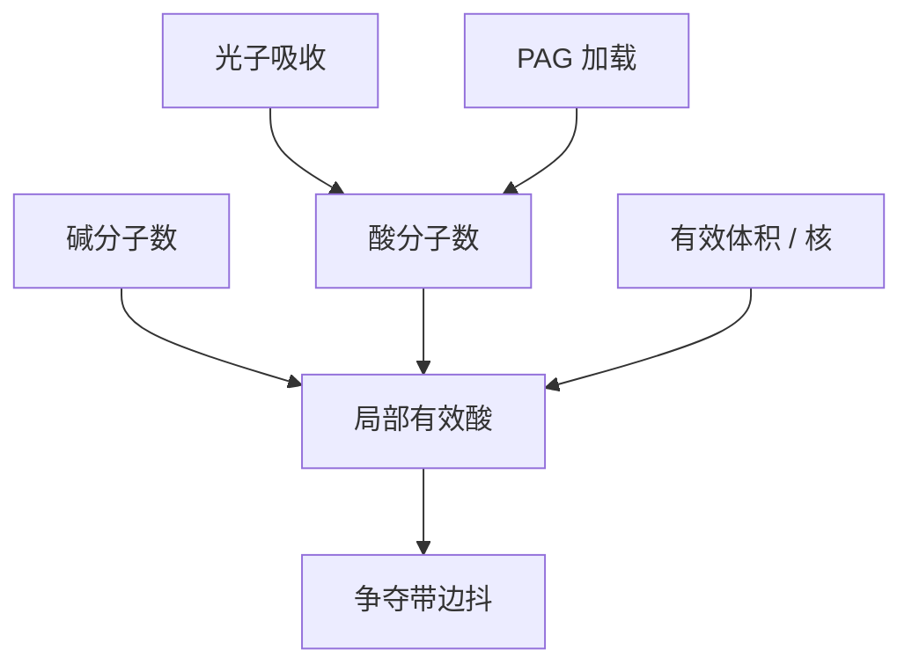

# 酸与淬灭剂的计数噪声

平均场把酸和碱写成连续浓度；纳米线上它们是可数的分子。泊松涨落在争夺带上直接变成边的抖。

<footer>—— 据 Naulleau 对材料离散与光子噪声的区分；Gallatin 对酸计数与 LER 的公开论述整理</footer>

[上一课](/litho/resist-polymer-mw)把平均分子量写成溶解与 LER 的材料前置。平均场课序到此结束。缺口是离散：[随机效应](/litho/euv-stochastics)已经从光子 $N$ 讲过 LCDU 与缺孔；本课补化学侧——酸与淬灭剂分子数。[PAG 与淬灭剂](/litho/pag-quencher)的一对浓度，现在变成一对计数。二次电子把吸收事件涂开，留给[下一课](/litho/secondary-electron-blur-model)。

## 问题

体积 $V$ 里平均 $\bar n_h=\bar h V$ 颗酸、$\bar n_q=\bar q V$ 颗碱。泊松方差等于均值。争夺带的 $V$ 由厚度 × 相关面积决定，EUV 薄胶、细线时 $\bar n$ 可以落到几十。局部碱多一颗，阈值抬；酸少一颗，脱保护不够。连续场 RD 对此输出平滑边，硅片上却是毛边与偶发桥断。

缺口不是再算 92 eV 光子面密度，而是：即使光子 $N$ 很大（ArF），PAG / 碱加载若低，化学计数仍醒。EUV 上两者一起小，不能只用光子项签核胶。

### 有效体积不是像素

把仿真网格当成独立体积会高估噪声：酸扩散与电子核让相邻体积相关，有效 $V$ 变大，相对涨落变小，同时边被糊。Gallatin 一类分析把模糊写成既降方差又降分辨率的同一标长。本课先承认计数，核的形状下一课再写。

淬灭剂加载升高，$\bar n_q$ 升，相对涨落降，但灵敏度掉、有效 $N$ 酸要更多。这是 RLS 在分子账本上的第一笔，三角课再收。

## 方法

估计：用加载 wt% 与分子量换成分子密度，乘争夺带体积，得 $\bar n$。比较光子吸收数与产酸数：量子产率或电离增益把两者耦起来，但方差不是同一泊松——产酸是分支过程，Fano 因子可以不是 1。工程上仍用 LCDU / LER 对剂量与对加载的两组斜率来拆光子项与化学项：加剂量主要压光子；加 PAG/碱（固定剂量）压化学，直到团聚或吸收饱和。

Naulleau 强调实验要把掩模固定图案与重复曝光涨落分开。化学计数属于后者。

## 机制

曝光把 PAG 抽样成酸位置；PEB 中和把酸碱成对湮灭。剩余有效酸的涨落在阈值模型里被 $\partial x/\partial h$ 放大，该导数就是 ILS / 化学衬度的倒数。[酸扩散](/litho/acid-diffusion-lwr) 把单颗酸的影响摊成核，降低高频抖、增加低频相关。碱的空间分布若团聚，会出现「固定」的化学掩模，重复曝光仍相关——那是材料均匀性，不是泊松。

聚合物链尺寸是第三套计数，上一课已前置。本课对象明确为酸与碱，避免把所有 LER 写成一种分子。

ArF 光子多，化学离散与聚合物团聚常主导 LWR。EUV 光子项上升，但不等于化学项消失。拆实验不能省。

## 边界

不编每立方纳米「标准酸数」。不把某一 SPIE 表的分子密度当节点规格。下一课的二次电子核改有效 $V$ 与空间相关，本课的泊松还是点过程。Monte Carlo 课会按本课密度抽样。

## 小结

- 酸与碱在争夺带里是可数的；连续浓度是它们的均值。
- 有效体积由核决定，网格像素不是独立体积。
- 加剂量与加加载压的是不同泊松源，要用斜率拆。
- ArF 也可由化学计数主导 LWR。
- 出处：Naulleau 对材料 vs 光子离散；Gallatin 对酸计数与模糊。
