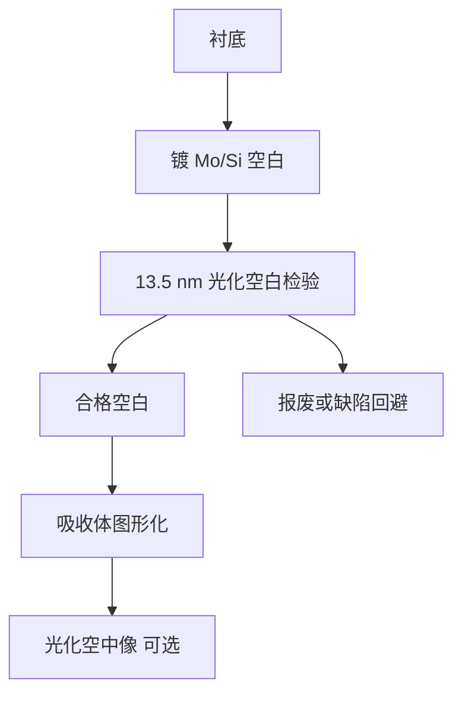

# 光化检验

空白版上的坑包要在 13.5 nm 上看才会以相位缺陷的真实衬度出现；非光化波长会漏检或误杀。

<footer>—— 据 EUV 光化空白检验（actinic blank inspection）的通称与公开原理；缺陷分类见 Bakshi</footer>

[上一课](/litho/euv-absorber-materials)（吸收体材料）。把 EUV 版分成埋藏相位缺陷与吸收体振幅缺陷，并指出深紫外看表面往往看不见坑。缺口是：必须用与曝光相同的 13.5 nm 去检验空白多层——这就是光化检验。本课钉 actinic blank inspection。光子打进胶之后的二次电子与酸模糊，留给[下一课](/litho/euv-absorption-blur)。

## 问题

相位缺陷的打印后果由布拉格双程相位 $4\pi n\Delta h/\lambda$ 决定，13.5 nm 下数纳米的坑就够致命。DUV 或可见光干涉看的是表面形貌或另一套光学常数，与 EUV 反射相位不是同一张图：有的坑在 DUV 显眼、EUV 不打印；有的 EUV 致命、DUV 几乎看不见。量产空白版良率若只靠非光化图，会把缺陷送到掩模厂图形化之后才在晶圆上以重复场出现。

Pellicle 不保护镀膜时埋进去的东西。补偿打印只能盖弱缺陷。因此空白阶段需要一种把「会在 NXE/EXE 上打印」的缺陷找出来的检验：波长与多层工作点对齐，即光化。

### 空白与图形、AIMS 不要混名

光化空白检验（ABI 一类通称）看的是未做吸收体图形的 Mo/Si 空白，找坑、包、埋藏颗粒。光化图形检验看的是做完吸收体之后。光化成像显微镜（AIMS EUV 一类）看等效空中像，给打印后果，而不是给一张 SEM 形貌。本课主钉空白：它决定这块版还值不值得写图形。工具品牌与内部灵敏度规格不编造。

「光化」这里就是 actinic：检验波长与曝光波长相同（13.5 nm 带内）。不是「用光的化学作用」那个生物含义。

## 方法

空白链：超光滑衬底检查 → 镀 Mo/Si → 光化空白检验 → 合格再进吸收体。光化通道用多层带通，对相位/反射率局部扰动敏感。检出图要能配准到扫描场坐标，供后续缺陷回避：把坑藏进不打印区或报废空白。

非光化形貌（原子力、光学表面）仍作筛选，降低光化机时；签字以光化为准。晶圆上的重复缺陷闭环：把场坐标反推到空白图，验证检验阈值是否与打印阈值一致。阈值设太紧，空白良率崩；太松，晶圆重复缺陷爆。

### 与 pellicle、图形检验的分工

膜上颗粒用膜检与离焦光学；吸收体缺口用电子束或光化图形通道；空白相位用 ABI。三类地图不能合成一张「掩模脏了」。High-NA 掩模侧角度更大，同一物理坑的打印衬度会变，空白规格要按平台重资格认证，原理仍是 13.5 nm 相位。

## 机制

多层把高度误差放大成反射相位。光化探头看见的是与扫描机同一套布拉格条件（角谱不必完全相同，但必须在 13.5 nm 工作），因此衬度与打印相关。非光化波长的穿透深度、折射率和多层反射峰都错位，相位缺陷的传递函数不同，这就是漏检/误杀的物理。

孤立大坑是可定位的点缺陷；中频粗糙是 flare 与背景，规格要分空间频率——上一课缺陷分类已要求这一点。光化检验对点缺陷灵敏，不等于取代中频粗糙的散射计量。空白供应商与掩模厂的数据接口是缺陷坐标与尺寸类别，不是一张照片。

AIMS 看打印后果，SEM 看吸收体形貌。形貌干净仍可能相位致命，这是 EUV 相对 DUV 铬版最容易在非光化流程里漏掉的一层。

## 边界

本课不写某代空白缺陷密度的内部规格，不点名未核实的机台灵敏度纳米数。光化检验通称足够：13.5 nm、空白、相位。后课默认：说到 EUV 掩模缺陷检测，先问是否光化、看的是空白还是图形。

也不把光化检验写成可以取消晶圆重复缺陷监控。阈值与打印之间永远有模型误差。出处：Bakshi 对 blank 缺陷与 actinic inspection；产业对 ABI 的公开通称。下一课离开掩模，进入胶里的吸收模糊。

同步辐射或实验室 EUV 显微镜可以做光化研究，不等于晶圆厂空白检验产能。量产说的是能把空白地图闭环到掩模厂的那类工具。

## 小结

- 光化检验用 13.5 nm 看空白多层的相位/反射率扰动。
- 非光化形貌会漏检或误杀；签字以光化为准。
- ABI 管空白，AIMS 管打印空中像，图形检验管吸收体，pellicle 管事后落尘。
- 缺陷图必须能对到扫描场，才能回避或报废。
- 下一课：光子被胶吸收之后，二次电子与酸把潜像涂开。
- 出处：actinic blank inspection 通称；Bakshi, *EUV Lithography*。
