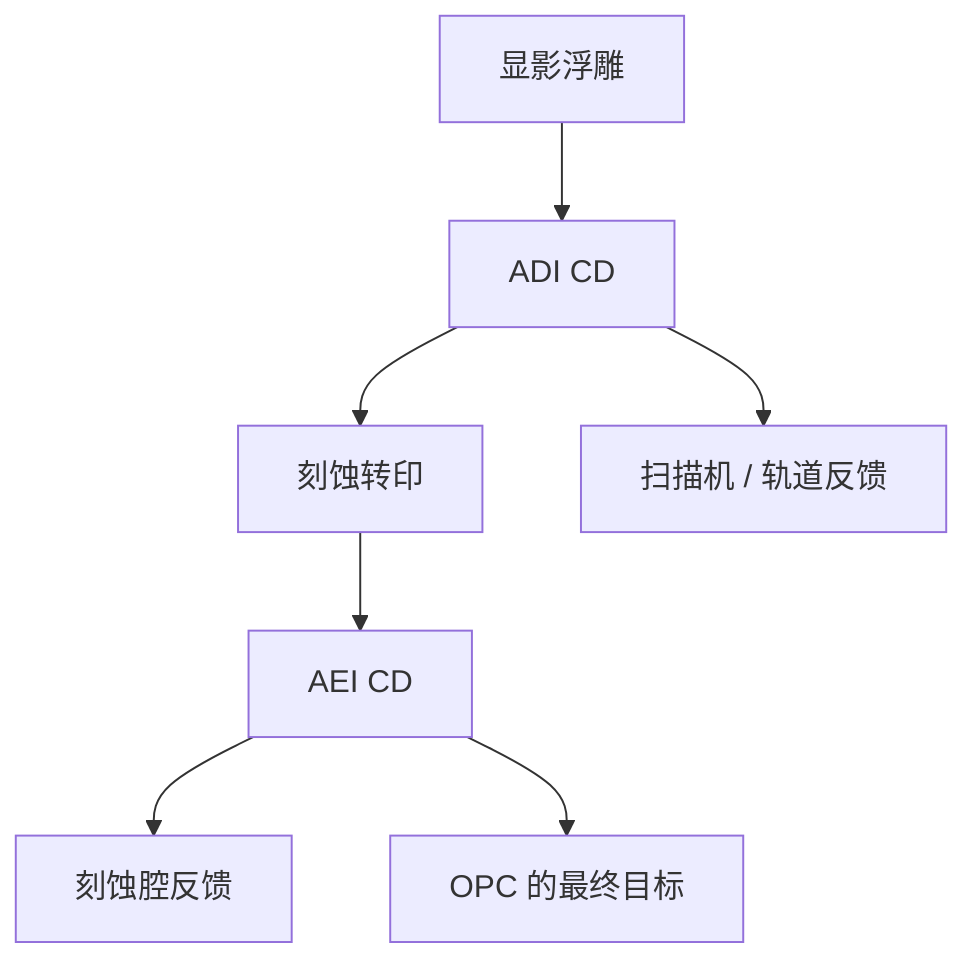

# 显影后对刻蚀后

显影后的线宽是胶浮雕的尺寸；刻蚀后的线宽才是衬底上留下来的尺寸。两套 CD 差一截偏置，不能当同一个反馈回扫描机。

<footer>—— 据 Levinson 对 after-develop / after-etch 计量与刻蚀偏置的区分整理</footer>

[上一课](/litho/litho-process-flow)把转印链写成掩模 → 空中像 → 潜像 → 显影浮雕 → 刻蚀转印，并已经点名 ADI 与 AEI 必须分开报。缺口是：产线同时活着两套 CD，反馈回路、OPC 目标和故障隔离各认哪一套，还没有写成合同。本课钉显影后检验（ADI）对刻蚀后检验（AEI）。套刻是下一课的位置问题，不在这里重讲对准。

## 问题

同一条栅，显影后 SEM 看到的是光刻胶顶（或某焦平面）的宽度；刻蚀、去胶之后，硬掩模或多晶硅上的宽度通常更窄或更宽，取决于横向侵蚀、聚合物沉积和选择比。上一课把这截差叫做刻蚀偏置。缺口不是再背一遍流程顺序，而是：扫描机的剂量/焦点该跟谁、刻蚀腔该跟谁、设计意图写在哪一套数上。

把 AEI 目标直接当成「镜头分辨率」，等于把腔室匹配算进 NA。把 ADI 当成出货尺寸，又会在电性上发现栅长短了一截。两套计量、两个班组、两个时间点，混用一张控制图就会振荡。

### 偏置不是一个全球纳米数

刻蚀偏置随节距、开口率、胶厚、硬掩模栈和腔室老化变。密线与孤立线的偏置可以差出工艺窗的一截，于是出现「刻蚀邻近」：上一课光学链之外的又一层邻域。OPC 若只拟合 ADI，硅上最终轮廓仍会偏；若只拟合 AEI，扫描机当天的剂量漂移会被刻蚀噪声淹没。

ADI 本身已含 SEM 收缩、荷电与测量算法偏置。报「显影后 48 nm」必须声明机台、电压、算法。AEI 换材料衬度，偏置又换一套。两套数都不能当真空里的真值。

## 方法

产线最小配置是：固定曝光矩阵量 ADI，同一批（或裂片）刻蚀后量 AEI，画 ADI–AEI 相关。均值差是偏置；斜率不是 1 时，说明刻蚀在放大或压缩光刻的 CD 变化——侧壁角与开口率在投票。控制策略通常拆环：扫描机/轨道盯 ADI（响应快、不含腔室），刻蚀盯 AEI 与偏置稳定性。长期把偏置送回 OPC 模型，而不是每个班次用 AEI 去拧激光能量。

设计规则与电学目标默认对着 AEI（或最终硅）。光刻工艺窗可以先用 ADI 画，但重叠窗必须声明「这是胶上的窗还是硅上的窗」。OPC 的前向模型若只校准到胶上，交付的是可显影的轮廓；要落到电性，还得再叠一层刻蚀模块，或直接拿 AEI 当目标。两套校准片、两次抽检，不能共用一张「CD 控制图」。[多重图形](/litho/lele-multipattern)里，第一次 AEI 是第二次涂胶的衬底，反射与涂覆均匀性跟着变，更不能把第一次 ADI 当成第二次的起始形貌。

### 两套图，两种故障

ADI 飘、AEI 跟着飘：先查剂量、焦点、胶厚、PEB。ADI 稳、AEI 飘：查刻蚀腔、聚合物、射频小时数。AEI 好、电性仍差：可能是剖面（侧壁、残留）而不是顶视 CD。本课只要求按段隔离，不把良率写成步骤数的函数。

## 机制

胶当掩模时，等离子体同时打胶顶与侧壁。选择比高、各向异性好，偏置小；胶不够厚或侧壁不陡，横向吃掉的量变成 CD。硬掩模可以「冻结」一次中间 AEI，再往下刻时胶已经不在。转移函数还可以滤掉一部分线边粗糙、放大另一部分——所以「光刻 LWR」与「硅上 LWR」也要分开报，机制与本课的平均 CD 偏置平行。

开口率通过反应物消耗与副产物再沉积改局部速率，这就是刻蚀微负载。它看起来像 OPE，但换一台刻蚀机、不换镜头，曲线会动。故障隔离必须能做这个实验：同一批 ADI、两台腔室，AEI 若分叉，责任在转印段。侧壁角把顶视 ADI 与底宽 AEI 进一步拆开，后课剖面会写；本课只要记住顶视合格不等于底宽合格。

正胶 ADI 的「线」是留下的胶；刻蚀后的「线」可能是硬掩模或衬底。tone 在转印中可能再反一次（亮场切槽）。比较 ADI/AEI 前先确认量的是同一类图形的同一段。

## 边界

本课不讲某家腔室的食谱，不把某一代 FinFET 的偏置写成定律。也不讨论注入层（无「AEI 线宽」、只有阻挡图形）。计量课会展开 CD-SEM 与散射测量；本课只钉两套时间点。下一课的套刻同样有「光刻后 / 刻蚀后」标记位移，机制类似，对象换成位置。

不要发明「AEI = ADI × 0.9 则良率合格」之类换算。偏置由工艺包标定。出处里的 Levinson 把 after-develop 与 after-etch 当作不同检验站，而不是同一个 SEM 数的别名。

下一课套刻同样有光刻后 / 刻蚀后标记位移。对象换成位置，隔离逻辑与本课的两套 CD 平行。

## 小结

- ADI 是胶浮雕 CD；AEI 是刻蚀后衬底/硬掩模 CD。
- 扫描机通常跟 ADI；设计意图与腔室匹配跟 AEI。
- 偏置随节距与开口率变，含刻蚀邻近，不得并进光学 OPE。
- ADI 稳而 AEI 飘，先查刻蚀而不是 NA。
- 出处：Levinson, *Principles of Lithography*；Mack 对转印链末段的讨论。
