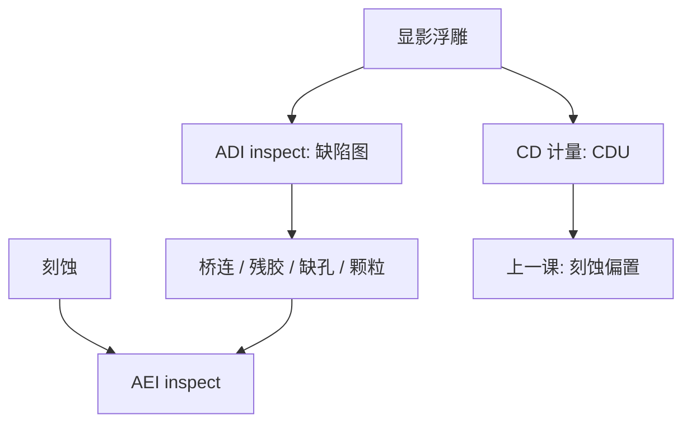

# 显影后缺陷检验

CDU 问线宽还在不在规格里；显影后检验问图形还在不在——桥连、残胶、缺孔是另一张图，不是 $3\sigma$ 的尾巴。

<footer>—— 据 KLA 一类图形晶圆缺陷检验（ADI inspect）的公开类别划分整理</footer>

[上一课](/litho/cdu-etch-bias)把刻蚀偏置写成 ADI CD 图如何变成 AEI CD 图。缺口是：显影之后除了量宽度，还要找缺陷。CD 合格的场里可以布满桥连和颗粒。本课钉显影后缺陷检验（after develop inspection）。浸没架构从下一课程的 [ArF 浸没](/litho/arf-immersion) 另起，不在这里灌水。

## 问题

刻蚀偏置课的 ADI 是线宽计量。产线说的 ADI inspect 是缺陷检验：在胶上用光学（亮场/暗场、宽带等离子体一类）或电子束把异常图案找出来——桥连、断线、残胶（scum）、缺孔、颗粒、涂布条纹。KLA 等把「显影后检验」做成与 CD-SEM、套刻、刻蚀后检验分开的工具类别：一个报纳米宽度，一个报缺陷密度与坐标。

缺口因此是良率图，不是再画一次刻蚀负载。把所有失效写成 CDU 出规格，会漏掉稀疏的致命缺陷；把检验灵敏度写成可以代替随机缺孔的电学，又会高估光学检验对个位数纳米孔的能力。

### 检验不是计量

计量抽样稀疏、求平均与方差。检验要覆盖全片或指定场，求的是捕获率与误报。食谱（recipe）决定看哪种缺陷、忽略哪种噪声。同一片胶，CD-SEM 可以全合格，检验图已经红了。

KLA 公开类别里，图形晶圆检验按层段分 ADI、AEI、以及后段金属等。本课只钉显影后这一段，不写具体型号灵敏度表，以免把手册抄成工艺常数。

## 方法

光学检验：用与设计或金片的差分找异常；宽带、多通道提高对残胶与桥的对比。电子束检验：分辨率够看更小的缺孔与桥，慢，用于关键层抽样或热点。两者都要和设计规则、OPC 热点清单对齐——上一课 PV-band 里的危险边，是检验食谱的优先窗。

与刻蚀的关系：有的胶缺陷在 AEI 被放大或被洗掉。ADII 抓到的残胶，刻蚀后可能变成硬缺陷；有的涂布颗粒在胶上显眼，刻蚀后无害。复检策略是 ADI 粗筛 + AEI 关键确认，不要只信一张图。

### 与随机、倒塌的接口

CAR / EUV 的缺失孔，光学检验未必看得到，电学或 e-beam 才看见。[图形倒塌](/litho/pattern-collapse) 成片出现时，检验图会呈现方向性成对缺陷，与随机缺孔的泊松图不同。食谱要能分类，否则 APC 会拧错旋钮。

## 机制

胶上的厚度与折射率跳变、多余体积（桥、颗粒）或缺失体积（孔、断）改变散射。光学检验读的是这个散射差，受照明波长、孔径、偏振限制——分辨率远差于 CD-SEM，但通量高。电子束检验读二次电子衬度，接近 SEM，通量低。分类算法把差分斑点标成缺陷类型；误报来自胶的 LER、色噪声、前层。

致命度：桥在金属上是短路，残胶在孔底是开路。CD 的 $3\sigma$ 不编码这类事件计数。良率模型要把检验密度与电学失效对照校准，而不是假设「CDU 进规格则良率进规格」。

浸没水印、气泡在缺陷图上的指纹已在浸没缺陷课；本课的检验是那类指纹的捕获器之一。不要把检验工具写成缺陷的物理成因。

## 边界

不编捕获率百分数，不把某代 BBP 的纳米灵敏度当所有层的墙。不在这里设计浸没头。涂胶显影轨道的条纹、边缘珠是轨道课，检验只负责看见。下一课程进入 193 nm 浸没光学，缺陷物理换成水膜，检验类别仍适用，食谱要重做。

掩模缺陷会在晶圆上重复成阵列；检验图若呈场内周期，先查版，再查胶。这与随机缺孔的空间统计不同。刻蚀偏置可以修 CD 均值，修不掉已经桥死的图形：检验必须在进干法之前抓住那一类，否则 AEI 只是把胶上的致命缺陷复印到硬掩模上。

## 小结

- ADI inspect 是显影后缺陷图，与 ADI CD 计量不是同一件事。
- KLA 一类工具按层段分 ADI/AEI；本课只钉胶上捕获。
- 光学求通量，e-beam 求小缺陷；食谱要对热点与致命类型。
- CDU 合格可以仍有致命桥连；检验密度要进良率模型。
- 场内周期缺陷先查掩模；刻蚀修不掉已经桥死的胶图。
- 倒塌与随机缺孔的缺陷图形状不同，食谱要能分类。
- 出处：图形晶圆缺陷检验的公开类别；Levinson 对显影后检验与良率的讨论。
