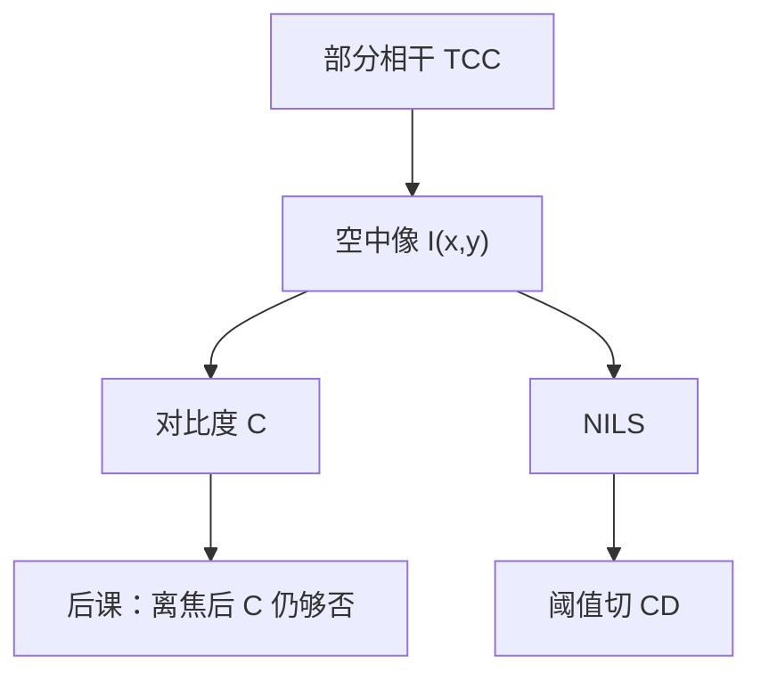

# 空中像与对比度

空中像是晶圆表面（或胶层指定平面）上的光学强度分布；对比度问的是这张灰度图还够不够被胶切成稳定的线。

<footer>—— 据 Mack, Fundamental Principles of Optical Lithography 对 aerial image 与 image contrast 的定义整理</footer>

[上一课](/litho/partial-coherence)给出部分相干与 TCC，强度原则上可以算。缺口是：还没有把「算出来的 $I(x,y)$」命名为空中像，也没有规定产线用哪一个标量来读它好不好印。本课钉空中像与对比度（以及 NILS），焦深如何把这张图沿轴毁掉，留给[下一课](/litho/depth-of-focus)。胶如何把强度变成溶速，是抗蚀剂课的缺口。

## 问题

TCC 积分的结果是位置上的强度 $I(x,y)$，单位是功率密度。光学工程师优化的对象就是这张图，不是显影后的 SEM。若直接跳到 CD，会把胶阈值、扩散和刻蚀偏置都算进镜头。缺口因此是：先承认空中像是光学链的输出，再定义它的调制有多深。

密线栅上最常用的标量是对比度

$$
C=\frac{I_\mathrm{max}-I_\mathrm{min}}{I_\mathrm{max}+I_\mathrm{min}}.
$$

$C=0$ 表示只剩零级，胶无论多陡都切不出线；$C$ 接近 1 表示暗区足够黑。孤立线、孔、二维拐角没有单一的 $I_\mathrm{max}/I_\mathrm{min}$，还需要边缘斜率。

### 对比度不是胶的 γ

$C$ 是光学强度的性质。胶的衬度 $\gamma$ 是显影速率对剂量的陡度，上一课序里还不存在——本课不要借用化学名词。空中像对比不够，再陡的胶也只是把噪声一起切锐；空中像对比很高，钝胶仍可能印出可用 CD。两个旋钮后课会相乘，本课只写光学这一个。

空中像可以定义在空气/水与胶的界面，也可以沿胶厚做层切。薄胶近似用一张二维 $I(x,y)$；厚胶或高 NA 要沿 $z$ 取样。本课默认指定平面上的二维强度。

## 方法

对节距 $p$ 的线栅，在最佳焦距取一条垂直于线的剖线，读 $I_\mathrm{max}$ 与 $I_\mathrm{min}$，得 $C(p)$。$C$ 随 $p$ 下降的那条曲线，就是「这个照明 + 这个 $\mathrm{NA}$ + 这张掩模」的光学可印窗口。部分相干改变的是 $C(p)$ 的形状：圆照明与环形照明的峰值节距不同。

边缘更敏感的量是对数斜率。归一化影像对数斜率

$$
\mathrm{NILS}=\mathrm{CD}\cdot\frac{d\ln I}{dx}\Big|_{\mathrm{threshold}}
$$

把斜率乘到目标线宽上，使不同 CD 可以比较。NILS 高，剂量误差引起的 CD 变化小。Mack 把 NILS 当作空中像与工艺窗口之间的桥梁：还没有胶模型时，先看 NILS 够不够。

### 阈值模型是临时接口

最粗的抗蚀剂模型是：强度高于 $I_\mathrm{th}$ 的地方显影掉（正胶）。CD 就是 $I(x)=I_\mathrm{th}$ 的两个根之间的距离。本课允许这个接口，只为了让对比度有一个「能不能切」的几何意思；酸扩散与真显影曲线禁止在这里展开。

不要把模拟器里的 aerial image 和 SEM 上的线宽叫同一个「像」。前者是 $I(x,y)$，后者已经过潜像与显影。OPC 若只拟合 SEM 而不校准空中像，光学与化学会缠死。

## 机制

空中像是衍射级在像面的干涉图样，再对源点做强度积分。两束成像给出近余弦的调制，对比度由两束振幅比决定；三束成像多一个零级偏置，$I_\mathrm{min}$ 抬高，$C$ 下降。这就是为什么低 $k_1$ 必须动照明或相移去压零级——机制在空中像上已经可见，不必等到 RET 目录。

散焦还没写公式，但机制已清楚：光瞳里的二次相位让各级相对延迟改变，余弦调制变浅，$C$ 与 NILS 一起掉。本课只在最佳焦距定义 $C$ 与 NILS，把轴向扫描留给焦深课。

### 矢量修正会改 I 而不是改定义

高 NA 下 TM 分量干涉变差，$I_\mathrm{min}$ 上升，标量对比度过于乐观。定义本身不变：仍是指定平面上的 $|E|^2$ 或坡印廷通量的约定投影。后课把 $I$ 升级成矢量能量沉积；对比度公式不用改写。

## 边界

空中像不含套刻，也不含 flare 的长程散射——杂散光会给 $I$ 加一层缓变底座，使全场 $C$ 下降，那是计量课的缺口。本课的 $C$ 与 NILS 是局部、理想光学的量。也不要把「对比度 70%」直接写成可量产：量产看的是曝光–散焦窗口里 CD 是否落在规格内，中间还隔着胶。

后课默认：说到空中像就是 $I(x,y)$；说到光学对比度就是 $C$ 或 NILS，不再与胶的 $\gamma$ 混名。

## 小结

- 空中像是指定平面上的光学强度 $I(x,y)$，是光学链的输出。
- 线栅用 $C=(I_\mathrm{max}-I_\mathrm{min})/(I_\mathrm{max}+I_\mathrm{min})$；边缘用 NILS。
- $C$ 不是胶衬度 $\gamma$；阈值切 CD 只是临时接口。
- 低调制来自零级偏置或丢失衍射级，机制已在空中像上可见。
- 本课在最佳焦距定义对比；离焦是下一课。
- 出处：Mack, *Fundamental Principles of Optical Lithography*；Goodman 对像面强度的傅里叶光学表述。
