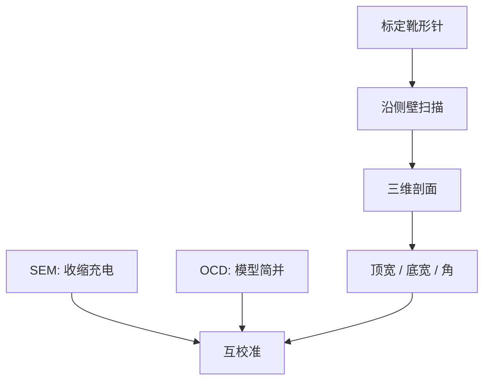

# AFM 线宽

针尖沿侧壁走一圈，线宽变成可溯源的三维剖面；慢，却能给 SEM 收缩和 OCD 简并一个几何参考。

<footer>—— 据 CD-AFM 三维线宽计量的公开原理整理</footer>

[上一课](/litho/ocd-mueller)用穆勒矩阵把偏振变换记全，剖面仍是电磁反演出来的。缺口是一条尽量不靠光学模型、也能看见侧壁的参考：临界尺寸原子力显微镜（CD-AFM）。本课钉 AFM 线宽。套刻标记从[下一课](/litho/overlay-marks)另起，不要把针尖当 overlay。

## 问题

SEM 有收缩与充电；OCD 有模型简并：CD 变胖与侧壁变陡可以走同一条谱。产线需要一台较慢、较局部、但几何意义清楚的尺，把另外两台钉住。CD-AFM 用经过标定的针尖（常为靴形 / flared tip）伸进沟槽，测左右侧壁和顶底宽，给出三维剖面而不是俯视灰度。

缺口不是再加偏振通道，而是换相互作用：接触/轻敲力学，不是电子，也不是远场光。把它写成「更准的 SEM」，会漏掉针尖卷积与速度；写成可以场内全抽样，又会忽略它慢到只能当参考与热点剖。

### 针尖有宽度

靴形针的突出量进入测到的缝宽。针磨损、污染、侧壁粘连都会改有效宽度。计量通称要求用纳米标准样周期校针，再把针宽从缝宽里扣掉。不报针尖状态的 AFM CD，与不报束条件的 SEM CD 是同一类不可比。

AFM 几乎不引发 CAR 那种电子束收缩，但仍可能刮伤软胶、带起碎屑。ADI 胶上的 CD-AFM 要声明是否破坏性、是否只用于校准片。

## 方法

用途分三档。参考：对一组光栅用 AFM 定顶宽、底宽、侧壁角，去校准 SEM 算法和 OCD 模型。工程：对热点、倒锥嫌疑、倒塌未完全的弯线看真实剖面——上一课穆勒若给出两个解，AFM 拆简并。监控：抽极少点看趋势，不代替 CDU 抽样密度。

与 SEM/OCD 对照时必须同一图形、同一工艺点：AFM 测的是接触到的几何，SEM 测二次电子边，OCD 测光斑平均。三数不等是常态；要解释差的来源，而不是选一个当「真」然后丢掉另外两个的信息。

### 三维，不是再一条顶视 CD

侧壁角、沟底圆角、顶圆、线的高，AFM 一次走完。刻蚀偏置课需要的「斜面」，这里是直接量，而不是从顶视猜。深宽比太高、缝太窄，针进不去，AFM 盲——那时只能靠截面 TEM 或 OCD，并承认参考链断了一截。

## 机制

针与表面力（范德瓦、接触、静电）把悬臂挠度写成高度。靴形针在侧壁上「卡住」的几何允许测到再入或近再入的倒锥，普通针做不到。卷积：真实剖面与针形状的膨胀，反卷积依赖针模型，过度反卷积会造假角。速度慢，是因为每点要接触稳定，且一场里只能走有限条线——这是参考计量的时间预算，不是扫描机 wph。

对硬掩模和多晶硅，AFM 更稳；对厚 CAR，针污染快。EUV 薄胶可测，但针相对线高变大，相对误差涨。公开计量文献把 CD-AFM 定位为参考环，而不是在线 APC 的主传感器。

不要把 AFM 的纳米数直接写进扫描机剂量闭环。抽样太稀、延迟太大。它校准 SEM/OCD，后两者再进 APC。

## 边界

不编针尖半径的「标准 10 nm」，不把某品牌机型当节点配置。截面 SEM/TEM 是破坏性参考，与 AFM 互补：TEM 看材料衬度，AFM 看表面几何。套刻是位移，不是线宽；下一课标记与衍射套刻，不要用本课的针去量 overlay。

周期性太差的逻辑二维图形，针轨迹规划困难，AFM 更适合一维栅和测试结构。全芯片热点仍以 SEM 巡检为主。倒锥与倒塌未完全的弯线，AFM 能看见 SEM 顶视当成「桥」或「CD 爆炸」的剖面，这是它相对上一课偏振通道的几何优势。

## 小结

- CD-AFM 给出三维剖面，作 SEM 收缩与 OCD 简并的几何参考。
- 针宽、磨损必须进入缝宽校正；慢，不能当场内主计量。
- 三法差一截是常态：电子边、光学反演、接触几何各报各的。
- 缝太窄针进不去，参考链要接 TEM 或承认盲区。
- AFM 校准 SEM/OCD，后两者再进 APC，不要用针尖跟剂量环。
- 倒锥与未完全倒塌的弯线，AFM 能看见顶视 SEM 误判的剖面。
- 出处：CD-AFM 三维线宽计量公开原理；与 SEM/OCD 互校准的产线通称。
