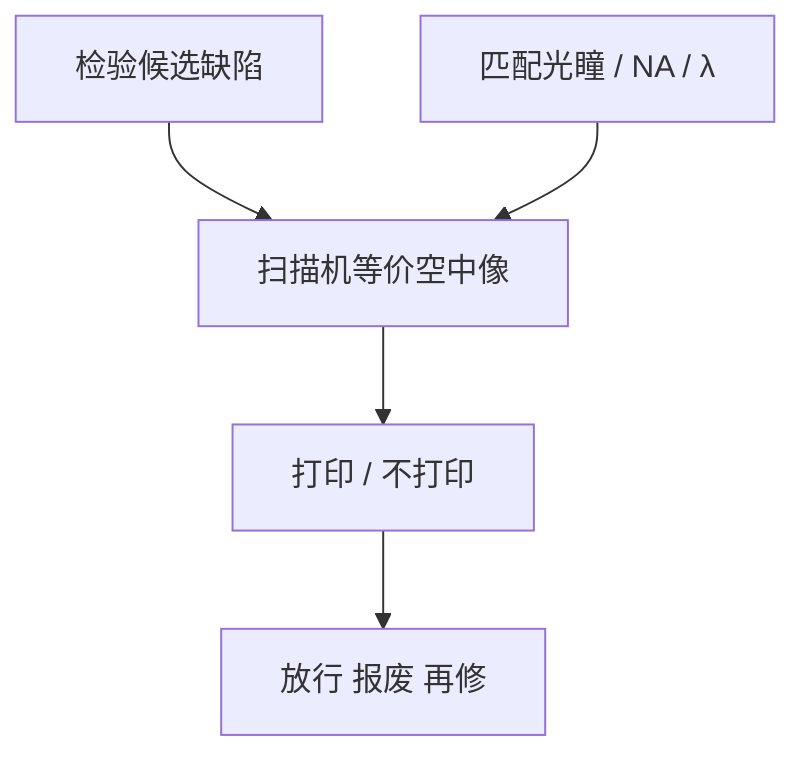

# AIMS 掩模鉴定

SEM 看见的是吸收体形貌；AIMS 看见的是扫描机波长与照明下的空中像——修过的补丁只在这里才算印不印。

<footer>—— 对照 Zeiss AIMS（Aerial Image Measurement System）掩模鉴定的公开产品与文献通称</footer>

[上一课](/litho/pellicle-mount-inspect)给出装膜后的出货态。缺口是光学检验与 SEM 都不等于扫描机打印。本课钉 AIMS。鉴定通过的版在寿命里仍可能雾化，留给[下一课](/litho/mask-haze）。

## 问题

掩模厂 D2DB 用的检验波长、NA、照明往往不是晶圆扫描机那一套。缺陷或修复补丁在非光化图上「合格」，在 193 nm 或 13.5 nm 的部分相干空中像上仍可能桥、断、CD 飞。AIMS 用等效的波长/NA/照明（DUV 成熟；EUV 光化 AIMS 更稀缺、更贵）在掩模上直接量空中像，把缺陷放到工艺窗口语言里。

缺口是**打印函数**，不是再提高检验像素。把 AIMS 当「更高分辨率 SEM」，仪器目的就错了。

### 与严格电磁的分工

[FDTD/RCWA](/litho/fdtd-mask) 后课会算掩模 3D；AIMS 是实物测量，吃真实侧壁、真实修复材料、真实 pellicle。模型再好也替代不了补丁的未知折射率。量产用 AIMS 抽关键缺陷，不用它扫整版——产能不允许。

EUV AIMS 与 DUV AIMS 不是同一台合同。无光化工具时，只能用模型 + 非光化再加风险接受，不能假装已经打印鉴定。

## 方法

流程：检验列出候选 → AIMS 在剂量/焦点小矩阵上看空中像 CD 或强度切片 → 判打印/不打印/可放行。照明必须尽量匹配 SMO 冻结的光瞳，否则鉴定的是另一台扫描机。pellicle 若已装，光路含膜；拆膜鉴定再装，状态不一致。

与 MPC：系统 3D 边应由模型校准，AIMS 主抓局部异常，而不是给全场 OPC 重新拟合。

## 机制

AIMS 物镜收集掩模衍射，重建的是与扫描机共轭的空中像平面强度（及部分相位信息，视系统而定）。缺陷的打印取决于它是否把通带内的衍射级搬出窗口。SEM 看到的体积缺陷若频谱在通带外，AIMS 可能判不打印——这正是 nuisance 过滤的物理。

## 边界

AIMS 不测量晶圆胶随机，不替代套刻。抽检不能证明未抽到的缺陷无害。不编造某缺陷尺寸的打印阈值表。

后课默认：出货前关键缺陷已经用打印视角判过；下一课处理上机之后随曝光剂量慢慢长出来的雾。

## 小结

- AIMS 用扫描机光学条件量空中像，鉴定缺陷与修复是否打印。
- 非光化检验通过 ≠ AIMS 合格；光瞳必须匹配。
- 整版扫 AIMS 不可行，只抽候选。
- 出处：Zeiss AIMS 公开论述；SPIE 掩模光化鉴定文献。
