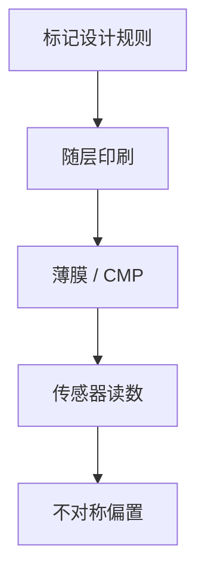

# 对准标记设计

标记要在薄膜和 CMP 之后仍可被传感器看见，又不能抢太多硅面积。周期、占空比和分层是设计，不是装饰。

<footer>—— 对照 [套刻标记](/litho/overlay-marks)；对准与套刻标记常近邻但合同不同</footer>

[上一课](/litho/alignment-sensors)给出读头。缺口是晶圆上印什么给它读。本课钉对准标记设计，不把高阶套刻模型提前写完。

## 问题

细密器件节距的标记对比弱；太大的标记浪费边缘。CMP 会把沟槽填偏，造成对准偏置。与套刻标记（成像或衍射套刻）若共用同一结构，优化目标冲突：对准要捕获鲁棒，套刻要残差可分解。

## 方法

周期匹配传感器波长与阶次；分段、双重图形层要标明「对哪一次曝光」。工艺窗口：在刻蚀/CMP 后抽检标记不对称。设计规则进 PDK，不是 OPC 临时加。

零层（zero layer）标记在有源区前，后续层都对它。损了要靠冗余或后层标记接力，这是策略课的网格，本课只谈单颗几何。

## 机制

衍射效率随占空比和深度；CMP 改变有效占空比 → 位置偏。多波长通道对同一几何权重不同，设计要让各色都还有信号。

## 边界

下一课减振：标记再好，地板在抖也套不准。

## 小结

- 标记几何是对准偏置的源头之一，要按层、按工艺设计。
- 对准标记与套刻标记合同分开。
- 出处：套刻标记课；对准传感器课。
