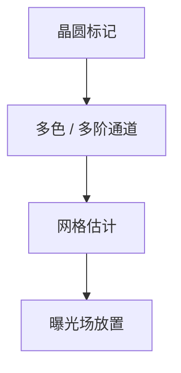

# 对准传感器 SMASH / ORION

对准传感器读的是标记衍射或成像，不是器件图形。SMASH、ORION 是公开产品名背后的通道：颜色、偏振、阶次怎么组合抗工艺。

<footer>—— 对照 ASML SMASH / ORION 公开对准光学；[对准策略](/litho/alignment-spm)</footer>

[上一课](/litho/focus-sensor-topography)跟 Z。缺口是 XY 网格：相对上一层或零层标记把掩模场放对。主干对准策略课已有 SPM；本课落到传感器硬件名与通道，不重写套刻定义。

## 问题

标记被薄膜、CMP、不对称刻蚀损坏后，单色成像对准会偏。多波长、多阶衍射（公开叙述中 SMASH 一类）提高对工艺的稳健。把套刻坏了只写成台编码器，会漏掉标记不对称。

## 方法

传感器选波长/偏振/捕获阶次，拟合标记位置。配方按层选通道。ORION 等后续公开名强调对先进节点标记对比。与 [DBO](/litho/dbo-ibo) 分工：对准是曝光前放场，套刻计量是曝光后验残差。

产品名会换代。本课用公开名指「多通道对准光学」这一类，不把某年手册当唯一实现。

## 机制

衍射对准看 ±1 阶相位；不对称叠层让两阶不等，位置偏。多色可以把不同穿透深度的信息合起来压偏置。成像对准则吃对比度与焦。

## 边界

下一课标记怎么画：传感器再好，坏标记设计也救不回来。

## 小结

- 对准传感器用多通道抗工艺，读标记不读器件。
- 与曝光后套刻计量分时、分目的。
- 出处：对准策略课；SMASH/ORION 公开描述。
