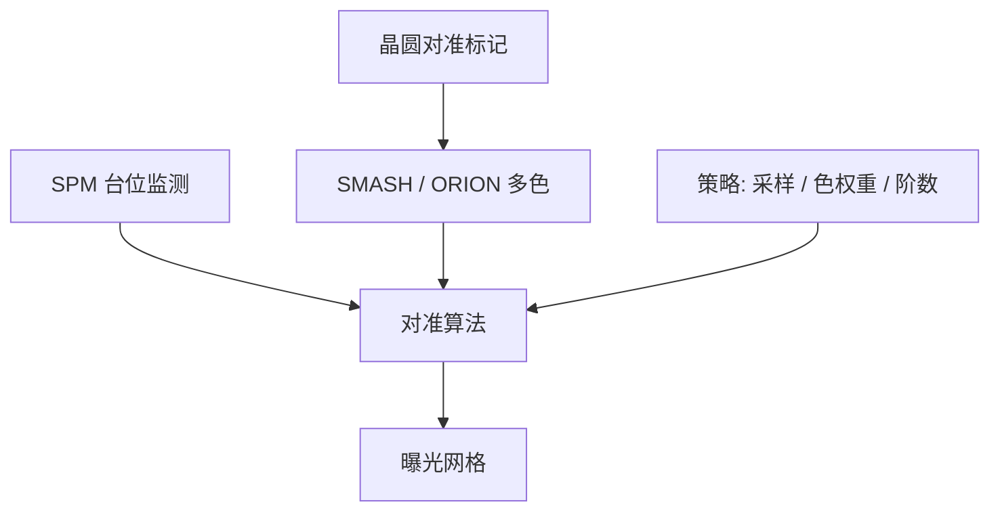

# 对准策略与 SPM

曝光前必须知道晶圆在台子上的哪一点；对准传感器读标记，工件台位置监测把这张读数钉到编码器网格上，策略决定用哪些色、哪些点去拟合变形。

<footer>—— 据 ASML 对准传感器与对准策略的公开论述，以及与对准互补的工件台位置监测（SPM）</footer>

[上一课](/litho/chiplet-packaging)把算力涨到封装侧，并不减小裸片内部层与层之间的纳米对准。缺口是扫描机里的对准：标记怎么选、多色如何压工艺不对称，以及 Stage Position Monitoring（SPM）如何把传感器读数和台位差一起喂给网格。掩模热膨胀从下一课才进套刻账单；本课先把「曝光前网格」钉住。

## 问题

[套刻 Overlay](/litho/litho-overlay) 已经区分对准与曝光后 overlay。[套刻标记](/litho/overlay-marks)写过 IBO/DBO 验收。缺口是机内策略：晶圆进机只有几十微米级预对准，要靠划片道光栅走到亚纳米网格。ASML 公开把 SMASH 再到 ORION 写成多波长、偏振更丰富的对准传感器，用最优颜色加权（OCW）把标记倾斜与工艺变形从位移里分开。

仅有传感器不够。台子被命令走到某处，编码器读到的路径仍有残差。公开专利叙述里，SPM 与对准传感器互补：监测晶圆台（或掩模台）相对计量架的位置/运动，把「传感器积分期间台子晃了多少」补进算法。没有 SPM，对准策略只是一张好看的色权重。

### 标记策略不是越多越好

点太少，翘曲和高阶场拟合不足；太多，测量时间吃片周期——双台把测量藏进曝光，仍不是无限。策略包括：用哪一层留下的标记、哪几个衍射级、哪几色、是否场内加密。工艺改 CMP 或膜厚，策略要重选，不是机台规格书上的单机 overlay 自动继承。

ORION 相对 SMASH 的公开卖点是更多色信号、对标记变形更不敏感。它不把产品套刻变成零。

## 方法

对准策略是一张配方：标记类型、采样图、模型阶数（线性到高阶晶圆对准 HOWA）、色与偏振权重。OCW 把多色读数组合成对不对称更钝的位移。混合计量可以把调平高度图的一部分信息喂进网格，公开论文称为 holistic 控制的一支。本课不展开 APC 软件商标。

SPM：在计量架上用编码器等读台位，与对准积分同步或加权，抑制传感器与台环路之间的串扰。对准闪光时台子并非理想静止，SPM 提供那段时间的位置修正。把它理解成「又一个对准波长」是错的——它不看晶圆标记，只看台。

### 与封装对准不要混名

Chiplet 与混合键合有自己的键合对准，精度语言是微米到亚微米凸点，不是扫描机里的纳米网格。本课对象是前道/后道光刻层。把 CoWoS 的贴片精度写成 ORION 的指标，类别错误。

## 机制

标记是光栅，对准光的衍射级相位编码位移。膜层使有效光学中心偏离几何中心，且随波长变——多色差就是不对称的诊断。策略用这组差去估计「真位移」，而不是平均掉。SPM 把台环的动态误差从标记相位里拆走，否则会把振动写成晶圆变形。

高阶模型用更多点拟合扫描方向的放大、偏扭和工艺指纹。点的布局决定能看见哪些阶；看见不等于应该补偿——过度拟合会把计量噪声写进曝光。[双工件台](/litho/twinscan-dual-stage)把加密采样放在测量位，使策略可以密而不直接吃曝光时间；SPM 仍要在曝光位跟上扫描同步，两段时间轴不要混。

单机套刻、匹配套刻、产品套刻仍是三个数。对准策略改的是产品网格的输入质量，不改定义。

## 边界

不要把未公开的对准残差纳米表填进来。不要重写编码器网格原理——TWINSCAN 课已经说过平面电机与短光束。本课也不把 DBO 套刻计量机当成 SPM。下一课的掩模加热是曝光期间的热源，对准网格若在曝光前测完，仍会被曝光中的掩模膨胀改掉，必须另开校正。

出处：ASML 对准公开故事与 ORION / OCW 产品论述；对准方法专利中对 SPM（stage position monitoring）与对准传感器互补的描述。不引用未公开的内部对准食谱。

## 小结

- 对准策略选择标记、色、采样与模型阶数，把工艺变形从位移里分开。
- SPM 监测台位，与对准传感器互补，不是又一路看标记的光。
- 封装对准与扫描机纳米网格不是同一指标。
- 曝光中的掩模热下一课才会改已经测好的网格。
- 出处：ASML 对准公开材料；SPM 公开专利表述。
