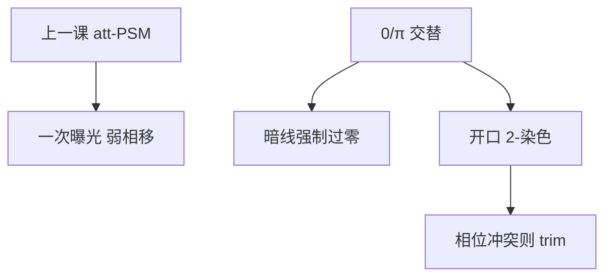

# 交替相移

相邻开口做成 $0$ 与 $\pi$，暗线靠相消过零，而不是靠衰减膜漏过百分之几的背景光。这是 Levenson 的强相移，不是上一课的 MoSi 合同。

<footer>—— 据 Levenson, Viswanathan, Simpson 的相移掩模，以及随后交替型（alt-PSM）与 trim 流程的量产表述</footer>

[上一课](/litho/binary-attpsm)把量产透射版钉成二元铬与衰减相移两类，并允许 Kirchhoff 薄屏 $t(x,y)$。缺口是强交替：$0/\pi$ 相邻分配、相位冲突、以及常常需要的第二张 trim。衰减型的透过率百分比不要再写一遍。亚分辨辅助杆留给[下一课](/litho/sraf-assist)。

## 问题

衰减型压低零级、一次曝光、可走标准 OPC，所以成为接触孔和许多 DUV 层的默认。密线栅若还要更黑的暗区、更宽的焦深，衰减的背景光不够：需要相邻开口相位差约 $180^\circ$，让中线电场强制过零。这就是交替相移（alt-PSM、Levenson）。

缺口因此是「何时离开 att 合同、改走 0/π 染色」，而不是重讲相消干涉的第一性原理。[相移掩模](/litho/phase-shift-mask)已经给过家族定义；本课只补交替型作为一层工艺的约束。

### 相位是 2-染色

给每一条目标暗线的两侧开口涂上相反相位，等价于对开口做图染色。二维连通一旦出现奇数环，无法 2-染色，就是相位冲突。设计规则要么禁止这种拓扑，要么接受 trim：第二次二进制曝光切掉不该留下的相位边。无铬相移（CPL 等）把透过区铺得更满，冲突与 OPC 更重，量产渗透仍不如 att。

相位边本身就是一条暗线。想要的栅极处这是特性；逻辑拐角处是缺陷。不要把「用了 PSM」理解成版图可以任意二维连通。

## 方法

石英台阶或等效膜系使光程差约 $\lambda/2$。相邻开口 $0/\pi$ 交替，铬可以很窄。典型流程：alt 掩模印出密线 → 二进制 trim 去掉多余相位边 → 转印。这已是两次光刻，套刻与产能要计入，和 LELE 的「两张分解掩模」不是同一件事：trim 删的是相位残影，不是把节距染色成两套线。

照明：交替型对部分相干与对准更挑剔，不能照搬 att + 环带的孔食谱。OPC 必须带相位通道；把上一课的 att 模型套上来，会在相位边造出假图形。

### 与衰减型对照

Att-PSM：图形仍由石英开口定义，暗区是弱透过 + $180^\circ$。Alt-PSM：暗线由干涉保证，分辨率潜力更大，掩模相位缺陷几乎不可按铬缺陷那样补镀。检测必须对相位通道敏感。本课不把掩模厂良率写成节点良率。

## 机制

物体透过率 $t(x)=A(x)e^{i\phi(x)}$，相邻周期的傅里叶零级互相抵消，能量进更高衍射级。离焦时选定级的相位关系仍能维持过零，故 DOF 往往优于二元密线。这与 [OAI](/litho/off-axis-illumination) 正交：OAI 选哪些级进瞳，交替相移改级的相位与零级强度；二者可叠加，但强偶极 + 二进制有时已经够一维层，不一定值得上 alt。

Trim 的空中像是二进制，套刻误差会让该切的相位边留下残线、或不该切的地方切进栅极。因此 alt 的一阶代价不只是「多一张版」，而是同层二次曝光的 overlay。

上一课的 MEF 在交替型里会改形状：暗线由过零钉住，对铬宽度不那么敏感，但对台阶深度与相位误差极敏感。OPC 若仍用 att 的 $t(x,y)$，过零位置会系统偏。

$180^\circ$ 为某一 $\lambda$ 与台阶深度而设计。ArF 交替版不能拿到 KrF 上当同一 alt-PSM。换波长必须换台阶或膜系。

## 边界

逻辑上强交替常常输给「att 或二元 + OAI + OPC」，或输给后来的多重图形：设计规则、trim、相位缺陷加在一起，比再降一点 $k_1$ 更贵。存储器与规则栅极层更适合。本课不把 Levenson 1982 写成 7 nm 良率论文。

SRAF 可以画在 alt 版上，但辅助杆的相位归属会再制造冲突；下一课按孤立线窗口讲辅助杆，不在这里提前铺规则表。EUV 反射掩模不是石英 0/π 台阶，不要把本课流程抄过去。

无铬相移是家族变体，会议演示不等于晶圆厂默认下单。本课的量产对象仍是「有铬的 0/π 交替 ± trim」。

## 小结

- 交替相移用 0/π 相邻开口强制暗区过零，强于 att 的弱背景。
- 开口必须可 2-染色；奇数环要改设计或 trim。
- Trim 是第二次光刻，套刻进入残线风险。
- 不重写二元 / att 合同；不替代 OAI。
- 孤立线辅助杆下一课。
- 出处：Levenson et al., IEEE 1982 相移掩模；Mack 对 alt-PSM 与 trim 的教科书表述。
