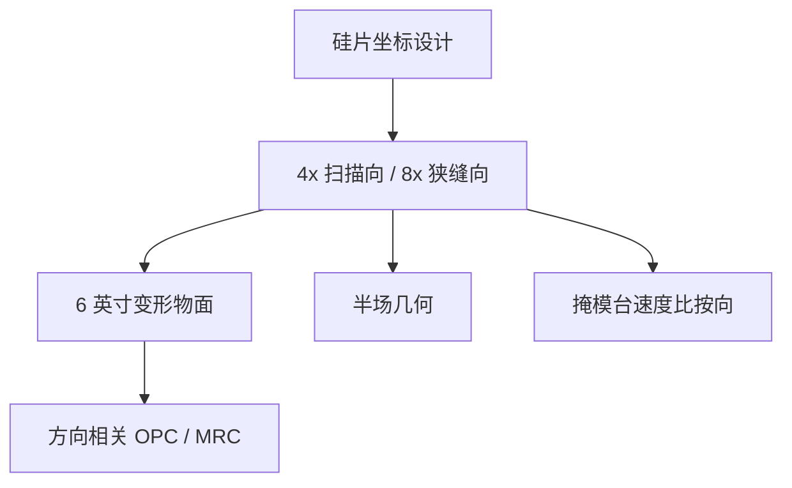

# 变形掩模倍率

硅片侧 0.55 若仍用各向同性 4×，掩模角会先死；扫描向约 4×、狭缝向约 8× 是把 6 英寸版和多层窗一起保住的倍率对。

<footer>—— 据 van Schoot 等对 High-NA 变形倍率的公开光学论述</footer>

[上一课](/litho/high-na-resist-budget)把轴向胶厚和焦深收进同一张预算。缺口是物面：胶再薄，掩模侧角度仍由 NA 除以倍率决定。本课钉变形掩模倍率（约 4×/8×）。真空磁浮台如何跑这条不对称同步，在[工件台](/litho/euv-maglev-stage)与同步课展开，这里只把倍率写进掩模与 OPC 合同。

## 问题

掩模 NA 等于硅片 NA 除以倍率。各向同性 4×、NA 0.55 给出掩模 NA ≈ 0.138，主光线与角谱把 [Mo/Si](/litho/euv-multilayer-mirror) 和吸收体阴影同时打出窗；6 英寸空白版也放不下光瞳。[变形光学](/litho/anamorphic-projection) 已经给出机器几何：狭缝向提高倍率、扫描向保持约 4×。本课的缺口是这张倍率对**掩模**意味着什么——场、写版、CD 定义、OPC 坐标系——而不是再推一遍 CRA。

胶厚课解决的是像面薄膜；倍率课解决的是物面缩放不对称。两者都是 0.55 能落地的条件，不是重复。

### 8× 不是「版上图形放大一倍就完」

狭缝向 8×：硅片上场在该方向减半，掩模上该方向的场更瘦，同一 6 英寸版装得下角谱。扫描向 4×：掩模台速度比仍熟悉，版长方向的场与 NXE 思路兼容。OPC、MRC、写掩模网格必须按方向用不同倍率还原到硅片纳米，不能再用各向同性 4× 的口令画一条边。

van Schoot 的论证对象是光学约束，不是某张产品海报上的 wph。本课引用 4×/8× 与半场几何，不把未核实吞吐写成事实。

## 方法

设计与 TAPOUT 在硅片坐标里画；掩模厂在变形物面坐标里写。中间要一张各向异性的放大：x、y 各一套倍率、各一套 MEF。SRAF 宽度、MRC 最小间距在版上是各向异性的合同，回到硅片又必须各向同性地满足电学规则。碎片长度、jog 规则按方向拆开，否则 8× 方向上「看起来很细」的助条在硅片上并不细，或反过来。

套刻与拼接：半场约 26 mm × 16.5 mm 是倍率几何的推论。层间若一张 0.33 全场、一张 0.55 半场，倍率定义必须在套刻模型里显式出现。这与胶厚预算正交：一个管 z，一个管物面缩放。

### 写版与检测

电子束按掩模纳米寻址。变形后，硅片上同样的 1 nm CD 误差在两个方向对应不同的版上误差。检测像素、缺陷打印阈值也要按方向解释。掩模 3D 模型的入射角随方向变，吸收体阴影已经不对称，再叠变形倍率，左右与 HV 必须分开校准。

## 机制

投影把掩模频谱按两个方向不同的缩放送进光瞳。MEF、PV-band、线端缩短在 H 与 V 上本来就因阴影不同；变形倍率把「版上同等改动」变成硅片上不等价的 CD。模型基 OPC 必须用变形成像核，规则 OPC 的各向同性表在这里没有资格。

工件台同步：掩模台在扫描向仍约 4 倍晶圆台速度；狭缝向步进与场尺寸按 8×。同步误差进套刻的杠杆按方向不同。本课只点名这条约定，不写伺服。

「变形掩模」不是把版图画成椭圆晶体管。设计仍在硅片正交网格上；各向异性只存在于物像缩放和掩模 3D 成像。

## 边界

本课不重写胶倒塌，也不展开半场拼接工艺。不要把 4×/8× 写成已经改过的产品倍率表以外的数。掩模厂的写场、检测视场和空白版利用率都按这张不对称缩放排，不能仍按 NXE 的各向同性 4× 排产。后课默认：说到 High-NA 掩模，先问方向倍率，再问吸收体厚度。

引用以 van Schoot 公开论文与 ASML High-NA 光学叙述为准。

0.33 NXE 仍是各向同性约 4×。不要把本课的 8× 套回 NXE 掩模厂规则。

## 小结

- High-NA 用约 4×/8× 变形倍率，保住掩模角、6 英寸版和扫描速度比。
- OPC、MRC、写版网格必须按方向还原到硅片纳米。
- 半场是倍率几何推论，与胶厚预算正交。
- 各向同性 4× 的规则 OPC 在此没有合同资格。
- 写版寻址按掩模纳米；同一硅片纳米在两方向对应不同版上误差。
- 出处：van Schoot 等 High-NA 变形光学公开论述。
