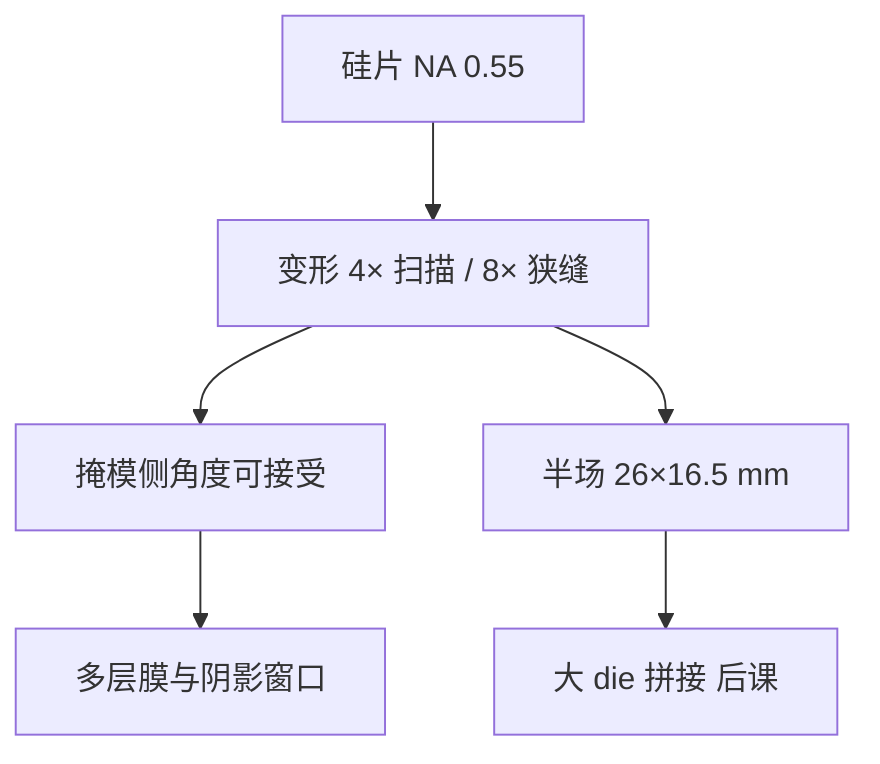

# 变形光学

High-NA 在扫描向保持约 4×、在狭缝向用约 8×，把掩模侧角度压回多层膜与阴影还能活的窗口。

<footer>—— 据 van Schoot 等 ASML High-NA 公开光学论述</footer>

[上一课](/litho/euv-oblique-shadow)把 0.33、各向同性 4× 的掩模主光线角钉在约 $6^\circ$，并指出再抬 NA 会把 CRA 与掩模 NA 一起打穿多层布拉格。缺口是：硅片侧仍要 0.55 的分辨率，掩模侧却不能按 $0.55/4$ 线性放大角度。本课钉变形光学（anamorphic projection）。半场如何拼大芯片，在 [High-NA 整机](/litho/asml-high-na) 与后课拼接里展开；氢污染控制从[下一课](/litho/euv-hydrogen-dgl)接回量产腔。

## 问题

掩模侧数值孔径是硅片 NA 除以倍率。各向同性 4×、NA 0.55 给出掩模 NA $\approx 0.138$，主光线角和入射角范围让 Mo/Si 峰值、偏振分裂和吸收体阴影同时越界；6 英寸版也放不下光瞳。镜子口径按 NA 涨，POB 包络成为机械墙。

需要不对称倍率：对阴影和多层最敏感的狭缝方向提高倍率、减小掩模角；扫描方向保持约 4×，以便掩模台与硅片台仍按熟悉的速度比同步。这就是 van Schoot 公开的 High-NA 变形方案，不是把 0.33 物镜「开光圈」。

### 4×/8× 各保护什么

扫描向约 4×：工件台扫描同步、掩模长度方向的场仍与 NXE 思路兼容。狭缝向约 8×：掩模上的场更瘦，角谱回到多层能给高反、吸收体能给可接受阴影的区间，6 英寸空白版装得下光瞳。硅片上场在狭缝向减半，约 26 mm × 16.5 mm，这是几何推论，不是任意切场。

变形不是「硅片上 X 与 Y 分辨率不同」。硅片侧 NA 仍以 0.55 为目标成像；不对称的是掩模到硅片的几何倍率。不要写成 EXE 只能做椭圆孔。

## 方法

蔡司为 EXE 做更大口径的强非球面变形投影组，波前计量按各向异性光瞳来。照明、掩模三维和 OPC 必须用两套倍率：同一条线在扫描向与狭缝向的掩模 CD、阴影和 MEEF 不同。光瞳填充在两方向不对称，SMO 自由度增加，旧的各向同性 4× 模型不能签字。

场几何：26 mm（扫描）× 16.5 mm（狭缝）。超过半场的 die 要两次曝光拼接，套刻与剂量连续性是下一层课的缺口；本课只把「为什么必须半场」接到变形倍率上。pellicle 角透过率与热也要按新 CRA 重写，不在本课展开膜。

### 分辨率从哪里来

$$
\frac{\lambda/\mathrm{NA}_{0.55}}{\lambda/\mathrm{NA}_{0.33}} = \frac{0.33}{0.55}\approx 0.60,
$$

特征尺寸约缩到 0.33 系统的 60%。卖点是把原需 EUV 双重的节距拉回单次。焦深按 $\lambda/\mathrm{NA}^2$ 再变薄，随机效应在更小孔上可能更严——变形光学解决的是掩模角，不是泊松统计。

## 机制

倍率提高的方向上，掩模 NA 减半相对各向同性 4× 的 0.55 方案，CRA 被压回与 0.33 平台可类比的工作区（van Schoot 公开论述的核心几何）。多层周期与吸收体厚度因此不必为 0.55 重做一套「更厚、更斜」的不可能膜系。代价是投影镜子更大、更非球面，透过率与热负荷不比 NXE 宽松，仍依赖高功率 LPP。

成像 TCC 在两方向用不同缩放。SRAF、ILT 曲边在 8× 方向的掩模规则与 4× 方向不同，MRC 要分轴。计算光刻资格认证按平台拆开，不能把 NXE OPC 改个 NA 数字交差。

EXE 与 NXE 不要混名。NXE 是各向同性 4×、全场、NA 0.33；EXE 是变形 4×/8×、半场、NA 0.55。说「ASML 的 EUV 倍率」而不标轴，在 2026 年会把阴影模型写错。

## 边界

本课不写未公布的镜面张数，不编造 EXE 的 wph。半场拼接的套刻算法留给机台课序。氢 DGL 不因变形而取消，下一课回到污染。出处：van Schoot High-NA 公开论文与 ASML/Zeiss High-NA 材料；场尺寸 26 × 16.5 mm、4×/8×、NA 0.55 是公开合同。

也不要把变形当成偏振魔法。大 NA 的矢量效应仍在硅片侧；变形只是不让掩模侧先死。

8× 方向掩模 CD 更大，写版与检测的纳米误差缩到硅片时除以 8，对那一轴的掩模误差预算更松；4× 轴仍按老规矩。这是分轴 MEEF，不是「掩模突然容易做了」。

## 小结

- 各向同性 4× 无法同时承载 NA 0.55 的掩模角与 6 英寸版。
- 变形光学：扫描向约 4×、狭缝向约 8×，压低 CRA 与掩模 NA。
- 硅片场约 26 × 16.5 mm；大芯片拼接是几何代价。
- 光学特征尺寸约缩到 0.33 的 60%；焦深与随机另记账。
- OPC/SMO/M3D 必须分轴；下一课接回氢气锁与污染。
- 出处：van Schoot 等 High-NA 公开光学；ASML / Zeiss。
