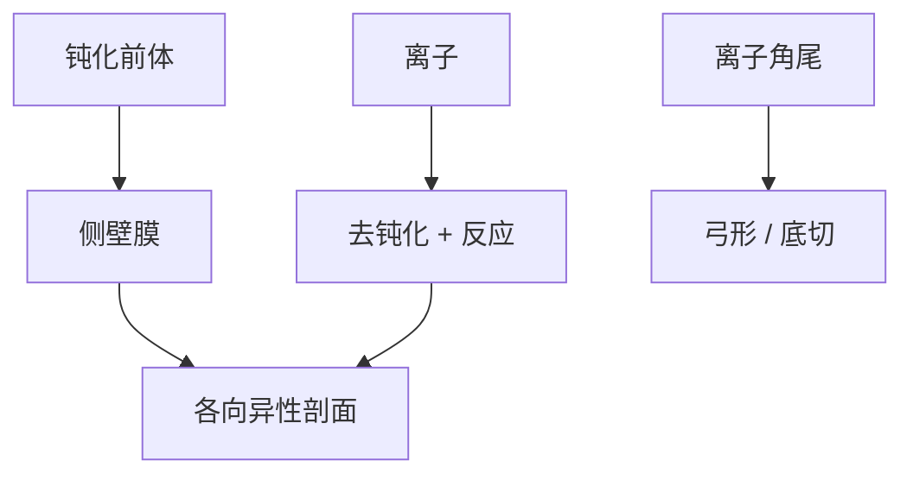

# 各向异性与侧壁钝化

各向异性不是离子「只会往下打」的神话；侧壁靠聚合物或氧化层挡住横向化学，底部靠离子把钝化打掉。

<footer>—— 对照 RIE 钝化–离子协同的教材图像；Coburn–Winters 之后的侧壁化学通称</footer>

[上一课](/litho/hardmask-sin-tin)把深度交给硬掩模。缺口是剖面：开口要直、底要清、侧壁不能长瘤或挖空。本课钉各向异性与侧壁钝化。负载效应如何让钝化通量随密度变，留给[下一课](/litho/etch-loading-effect）。

## 问题

纯化学刻蚀各向同性，细线立不住；纯溅射损伤大、选择比差。RIE 的直壁来自：**底部**离子去钝化 + 反应，**侧壁**钝化膜挡横向。含氟碳的介质刻蚀、HBr/O2 的多晶硅、金属氯化学，钝化物种不同，逻辑同构。钝化太厚：底清不掉、CD 缩、弓形；太薄：腰斩、底切、选择比崩。

缺口是**剖面旋钮**，不是再讲鞘层。OPC 紧凑核通常不显式含侧壁角；3D 胶/刻蚀抽检才看见钝化失败。把顶视 CD 当直壁，电学和打穿会反对。

### 钝化是图形相关的

聚合物前体来自气体和被刻的胶/硬掩模。开口率高，碳源与消耗变，侧壁膜厚随局部环境走——这就是下一课负载的化学面。孤立线与密线剖面可以一个垂直、一个倾斜，AEI CD 却被调到同一数。

过刻阶段钝化条件往往与主刻不同。主刻直、过刻腰斩，是常见的食谱拼接错误。

## 方法

旋钮：聚合物比（C/F、O2 添加）、离子能量、温度、气压（角分布）。计量：截面 TEM/SEM、侧壁角、底脚、弓形、残留。与选择比课联立：同一聚合物既保硬掩模又保侧壁，窗口是三维的。ALE 用循环把钝化与去除拆开，本课承认它是钝化逻辑的极限形式，不展开循环时序。

剖面规格要对代表 AR 和开口率，而不是只切一条密线。主刻与过刻的钝化比若分家，应分两段计量，避免「平均侧壁角」掩盖过刻腰斩。

## 机制

侧壁膜生长速率对离子通量不敏感（少离子），对中性通量和表面温度敏感。底部膜被离子溅射或离子协助反应去掉。角分布宽时，侧壁也被离子擦到，钝化变薄，出现弓形。电荷在高 AR 孔的累积会弯离子轨迹，侧壁出现缺口——几何 ARDE 的电场版。剖面进入 via 填充和可靠性（虚空、击穿）。

离子角尾把侧壁膜擦薄，图中弓形与底切是同一平衡被破坏的两种脸。剖面规格要分主刻与过刻，不能只报平均角。

## 边界

不写某气体的未公开配比。不把钝化当缺陷课的颗粒源展开。光学侧壁角（胶）与刻蚀侧壁角不要混报。

后课默认：直壁是钝化与离子的平衡，随开口率漂。下一课把这漂移命名为负载，并接到填充与 dummy。

## 小结

- 各向异性 = 侧壁钝化 + 底部离子去钝化，不是离子神话。
- 钝化厚度随开口率与过刻阶段变，顶视 CD 不够。
- 剖面进入填充与可靠性。
- 出处：RIE 钝化协同教材图像；Coburn–Winters 传统。
