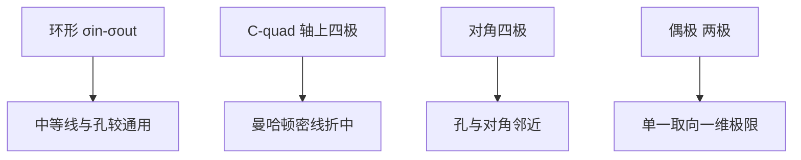

# 环形、偶极与四极

离轴照明已经决定了「能量要离开光轴」；剩下的工程是把能量落在哪一段环、哪几个极上，使目标节距的两束刚好进瞳。

<footer>—— 据 Mack 对环形 / 偶极 / 四极作为 RET 光瞳的分类，以及 ASML 浸没机照明器产品页对 annular、dipole、C-quad 的公开命名</footer>

[上一课](/litho/off-axis-illumination)讲清了为什么要把照明移出光轴：密线条走零级加一个一级，对比度与焦深在特定节距上变好。缺口是具体光瞳形状——$\sigma_\mathrm{in}$–$\sigma_\mathrm{out}$、极的方位与张角、C-quad 与常规四极差在哪——而不是再推一遍 $k_1=0.25$ 的两束下限。可编程自由光瞳留给[下一课](/litho/flexray-pupil)。

## 问题

上一课把环形、偶极、四极写成 OAI 家族的三个名字。产线订照明时面对的是一组可调参数，不是三个开关。环形要内外半径；偶极要极心半径、张角、以及极轴相对栅极的方向；四极还要决定极是放在坐标轴上（C-quad）还是放在对角（conventional quad）。选错一组，目标节距的一级会擦着光瞳边缘，或者正交取向的图形根本没有一级进瞳。

缺口因此是把「离轴」落实成一张光瞳图，而不是重讲三束变两束的动机。没有这张图，后课的微镜阵列没有离散模式可对照。

### 取向是第一约束

偶极的两个极连线，定义了哪一取向的密线栅能做两束成像。栅极层往往只有一个密方向，可以上强偶极。金属层 x/y 都有密线，偶极会把其中一个方向做成近乎零调制；这时要用四极或环带，把能量分给两个取向。接触孔更吃环带或对角四极，因为最近邻沿两个轴、对角旁瓣还要另管。

ASML 公开分辨率必须绑照明模式：同一台 $\mathrm{NA}=1.35$ 浸没机，偶极与 C-quad 报的半节距可以差一截。用偶极数字去承诺二维 SRAM，是范畴错误。

## 方法

环形：照明填 $\sigma_\mathrm{in}$ 到 $\sigma_\mathrm{out}$ 的环，对中等密线与孔较通用，工艺窗随节距掉得比较平滑。四极：四个极，C-quad 的极在 $\pm x$、$\pm y$，服务曼哈顿密线；对角四极把极放到 $45^\circ$，对孔类与对角邻近更友好。偶极：两个极，把几乎全部能量给一个取向，一维极限最激进，光通量也最低。

这些形状在传统照明器里由衍射光学元件（DOE）或孔径光阑生成。换层等于换元件；内外 $\sigma$ 与极张角只能在离散档位里跳。Mack 把它们与 PSM、OPC 并列进 $k_1$，强调的是「形状」而不是把 $\sigma$ 拧到 0。

### 节距窗口与极半径

极（或环）的径向位置决定零级在投影光瞳里落在哪里，从而决定哪一个节距的一级落在对侧。极太靠外，更密的节距才能配对，较疏的节距一级可能出瞳或与零级重叠不当；极太靠内，密节距又不够离轴。这就是为什么「厂里那个偶极」不能从栅极层抄到切线层：切线往往更疏、更二维。

## 机制

空中像仍是各源点的相干成像再对源做强度积分。环形把源点铺成一圈，许多节距都能凑到一对级，但没有一个节距拿到全部能量。偶极把源点收成两团，目标取向的 TCC 最利于两束，正交取向几乎没有交叉项。四极是两次偶极的折中：x 与 y 都有调制，峰值对比各让一截。

偏振还没在本课展开：同一偶极，切向偏振与非偏振的对比可以差一截，那是照明偏振课的缺口。本课只要求声明「这是哪一种极几何」，后课再给每个极加琼斯矢量。

换光瞳等于换空中像核。上一课已说过旧 OPC 不能沿用；本课补一句工程：内外 $\sigma$ 或极张角只要改一档，SRAF 位置与主边碎片都要重解，不能只拧剂量把 CD 拉回名义值。

$\sigma$ 相对投影 $\mathrm{NA}$ 归一。浸没 $\mathrm{NA}=1.35$ 之后，同一 $\sigma$ 对应的物方角与干式不同；把 KrF 环形食谱的内外 $\sigma$ 抄到 ArF 浸没上，极在瞳面上的物理位置不对。

## 边界

本课不把自由形状照明算进来：微镜阵列可以逼近上述经典形状，也可以画出 SMO 花瓣，那是下一课。也不重做套刻：换光瞳会改通过焦点的图形位移，但 overlay 预算仍单独做。掩模侧 OPC 与 SRAF 必须按新光瞳重解，本课只钉瞳面，不写边碎片。

ASML 照明器产品页上的环形 / 偶极 / C-quad 是可交付模式名，不是某节点良率。不要用公开半节距去倒推 7 nm 金属层一定用了哪种极。

极张角太小，光通量与源点统计都差，扫描时间变长；张角太大，又接近环带，丢掉两束的纯粹性。产能与窗口在同一组参数上打架。

## 小结

- 环形、C-quad、对角四极、偶极是 OAI 的具体瞳形，不是新的离轴动机。
- 极的方位服务取向，径向位置服务节距窗口。
- 偶极只服务单一密方向；二维层要用四极或环带。
- 传统照明器靠 DOE / 孔径，模式是离散档。
- 自由光瞳下一课；偏振再下一课。
- 出处：Mack, *Fundamental Principles of Optical Lithography*；ASML 浸没机对 annular、dipole、C-quad 的公开照明模式。
