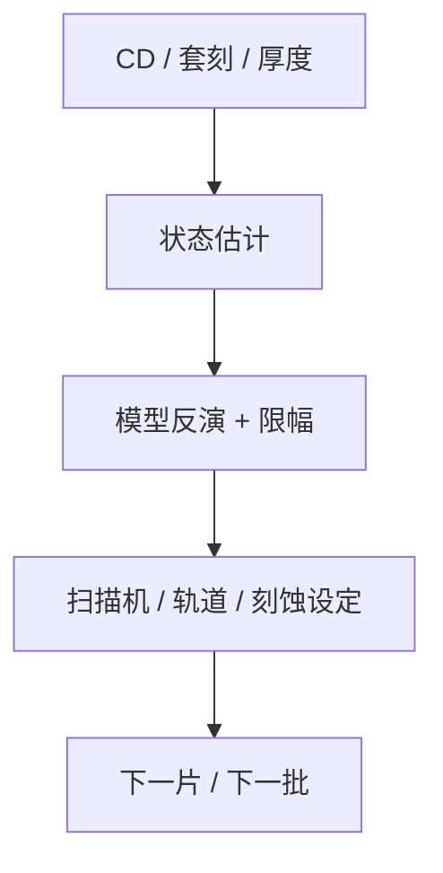

# 先进过程控制 APC

规格内不等于受控：APC 用模型把计量残差变成下一片的剂量、焦点或网格修正，而不是等人看见趋势再拧旋钮。

<footer>—— 对照 SEMI 对 APC / run-to-run 的通称；IEEE 半导体生产中的先进过程控制传统</footer>

[上一课](/litho/critical-layer-alignment)把对准树交到量产。缺口是闭环：读数如何变成下一场的设定。[剂量控制](/litho/dose-control) 已有机内环；本课钉厂级 APC（advanced process control）的位置。前馈与反馈如何拆，留给[下一课](/litho/feedforward-feedback-r2r）。

## 问题

机内环（剂量传感器、调平）吃掉秒级噪声。批次间胶厚、光源老化、腔体聚合物、卡盘污染是小时到周的漂移，要靠离线或近线计量 + 控制器。APC 把 CD、套刻、厚度映射到可执行的补偿：剂量偏置、焦点偏置、叠对校正项。没有模型，补偿会把噪声写进下一片。

缺口是**控制层**，不是再讲扫描机内部传感器。把 APC 当「自动 SPC」，会只报警不动作；把 APC 当无限权限优化器，会和 OPC 版本、食谱锁定打架。

### APC 不替代工艺能力

控制器不能把 $C_{pk}$ 从无能变成有能。窗口本身不够时，APC 只是把均值钉在悬崖边。PWQ 与 LRC 仍是能力门；APC 管的是受控。

SEMI E133 一类标准谈的是数据与接口，不是某家算法商标。控制器要有权限、限幅和失效安全：计量坏了应停补，而不是猛拧。

## 方法

结构：计量 → 状态估计（滤波）→ 模型反演 → 限幅 → 写回扫描机/轨道/刻蚀。对象分层：CD 对剂量/焦点；套刻对网格；厚度对涂胶或 CMP。与 OPC 回环课分工：APC 动低维设定；核形状仍走工程版本。权限：哪些层开 APC、最大步长、与重工的优先级。

开环层（窗口已贴悬崖、或计量不可靠）应明确关闭 APC，只留 SPC。把所有层默认打开，会在新胶导入期把噪声写进剂量历史。SEMI 对 APC 的接口强调限幅与质量位，本课把它们当成开环开关。

## 机制

假设计量 = 真值 + 噪声，过程 = 缓变状态 + 突发。控制器常用 EWMA 一类更新状态，再按增益反推设定。增益过大振荡，过小跟不上。突发（换版、保养）应重置状态，而不是被 EWMA 慢慢吞。这与后课 SPC 的「异常规则」衔接：APC 负责补偿，SPC 负责宣布「不可再补」。

限幅后的设定不再跟踪，状态应升格给 SPC。控制器只钉均值；窗口本身仍由 PWQ 与 LRC 守门。

## 边界

APC 不修随机光子缺陷，也不改设计规则。不把未公开的控制器增益当文献。本课不写限价簿。

后课默认：厂级有限幅的设定更新。下一课把前馈（已知扰动）和反馈（残差）拆开，并落到 run-to-run。

## 小结

- APC 用计量与模型更新低维设定，限幅并失效安全。
- 它钉均值，不创造工艺窗口。
- 与 OPC 核版本分层，禁止每片重 OPC。
- 开环层应显式关闭 APC，只留 SPC。
- 出处：SEMI APC/R2R 通称；半导体 APC 的 IEEE 传统。
