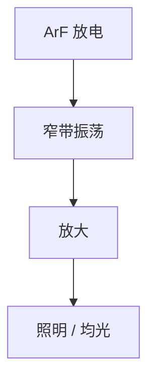

# ArF 准分子激光器

193 nm 量产光来自 ArF 准分子放电，不是汞灯的 i 线尾巴。脉冲、气体和腔镜是剂量与带宽的上游。

<footer>—— 对照 Cymer / Gigaphoton 公开的 ArF 准分子光源；波长台阶见 [litho-wavelengths](/litho/litho-wavelengths)</footer>

[上一课](/litho/resist-strip-ash)收束轨道剥离。成像与胶、轨道已经在补层里；缺口转到**曝光机里面谁发光**。本课是「曝光机子系统」第一课：ArF 准分子激光器。不重推 [瑞利判据](/litho/rayleigh-litho)，也不把浸没水膜再讲一遍——[ArF 浸没](/litho/arf-immersion) 假定光源已经是 193 nm。后课带宽、脉冲能量、气体寿命都默认本课的放电结构。

## 问题

主干把 193 nm 写成波长台阶上的一个点。机台里它是稀有气体卤化物放电：氩与氟在高压脉冲下形成 ArF*，退激发出约 193.3 nm。汞灯连续谱滤不出这条线的亮度与窄带；准分子是脉冲、高峰值、可压窄的。缺口是把「193 nm」落到腔、放电和为什么后课要谈线宽。

KrF 248 nm 是另一台准分子（KrF*），不是把 ArF 换滤光片。气体、镀膜、光路材料整套换。本课只钉 ArF 浸没量产这一条。

## 方法

振荡级加放大级（MOPA 或同类主振–功放）是公开架构：振荡级出窄带种子，放大级出功率。光束再进照明均光。剂量按脉冲计数 × 单脉冲能量；重复频率进 [扫描仪产能](/litho/scanner-throughput)。本课不写具体 kHz 广告值当物理常数。

## 机制

准分子寿命短，不能当连续波腔慢慢建场，必须脉冲放电。光谱天然比需要的成像带宽宽，所以下一课必须压窄，否则色差与焦深被吃掉。氟腐蚀光学件，气体寿命是运行成本，再后一课。

## 边界

本课不写 EUV 锡滴 LPP——那是另一条波长的光源课。下一课只谈线宽压窄，不改放电化学。

## 小结

- 193 nm 量产光是 ArF 准分子脉冲，不是灯。
- 功率与光谱分属放大与压窄，后课拆开。
- 出处：准分子光源公开架构；波长台阶课。
