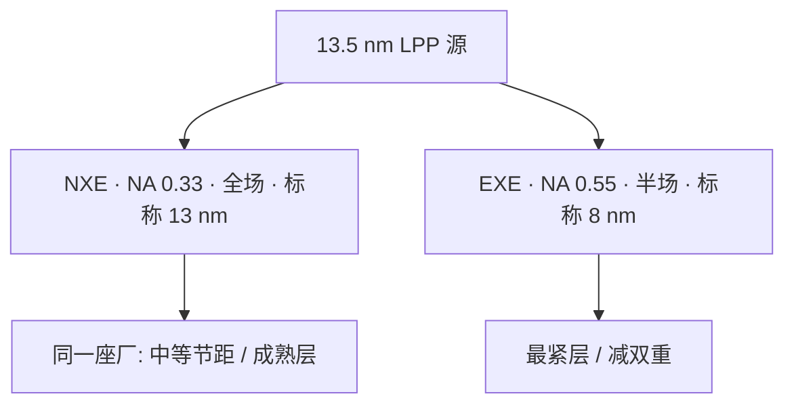

# ASML EUV / High-NA

    
ASML 把量产 EUV 收成两条平台合同：NXE 以 NA 0.33 印约 13 nm 标称分辨率，EXE 以 High-NA 0.55 印约 8 nm；同一 13.5 nm 光源，拧的是孔径而不是再换波长。

    <footer>—— ASML TWINSCAN NXE / EXE 公开产品说明与 High-NA 科普</footer>

[上一课](/litho/rayleigh-litho-note)（瑞利判据笔记（Mack））。[NXE](/litho/asml-nxe) 写过 0.33 全场量产线如何吃 7/5/3 nm 关键层；[High-NA EXE](/litho/asml-high-na) 写过变形光学与半场为什么必须出现。本篇把 **ASML 的 EUV 产品线**当成一条工业叙事来读：两条平台如何并存、厂商分辨率标称（13 nm / 8 nm）和瑞利式怎么对上、以及导入节奏里哪些是已公开里程碑。不重复六镜物镜逐镜、锡滴预脉冲或磁浮工件台的细节；那些见 [蔡司光学](/litho/zeiss-euv-optics)、[LPP](/litho/euv-lpp-tin)。不填写未公布的镜面张数或未证实的机台报价。

## 问题

ArF 浸没把单次曝光停在大约 40 nm 半节距之后，逻辑关键层要靠 DUV 多重图形堆套刻。EUV 用 13.5 nm 换波长，使 $k_1\lambda/\mathrm{NA}$ 在可接受的 $k_1$ 下落到十几纳米。第一代量产孔径定在 **0.33**：再高则当时镜子口径、掩模侧角度和透过率不可用。0.33 够支撑 5/3 nm 的许多关键层单次曝光，但更紧的金属节距仍要 EUV 双重，或等待更大 NA。

High-NA 要回答的是：在**不换波长**的前提下，把硅片侧 NA 从 0.33 提到 0.55，把原先需要双重的节距拉回单次，并让代工厂在 2 nm 级及后续节点上减少循环。它不是「另一家公司的 EUV」，而是 ASML 在同一光源家族上开的第二条整机平台。问题立刻变成工厂经济：0.33 全场成熟、拼接少；0.55 分辨率更高、场减半、焦深更薄、镜子更贵。两条线必须长期并存，类似当年干式与浸没 DUV。

### 两条平台合同：NXE 与 EXE

**NXE**（TWINSCAN NXE:3400 / 3600 / 3800 等世代）是 NA 0.33、4×、曝光场约 26 × 33 mm 的量产平台。ASML 公开把其分辨率标称写成 **13 nm**，用于先进逻辑与存储的基础层。世代差异主要在源功率、可用性、套刻和生产力：例如 NXE:3800E 被公开写成可按 **220 wph** 配置出货——那是厂商规格与出货叙述，不是本博客测的。NA 在 NXE 上是平台常数，直到 EXE。

**EXE** 是 High-NA 平台。EXE:5000 是第一台 0.55 系统，偏工艺开发；EXE:5200 / 5200B 把套刻与产能往量产推。ASML 公开：NA 0.55，标称分辨率 **8 nm**；相对 NXE，单次可印特征约 **1.7 倍更小**、晶体管密度约 **2.9 倍**、成像对比约高 **40%**。对比提高被写成可减少图形缺陷、并允许更低剂量从而加快扫描——剂量与随机效应的完整账见 [EUV 随机](/litho/euv-stochastics)，本篇只记厂商对比句。首批 High-NA 模块于 **2023 年 12 月**运往 Intel；平台预期在 **2025–2026** 支持高量产。蔡司提供更大口径的变形投影光学，见 High-NA 专文。

「ASML 的 EUV」在 2026 年已经不够区分两代光学合同。NXE 是 0.33，EXE 是 0.55。说「买了一台 EUV」而不标 NA，会把半场拼接与全场 OPC 混成同一套资格认证。

## 方法

读产品线时用瑞利式核对标称分辨率，而不是把 13 nm、8 nm 当成某一层金属的量测 CD。波长同为 13.5 nm：

$$
\frac{\lambda/\mathrm{NA}_{0.55}}{\lambda/\mathrm{NA}_{0.33}} = \frac{0.33}{0.55}\approx 0.60,
$$

特征尺寸约缩到 0.33 系统的 60%，与厂商「1.7 倍更小」同一数量级；具体仍乘 $k_1$。13 nm / 8 nm 是 ASML 产品页上的分辨率标称，对应其采用的 $k_1$ 惯例，不是把节点名代入公式。NXE 的结构优势是全场、各向同性 4×，OPC 与拼接更简单；EXE 的结构变化是变形倍率与半场，大 die 可能两次曝光拼接。

工厂方法是分层：0.55 吃最紧的层，0.33 吃中等节距与已经资格认证过的层。光源、掩模厂、胶、计算光刻都要为变形半场另开一条认证，这是导入周期以年计的原因之一。EXE:5200B 公开强调更高的晶圆级功率与改进的投影光学（与 ZEISS SMT 合作），以抬产能；精确 wph 以当时产品页在指定剂量（例如 50 mJ/cm²）下的数字为准，本文不把未经核对的产能填死。

### 8 nm 与 13 nm 是厂商分辨率标称

不要把「EXE 印 8 nm」读成所有层的金属半节距都是 8 nm，也不要把「NXE 印 13 nm」读成 3 nm 节点的所有层都在 13 nm。节点是代工厂命名；机台卖的是 NA、场尺寸、套刻规格和产能档。High-NA 的卖点是把原需 EUV 双重的节距拉回单次，节省循环与套刻层。它不自动消灭随机效应：更小孔里的光子更少，剂量与胶的压力可能更大。NA 解决光学截止，不是泊松统计。

变形光学与半场几何（约 26 × 16.5 mm）见 High-NA 专文。本篇只声明：0.55 不是把 0.33 物镜「开光圈」，而是新平台；6 英寸版能继续用，是变形倍率换来的生态兼容。

## 机制

EUV 整机仍是真空双工件台 + 反射掩模 + 多层膜物镜 + 锡滴源。High-NA 改的是投影光学口径与场几何，并重写源功率、热负荷、pellicle 与套刻预算。透过率方面，更大、更多角度的镜子可能让光瞳边缘反射下降，系统能量账不比 NXE 更宽松，因此仍依赖高功率 LPP 与高透过 pellicle。焦深按 $\lambda/\mathrm{NA}^2$ 再变薄，调焦与硅片平整度的预算更紧。

经济比较是「双重 EUV + 0.33」对「单次 0.55 + 可能拼接 + 更高剂量」。对比度提高 40% 是厂商在成像上的卖点，用来减少缺陷或降剂量；实际良率还要过胶、掩模 3D 与计算光刻。出口管制与价格使 EXE 比 NXE 更稀缺，产能爬坡取决于蔡司镜子产量和客户工艺。

### 导入节奏与并存

Intel 公开接收首批 High-NA，用于 18A 一类节点研发与后续 HVM；TSMC、Samsung 的导入节奏以各自公开为准。NXE 不会因为 EXE 出货而停产逻辑。同一节点里两种 NA 并存。计算光刻必须为变形光瞳和拼接缝另建模型，否则半场几何上的套刻合格，图形热点仍会在缝两侧成对出现。

## 边界与工程取舍

High-NA 不改变 13.5 nm，不取消真空与锡滴。不要把未公布的镜面张数或未证实的 wph 写死。不要用 EXE 的 8 nm 标称去否定 NXE 在 3 nm 上的量产角色。出口与供应链使 High-NA 机台数量在导入期远小于 0.33 机队；路线图是「最紧层切换」，不是「全厂一夜换机」。

公开权威是 ASML 产品页与 High-NA 科普：0.33 / 0.55、13 nm / 8 nm、1.7× 与 2.9×、40% 对比、2023-12 首台、2025–2026 HVM 窗口。Bakshi 提供成像与掩模三维背景。机制与场几何的展开见已有 NXE / EXE 专文。

出处：ASML EUV 产品页（NXE / EXE:5000 / EXE:5200B）；*5 things you should know about High NA EUV lithography*。波长与 NA 代入瑞利式见 [瑞利笔记](/litho/rayleigh-litho-note)。

## 小结

- ASML 量产 EUV 是两条平台：NXE（NA 0.33，标称 13 nm）与 EXE High-NA（NA 0.55，标称 8 nm）。
- 相对 NXE，EXE 公开为约 1.7× 更小特征、约 2.9× 密度、约 40% 更高成像对比。
- 0.33 全场与 0.55 半场将长期并存；导入以客户公开为准。
- 出处：ASML 公开产品与 High-NA 材料。
