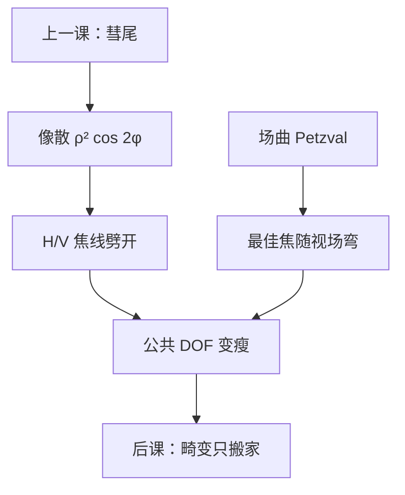

# 像散与场曲

彗差拖出尾巴；像散把点和线收成两条正交焦线，场曲则让这组焦线随视场半径整体搬家——糊斑可以仍近似椭圆，最佳焦已不是一个平面。

<footer>—— Born &amp; Wolf, Principles of Optics 对像散与 Petzval 场曲的讨论</footer>

[上一课](/litho/coma-aberration)把离轴奇对称写成彗差。缺口是：**仍旋转偶对称、却把 H 与 V 劈开的项，以及最佳焦随视场弯曲**。畸变不糊只搬家，留给[下一课](/litho/distortion-field)。不要从瑞利 CD 重讲，也不要引用未公开的狭缝像散图。

## 问题

初级像散（Seidel $S_{III}$）波前 $\propto H^2\rho^2\cos 2\phi$：同一视场点上，子午与弧矢光束的焦点沿轴分开。水平密线与垂直密线看见两个不同的 $Z_4$，Bossung 左右错开，HV 偏置随焦面变号。场曲（Petzval，$S_{IV}$）是视场相关的离焦：最佳焦面弯成曲面，狭缝中心与边缘不能共用一个 $z$。缺口因此是这组**偶次、场相关的二次项**，而不是再画一遍彗尾。

球差也是 $\rho$ 的偶次，但不含 $H$，也不含 $\cos 2\phi$。把「边缘场 CD 不对」全部写成球差，会漏掉 H/V 劈裂与焦面弯曲。

### 两条焦线不是两次调焦能同时吃掉的

调焦只能选一个平面。像散存在时，选 H 线的最佳焦就牺牲 V 线，窗口的公共 $z$ 变瘦。场曲则是：选狭缝中心就牺牲边缘。扫描机可以用镜头操纵做场相关补偿，本课不写成产品目录；只承认系数随场点变。

Fringe 像散常在 $Z_5$、$Z_6$（$0^\circ/45^\circ$）。场曲会泄漏进各场点自己的 $Z_4$。拟合时要把「全局离焦」与「场曲」声明清楚，否则套刻与 CD 的焦轴对不上。

## 方法

对每个场点报像散系数与当地离焦（含场曲）。空中像：圆点物变成椭圆核，长短轴随 $z$ 在两条焦线之间交换。线栅：取向与像散轴对齐时，等效纯离焦偏置。Born &amp; Wolf 用 Sturm 焦线描述；光刻读图用 H/V Bossung 的焦轴错位。

Petzval 和的符号由透镜光焦度与折射率决定，浸没改变像方 $n$，场曲预算要重算——回到[第一课](/litho/em-wave-index)的 $n$，不是改 $k_1$。本课不展开浸没流体。

### 与照明、偏振的纠缠

偶极沿 x 时，H/V 已经不对称；再叠加像散，窗口可以看起来「像差很大」，其实是源与 $S_{III}$ 同向相加。TM 通道本就弱的取向，对像散偏置的焦更脆。拆实验时先关矢量、再关源，最后才归到 $Z_5$、$Z_6$。

EUV 反射镜的像散同样用 $\cos 2\phi$ 说话。斜入射物方几何会额外贡献有效像散，那是阴影 / 3D 课的缺口，不要全部记在投影 $S_{III}$ 上。

## 机制

$\cos 2\phi$ 相位让 $x$ 与 $y$ 的二次聚焦力不同，核变椭圆，两条线栅的有效 $c_4$ 差一个符号。场曲是 $H^2$ 乘到离焦上，狭缝上每个点的窗口中心不同；扫描平均把这条弯折收成一条有效焦面，边缘图形永远离自己的最佳焦更远。NILS 按取向与场点分别掉，对比度 $C$ 的单数报不出这张图。

彗差是奇数，平均 CD 可以藏；像散是偶数，平均 CD 随焦面走，H 与 V 反向——产线 HV bias 的光学桶经常落在这里。

### 后课默认的接口

说到 H/V 最佳焦劈裂，先问像散；说到狭缝边缘整体失焦，先问场曲。下一课的畸变即使在最佳焦面上也改位置，不改糊斑椭圆度。Zernike 约定与场点继续必须声明。

## 边界

本课不含晶圆翘曲本身（那是额外的 $z$ 图），也不含掩模面弯曲。禁止编造未公开的像散毫波数或场曲微米表。高阶像散（$\rho^4\cos 2\phi$ 等）同样劈 H/V，截断后残差仍在。矢量与薄膜栈改的是 $I$，像差名字不变。

## 小结

- 像散：$\rho^2\cos 2\phi$，两条正交焦线，H/V Bossung 错开。
- 场曲：最佳焦随视场半径走，狭缝不能共用一个 $z$。
- 与球差（无方位）、彗差（奇数）不同。
- 公共焦深按取向与场点取交集。
- 畸变下一课：不糊，只进套刻。
- 出处：Born &amp; Wolf, *Principles of Optics*。
