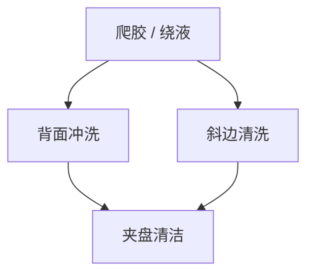

# 背面与斜边清洗

胶和 BARC 会爬到斜边和背面。夹盘看见的脏，下一台设备还要看见。清洗是接触面合同，不是图形合同。

<footer>—— 对照 backside rinse / bevel clean 在轨道上的公开步骤</footer>

[上一课](/litho/wafer-edge-exposure)清正面边缘。缺口是光与 EBR 喷嘴够不着或故意留的斜边、背面。夹盘污染、热板接触不良、下一层 CVD 的边缘珠，都从这里起。

## 问题

旋涂时胶绕过斜边；搬运时正面液滴绕到背面。夹盘真空孔被堵、颗粒被压进背面再印到下一片正面。把这些写成「环境颗粒」，会漏掉可预测的爬胶路径。

## 方法

背面溶剂冲洗、斜边专用喷嘴、机械刷（谨慎，刮伤风险）。与 EBR 溶剂可能同一化学、不同几何。清洗后要检查夹盘残留与真空泄漏率。双面都有膜的工艺（某些堆积）不能乱冲——配方绑定层次。

斜边是应力与剥离的起点，也是金属污染的高速公路。清洗过猛会在斜边留下锯齿膜，后续剥离更差。

## 机制

离心与表面润湿把液体带到背面。毛细沿斜边缝爬。清洗是反向润湿+旋转甩出。残留膜在高温模块碳化成颗粒。

## 边界

下一课 BARC 开口：回到正面图形转印，假定背面已可夹。

## 小结

- 背面与斜边清洗保护夹盘与下游腔体。
- 与正面 EBR / WEE 几何不同，常被漏检。
- 出处：backside / bevel clean 通识。
