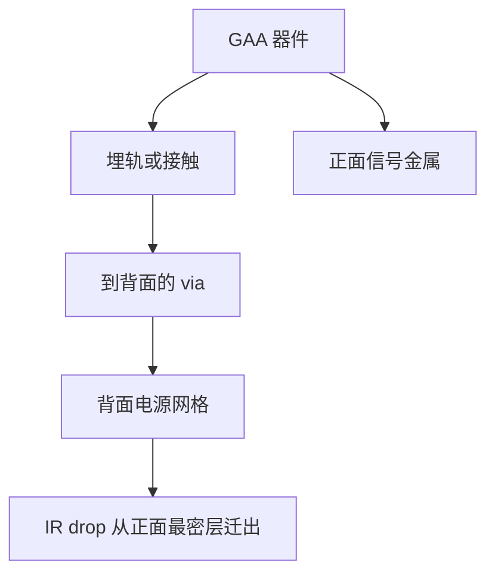

# 背面供电 BSPDN

正面金属栈同时背电流和信号时，供电孔先把布线资源吃光；把电源改到底面，是为给信号让出节距，不是再加一层装饰金属。

<footer>—— 对照 Intel PowerVia 与 imec BSPDN 的公开演示与展望</footer>

[上一课](/litho/nanosheet-spacing)把 GAA 的垂直片缝和横向节距拆开。缺口是：再紧的 CPP 与片宽，正面仍要走电源轨和信号。本课钉背面供电（backside power delivery network, BSPDN）。互补 FET 如何把 N/P 再堆一层，留给[下一课](/litho/cfet)。

## 问题

标准单元顶部的电源轨占掉最密金属资源，via 到晶体管的路径与信号争抢。[后道 EUV](/litho/beol-euv) 把最密 Mx 做出来，供电网格仍在同一面抢密度、抢 IR drop。缩放继续，正面 PDN 成为布线墙，而不是光刻分辨率墙。

BSPDN 把电源/地改到晶圆背面：埋入式电源轨或纳米通孔把电流从背面金属送到器件，正面留给信号。Intel 公开的 PowerVia、imec 的 BSPDN 叙述走同一家族：背面金属 + 穿到正面器件的连接。缺口是集成与对准，不是再讲一遍片缝填充。

### 背面不是「再做一次 BEOL」那么轻

要减薄、键合或直接在背面做金属，晶圆变薄后的翘曲、对准、缺陷与热，全部进套刻预算。电源 via 必须打中埋轨或接触，而不打穿沟道。这是新的光刻/对准层，不是把正面 Mx 配方镜像。

PowerVia、BSPDN、buried power rail 是各家对同一族的公开名称，细节（先轨后通孔、键合次序）不同。写课用「背面 PDN + 到器件的连接」，不要把商标当代数。

## 方法

公开路径大致是：正面做完器件与部分互连 →（埋轨若在正面中段）→ 减薄露出连接点 → 背面金属网格 → 与封装或凸点衔接。光刻要管：埋轨开口、nano-TSV / via-to-rail、背面金属节距（通常松于最密正面信号，但仍要套刻到器件栅格）。对准策略从正面标记翻到背面，SPM 与红外对准成为一等设备问题。

电源完整性：背面网格可以更粗、更厚，IR drop 与电迁移从正面最密线转出。信号层得以放松拥塞，这是 DTCO 收益，用布线资源换，不是用 DIBL 数字换。

### 与 GAA 的耦合

纳米片接触已经挤。背面供电把电源 via 从顶部移走，给接触和信号 via 让位，GAA 的 Weff 档才有地方接出来。没有 BSPDN，GAA 的静电学收益更容易被正面供电孔吃掉——上一课的间距课在电路上还没闭环。

## 机制

正面最密层从「信号+电源」变成「以信号为主」，有效布线轨道增加。代价是晶圆变薄后的热机械：扫描时的卡盘、键合应力、背面金属与硅的热失配，都会进 [晶圆热套刻](/litho/wafer-thermal-overlay)。良率学习曲线按新缺陷模式计：漏电到衬底、via 未打中、减薄损伤。

封装侧：背面已是电源面，与衬底凸点、中介层的接口要重画。这与 Chiplet 课衔接，但本课不把封装当 BSPDN 的替代。

读公开演示时区分：已宣布的产品路径、风险试产、实验室截面。把实验室背面网格写进当前节点功耗模型会高估可交货频率。

## 边界

本课不写 CFET 堆叠，也不给未公开的 via 直径。不要发明 Intel 或 imec 的层数表。减薄后的晶圆刚度下降，扫描加速度与卡盘夹持会改 overlay 模型，必须回到热套刻与吸盘课一起看。后课默认：先进逻辑的供电可以在背面，正面最密层主要为信号服务。

引用 Intel PowerVia 与 imec BSPDN 公开材料。

背面供电不降低 EUV 层的物理需要，它改变层的**用途**。最密信号仍可能是 EUV。

## 小结

- BSPDN 把电源移到背面，把正面最密层还给信号。
- 新光刻项是埋轨、到背面的 via 和薄晶圆对准，不是镜像 Mx。
- 与 GAA 耦合：接触与供电不再在同一面挤。
- 热机械与减薄缺陷进入套刻和良率。
- 背面网格通常松于最密正面信号，但仍必须套刻到器件栅格。
- 出处：Intel PowerVia；imec BSPDN 公开论述。
