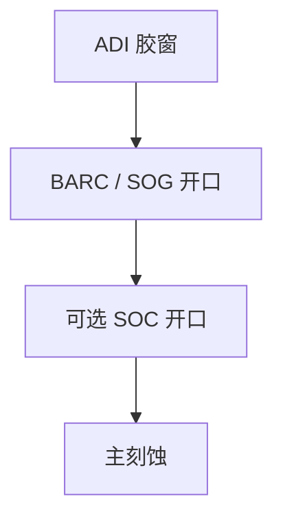

# BARC 开口刻蚀

胶上的窗只开到 BARC 顶；转印还要把抗反射层打开。开口刻蚀吃 CD、吃侧壁，是 OPC 回环的第一段等离子体。

<footer>—— 对照 BARC open etch；接续 [驻波与 BARC](/litho/standing-wave-barc)、[刻蚀偏置](/litho/cdu-etch-bias)</footer>

[上一课](/litho/backside-bevel-clean)把片夹干净。缺口回到正面：显影停在胶，BARC / SOG 仍盖着衬底。本课钉开口刻蚀，不把主衬底刻蚀写完。

## 问题

BARC 为光学存在，对刻蚀是必须打穿的膜。开口偏置进入 [刻蚀进 OPC](/litho/etch-in-opc) 的第一项。选择比不足会打穿衬底或削胶顶；过刻侧蚀吃线宽。把 AEI–ADI 差全写成主刻蚀，会漏掉这一薄层。

## 方法

短等离子体，化学依 BARC 是有机还是含硅（SOG）。终点：光学或时间。三层：先开 SOG 再开 SOC，每段选择比不同。CD 量测应分 ADI、BARC-open 后、主刻后，才能把偏置拆开。

有机 BARC 常用氧化性气体，胶也会被吃。开口时间窗口窄，是随机残膜与过刻之间的缝。

## 机制

各向异性开口尽量保侧壁，但仍有微观侧蚀。驻波造成的胶脚在开口时可能被修掉或被放大。与去渣的差别：去渣清残胶，开口打穿设计存在的底层。

## 边界

下一课胶去除：图形已经转到硬掩模或衬底之后，胶本身要剥离。开口时胶还在当掩模。

## 小结

- BARC 开口是光学层的等离子体代价，偏置要单独量。
- 三层开口是一条链，不是一次刻蚀。
- 出处：BARC / trilayer 开口通识；刻蚀偏置课。
