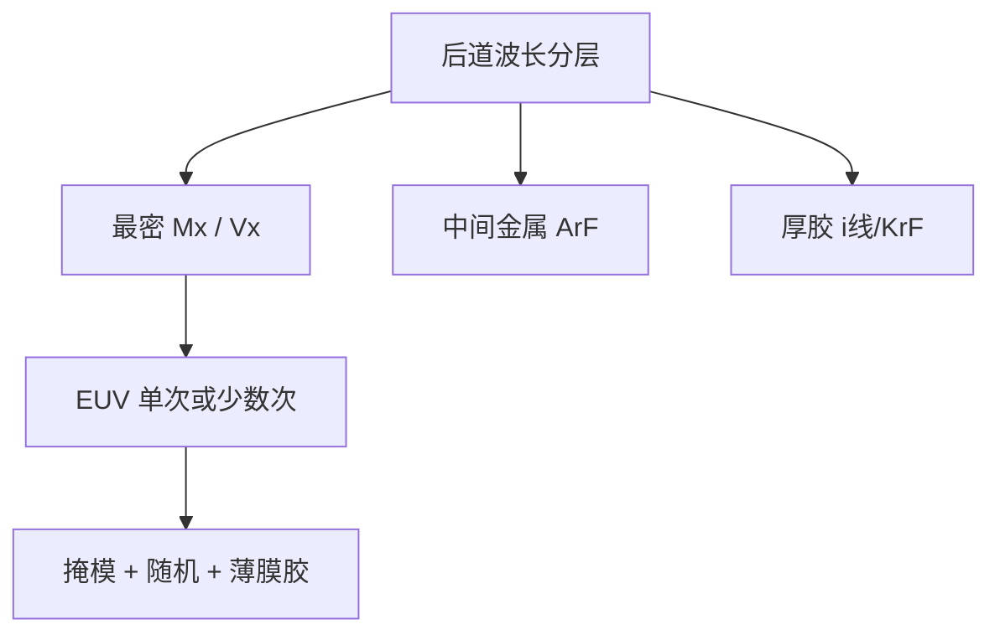

# 后道 EUV

后道混用波长是默认；最密的金属与通孔在公开节点上把 EUV 请进后道，不是每一层金属都换 13.5 nm。

<footer>—— 对照代工厂对 7/5/3 nm 类节点后道 EUV 层的公开叙述</footer>

[上一课](/litho/beol-wavelength-mix)把 i 线 / KrF / ArF 按节距与胶厚分到不同后道层，并明确先进产品并非层层 EUV。缺口是：哪些后道层**确实**用了 EUV。本课钉后道 EUV（金属/通孔关键层）。[FinFET 到 GAA](/litho/finfet-gaa) 从下一课起换前道沟道拓扑，不在这里重写晶体管。

## 问题

波长分层课的选择规则是：松节距、厚胶、便宜机台留在 DUV；只有节距与缺陷把多重曝光的套刻和周期时间逼到墙，才换短波。7 nm 类逻辑在前道关键层引入 EUV 之后，公开叙述把最密的金属和通孔也逐步换成 EUV 单次（或少数次）曝光，以丢掉 LELE/SADP 在后道的套刻层。更松的中间金属、厚钝化、植球开窗仍留在 ArF 或 KrF。

缺口是这张分层图，不是再论证「EUV 分辨率更好」。后道金属层数多、胶厚与双镶嵌各异，EUV 的薄膜胶、随机孔和掩模成本必须按层付得起。

### 通孔往往比金属更早「值得」EUV

二维孔阵列的 $k_1$ 紧、随机缺失孔对剂量敏感，多重曝光的套刻直接变成通孔套错。公开节点故事里，via 层进入 EUV 常常早于或紧随最密金属。金属线可以用自对准双重再拖一程；二维孔没有同样便宜的自对准。这是选择规则的应用，不是绝对年表。

不要把某代「EUV 层数」的传闻整数写成课标。公开事实是：关键前层 + 最密 BEOL 用 EUV，层数随节点增加。具体整数以各厂当时公开为准，本课不编。

## 方法

选层看节距、套刻预算、缺陷与掩模成本。最密 M0/Mx 与 Vx：EUV + [OPC](/litho/opc) + 薄膜胶；随机预算按 [stochastics](/litho/euv-stochastics) 加剂量。中间金属：ArF 浸没 + 多重或单次。厚介质开窗：i 线/KrF。同一片晶圆上多种波长，扫描机配方按层切换，不是「一台 NXE 包后道」。

双镶嵌：沟槽与通孔的套刻、以及铜填充，把 EUV 的 CD 和 overlay 写进电阻电容。后道 EUV 的成功标准是线电阻与 via 电阻的分布，不只是 SEM 的 ADI。

### 与前道 EUV 的差别

前道多在薄膜、高 AR 硬掩模；后道要兼顾低 k 损伤、铜阻挡和较厚的叠层地形。EUV 焦深对后道台阶更苛刻，局部平坦化与胶厚预算（High-NA 更甚）按层重做。不要把前道接触孔的 OPC 配方直接贴到 Mx。

## 机制

EUV 单次把最密金属的多重套刻项拿掉，套刻预算还给层间与热。代价是掩模（反射版、pellicle、吸收体 3D）和光子噪声。后道孔密度高，随机缺失与桥接直接进良率。剂量与胶的折中在后道同样成立：欠剂量换吞吐，孔先死。

自对准后道方案（如 SAQP 金属）与 EUV 单次是竞争关系：哪一层用哪条，看当时的成本与缺陷，不是物理唯一解。公开节点是混用，不是一条教条。

Chiplet 与封装再布线不是本课的后道。本课的 BEOL 停在片上金属栈。封装光刻见 CoWoS / Chiplet 课。

## 边界

本课不把 GAA 片宽当金属节距，也不写具体 M 层编号表。不要发明某厂 N 层 EUV 的精确名单。同一产品里前道接触与后道 via 可以同波长、不同胶厚与不同 OPC 版本，配方按层资格认证。后课默认：后道可以有 EUV，但按层，且多数层仍是 DUV。

引用代工厂公开的节点技术叙述（7/5/3 nm 类关键层与密金属/通孔用 EUV）。

High-NA 首先服务更密的前道与最关键层；后道是否跟到 0.55 是另一张成本账，不要默认「EXE 包所有 Mx」。

## 小结

- 后道 EUV 用在公开节点的最密金属与通孔，不是全部金属层。
- 通孔的二维套刻与随机缺陷往往更早逼出 EUV。
- 中间金属与厚胶层仍按上一课的波长分层留在 DUV。
- 签核看电阻电容与缺陷，不只看 ADI。
- 自对准多重与 EUV 单次按层竞争，公开节点是混用。
- 出处：代工厂 7/5/3 nm 类节点后道 EUV 的公开叙述。
