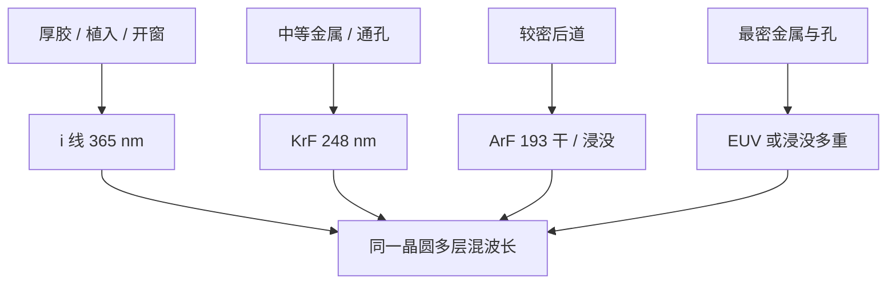

# 后道波长分层

后道不是一层金属用一台最贵的扫描机。节距、胶厚、套刻与成本把 i 线、KrF、ArF 甚至 EUV 分到不同层上，混用是默认，不是过渡期。

<footer>—— 对照 Levinson 对多层光刻与波长选择的产线论述</footer>

[上一课](/litho/contact-hole-patterning)把最紧的孔写成二维成像加高 AR 转印。缺口是：芯片上绝大多数后道层并不是那种孔。金属、通孔、钝化、植球前的厚胶，节距可以差一个数量级。本课钉后道波长分层：i 线 / KrF / ArF 如何按层混用。[FinFET 到 GAA](/litho/finfet-gaa) 从下一课起换前道器件拓扑，不再把金属层波长当晶体管微缩。

## 问题

[波长台阶](/litho/litho-wavelengths)已经说明 $\lambda$ 不能微调。若由此推出「先进产品每一层都该 EUV」，后道成本与产能会立刻墙。Levinson 的产线图像是分层：关键前层和最密金属才配短波与高 NA；植入阻挡、厚介质开窗、松节距金属仍用 i 线或 KrF，因为胶可以更厚、焦深更松、机台小时更便宜。

缺口是选择规则，不是再列一条汞灯到 EUV 的年表。上一课的接触孔工艺只绑定「这一层的节距与缺陷」；后道有十几层金属，必须允许同一片晶圆上多种波长。

### 节点名不是后道波长

「7 nm 产品」指前道栅极节距的商品名。后道某层仍可能是 193 nm 浸没多重，或 248 nm 单次。把商品节点写成整片波长，会高估 EUV 层数、低估 DUV 机队。

植入层常用厚胶挡离子。厚胶与 i 线 / KrF 的焦深匹配，强行上 ArF 薄胶并不自动更好。

## 方法

按节距与膜厚选波长，再选 NA 与是否多重。松金属：i 线或 KrF 单次，二元掩模，规则 OPC 即可。中等后道：干式或浸没 ArF，衰减相移，模型基 OPC。最密金属与通孔：浸没多重或 EUV 单次，计算光刻和套刻预算按[多重图形](/litho/lele-multipattern)另开。同一后道栈里出现三种波长是常态。

混机带来匹配套刻：ArF 层对 KrF 层、EUV 对浸没，要对准网格和标记在各波长下都可读。ASML 公开写过 DUV–EUV 交叉匹配；本课只要求分层时把匹配写成预算项，不抄未核对的纳米规格。

### 胶与涂显也分层

换波长等于换胶族：DNQ–酚醛对 i 线，CAR 对 KrF/ArF，EUV 另册。涂胶显影轨道的烘箱与显影头按胶族资格认证，不能假设「后道轨道通用」。上一课的孔若在 EUV 胶上过了随机，松通孔仍可能走 ArF 正胶，缺陷模式完全不同。

## 机制

分辨率仍是 $k_1\lambda/\mathrm{NA}$。后道把 $k_1$ 用得更松、把 $\lambda$ 选得更长，换来焦深、胶厚和机台成本。金属电阻与通孔电阻关心的是刻蚀后的开口和填充，不是每一层都逼近单次曝光地板。分层的机制是：**电学关键路径上的节距**才配短波；其余层的优化目标是缺陷、产率和与前层的套刻。

混波长的代价是工件台、镜头指纹和热负荷各不相同，产品套刻要把设备项按层配对。Chiplet 不取消这张表：每颗裸片内部后道仍然分层。

「后道已经不用光刻」是封装口头禅。中介层和 RDL 另有一套线宽，仍然是光刻；只是波长更老、胶更厚。

## 边界

不要把某代工厂未公开的「EUV 用了几层」写成行业定律。本课只给分层逻辑：节距、胶厚、套刻、成本。不要在这里重讲 GAA 释放。也不要把 i 线写成已被淘汰——厚胶层还在用。出口管制卡住的是先进扫描机，成熟波长的后道仍可扩产，与[国产替代](/litho/china-litho-supply-chain)的档位叙事一致，本课不重写供应商名单。

出处：Harry J. Levinson, *Principles of Lithography*（SPIE）对多层工艺与工具选择的讨论；波长台阶见 Mack 与产线公开机队混用。不编造某厂 BEOL 层数表。

## 小结

- 后道按层选 i 线、KrF、ArF、EUV，混用是默认。
- 商品节点不等于每一层的曝光波长。
- 厚胶与松节距优先更长波长和更大焦深。
- 混机套刻与涂显资格是分层的隐藏成本。
- 前道器件拓扑下一课，本课停在金属/通孔波长。
- 出处：Levinson 光刻原理；波长与机队公开分层逻辑。
