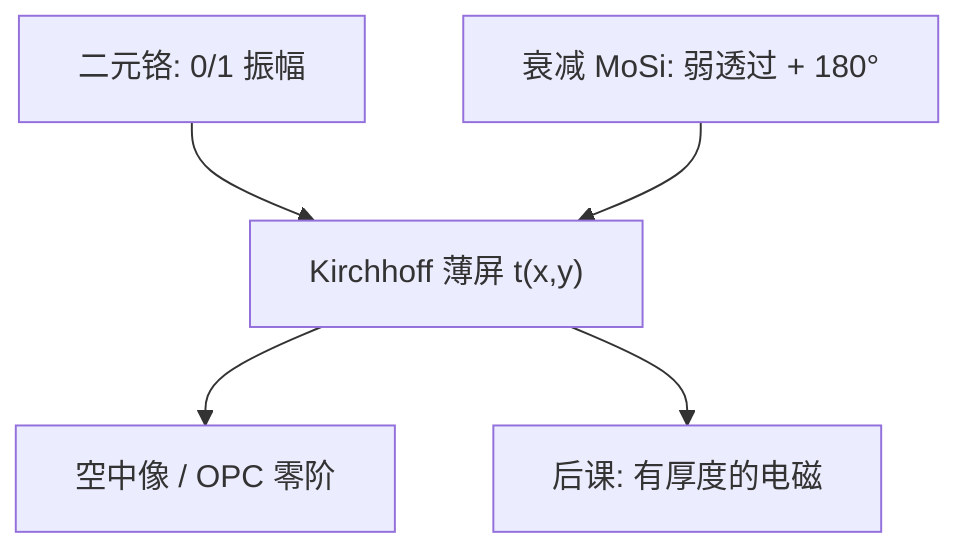

# 二元掩模与衰减相移

产线订的 DUV 版，多数是铬二元或 MoSi 衰减相移两类产品；相位机制上一课已经讲过，本课钉的是薄掩模透过率合同。

<footer>—— 据 Levenson 之后的量产膜系惯例，以及 Mack、Levinson 对 binary 与 att-PSM 的表述整理</footer>

[上一课](/litho/phase-shift-mask)说明了 $180^\circ$ 如何在暗区制造相消，并区分了交替型与衰减型。缺口是：晶圆厂下单时面对的是两类标准透射掩模——二元铬（COG）与嵌入式衰减相移（att-PSM，典型 MoSi）——以及还在用的 Kirchhoff 薄掩模假设。吸收体真正的厚度怎样捣乱，留给[下一课](/litho/mask-3d-effect)。不要把交替型 trim 流程再讲一遍。

## 问题

上一课的机制图里，二进制是振幅型、衰减型是弱相移背景。产线语言还要补规格：二元掩模的暗区透过率近似 0、亮区为石英；att-PSM 的「暗」区仍漏过百分之几的光并带约 $180^\circ$，亮区仍是石英开口。接触孔与许多 193 nm 层默认衰减型，因为它一次曝光、可走标准 OPC，增益虽小于交替型，但没有相位冲突。更老或更松的层仍用二元铬，写和修都便宜。

缺口因此是产品选择与薄掩模成像接口，不是再推导相消干涉。没有这层，下一课的「三维效应」没有对照物——对照物就是：透过率只是 $(x,y)$ 上的复数薄屏。

### Kirchhoff 薄屏

Kirchhoff 近似把掩模写成平面复透过率 $t(x,y)$，衍射用标量角谱，不进膜厚、不进侧壁、不进波导。OPC 的第一代模型就是它。只要吸收体厚度远小于横向特征、入射接近正入射，误差可接受。193 nm 的 MoSi 厚度已经到波长量级，这个「远小于」开始坏——那是下一课。本课先允许薄屏，否则 3D 修正没有零阶。

「6% 衰减」仍是常见讨论值，不是物理常数。透过率、相位由膜系与波长锁定；ArF 版不能当 KrF 的同一 att-PSM 用。

## 方法

选二元：图形松、$k_1$ 高、要修缺陷简单、成本优先。选 att-PSM：需要压零级、抬边缘斜率，尤其是孔与半密图形，且不愿上交替型的 trim。照明仍与 [OAI](/litho/off-axis-illumination) 搭配；掩模类型不替代光瞳选择。

掩模误差因子（MEF）在低 $k_1$ 时大于 1。二元与衰减的 MEF 不同，因为背景光改变了空中像对开口宽度的导数。写 OPC 必须用对应的 $t(x,y)$，把衰减膜当成「深铬」会系统偏置。

### 缺陷与修复

铬缺陷可补镀或挖；衰减膜的相位/透过率缺陷更接近上一课的相位缺陷行为，但比石英台阶交替型容易纳入标准检测。本课不把掩模厂良率写成节点良率。

## 机制

二元：物体频谱由开口决定，零级强，密图形调制靠开口占空比和照明。衰减：背景复振幅与开口干涉，等效削弱零级、在边沿加相消，孤立图形与孔的 NILS 往往更好。两者都还在透射几何里；EUV 反射掩模不是本课的产品。

薄屏假设忽略开口里的波导相移，于是左右边缘对称、HV 无偏置。真实膜一厚，这些对称性破裂——下一课专门收这笔。本课的后课接口是：凡说「二元 / att-PSM 成像」，先给出 $t(x,y)$，再声明是否加 3D。

## 边界

交替型 PSM、无铬相移仍是上一课的家族成员，不是本课的下单默认。本课也不讲多电子束如何把版写出来。浸没流体与掩模无关。禁止把 att-PSM 写成「已经包含掩模 3D」：衰减是薄膜光学设计，3D 是厚度与入射角的电磁修正。

## 小结

- DUV 量产透射版主要是二元铬与衰减相移两类。
- 衰减型一次曝光、压零级；二元型简单、松层仍用。
- 零阶成像是 Kirchhoff 薄屏 $t(x,y)$。
- MEF 与 OPC 必须用对膜系，不能把 MoSi 当深铬。
- 吸收体厚度的电磁效应下一课。
- 出处：Mack / Levinson；相移量产膜系惯例（Levenson 之后）。
